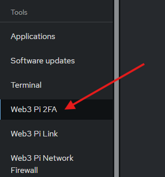
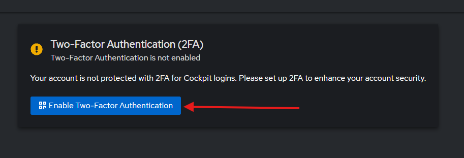
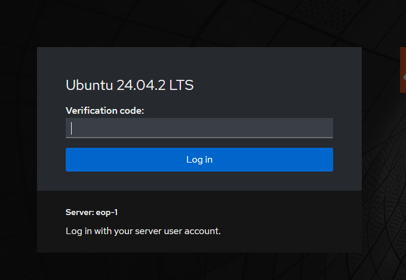
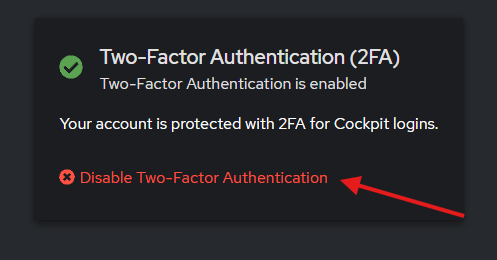

---
hide:
    - toc
---

# Two-Factor Authentication (2FA) for Cockpit

Adding Two-Factor Authentication (2FA) to Cockpit increases the security of your server by requiring a time-based one-time password (TOTP) in addition to your regular credentials.

The Web3 Pi team developed a plugin to easily enable 2FA in Cockpit using a graphical interface. Alternatively, you can manually configure 2FA using the `libpam-google-authenticator` package.

=== "Using the official plugin"

    ## Step 1: Install Required Packages

    Navigate to the `Web3 Pi Updater` section in Cockpit and install `Two Factor Authentication Plugin for Cockpit`:

    

    Alternatively, you can install the plugin manually by opening a terminal and running the following command:

    ```sh
    sudo apt-get install w3p-two-factor-auth
    ```

    !!! note

        Cockpit will restart after the installation of the plugin, so you may need to refresh the page and log in again.

    ## Step 2: Configure 2FA

    After installing the plugin, navigate to the `Web3 Pi 2FA` section in Cockpit:

    

    Click `Enable Two-Factor Authentication` to start the setup process.

    

    Follow the on-screen instructions to set up 2FA:

    1. Scan the QR code with your preferred authenticator app (e.g., Google Authenticator, Authy).
    2. Enter the verification code from your authenticator app to complete the setup.
    3. Save the emergency scratch codes in a safe place.

    !!! note

        Scratch codes are one-time use only. If you lose access to your authenticator app, enter one of these codes to log in and recreate your 2FA setup.

    ## Step 3: Test Your Setup

    1. Log out of Cockpit.
    2. Log back in. You should be prompted for a verification code from your authenticator app.

    

    ## Uninstalling 2FA

    To remove 2FA from Cockpit, navigate back to the `Web3 Pi 2FA` section and click `Disable Two-Factor Authentication`.

    

=== "Installing manually"

    ## Step 1: Install Required Packages

    Open a terminal and run:

    ```sh
    sudo apt-get install libpam-google-authenticator -y
    ```

    This installs the PAM module for Google Authenticator.

    ## Step 2: Configure Google Authenticator for Your User

    Run the following command to set up Google Authenticator with recommended options:

    ```sh
    google-authenticator -t -d -f -r 3 -R 30 -W -Q UTF8
    ```

    !!! note

        - `-t` use TOTP instead of HOTP (recommended).
        - `-d` disable reuse of previously used TOTP tokens.
        - `-f` disable confirmation before writing the `~/.google_authenticator` file.
        - `-r 3 -R 30` limits the number of login attempts to 3 every 30 seconds.
        - `-W` by default google-authenticator allows the use of codes that were generated a little before or a little after the current time. This option disables that feature (recommended for security).
        - `-Q UTF8` specifies the encoding for the QR code. Change to `-Q ANSI` if you're having issues with viewing the QR code.

    - This will generate a secret key, QR code, and emergency scratch codes.
    - Scan the QR code with your preferred authenticator app (e.g., Google Authenticator, Authy).
    - Enter the verification code from your authenticator app to complete the setup.
    - Save the emergency scratch codes in a safe place. 

    !!! note

        Scratch codes are one-time use only. If you lose access to your authenticator app, enter one of these codes to log in and recreate your 2FA setup.

    ## Step 3: Enable 2FA for Cockpit

    Use the following command to add the Google Authenticator PAM module to the Cockpit PAM configuration:

    ```sh
    sudo bash -c 'echo "auth required pam_google_authenticator.so nullok" >> /etc/pam.d/cockpit'
    ```

    This tells Cockpit to require a TOTP code during login.

    !!! note

        - The `nullok` option disables 2FA for users that do not have a `~/.google_authenticator` file.

    ## Step 4: Restart Cockpit

    Restart the Cockpit service to apply the changes:

    ```sh
    sudo systemctl restart cockpit
    ```

    ## Step 5: Test Your Setup

    1. Log out of Cockpit.
    2. Log back in. You should be prompted for a verification code from your authenticator app.

    


    ## Uninstalling 2FA

    To remove 2FA from Cockpit, simply delete the line you added to the PAM configuration:

    ```sh
    sudo bash -c 'sed -i "/pam_google_authenticator.so nullok/d" /etc/pam.d/cockpit'
    ```

    Then restart the Cockpit service:

    ```sh
    sudo systemctl restart cockpit
    ```

    You can also remove the generated `~/.google_authenticator` file and the installed packages if you no longer need 2FA:

    ```sh
    sudo apt remove libpam-google-authenticator -y
    rm ~/.google_authenticator
    ```