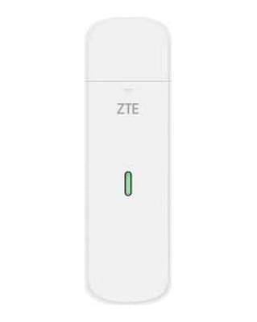
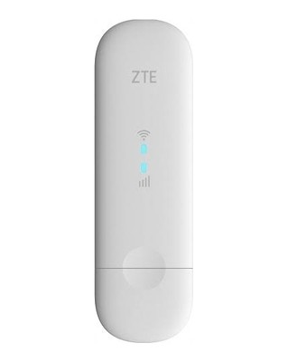
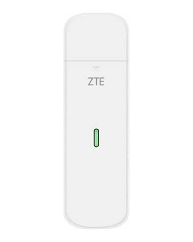
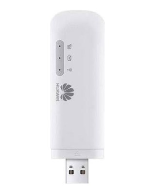
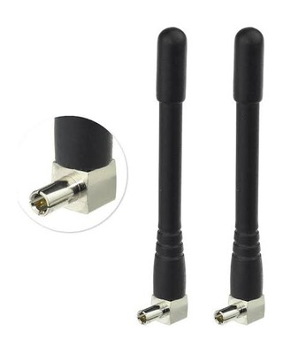
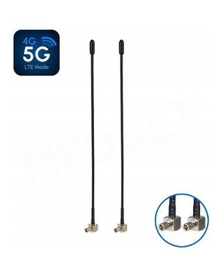
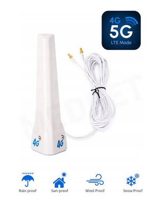

# Internet Failover (LTE)

Internet Failover is a built-in feature of **Web3 Pi vOS** — it ships in every vOS
image, disabled by default; no extra software to install.

Your Ethereum node normally runs on Ethernet. With Internet Failover enabled, you plug a
USB LTE modem (with a SIM card, PIN disabled) into the Raspberry Pi and the node survives
internet outages on its own:

- **If the Ethernet cable dies** (unplugged, switch failure), the system moves to LTE
  **within seconds**.
- **If the cable looks fine but the internet behind it is dead** (ISP outage — the most
  common case), a watchdog notices within ~20 seconds and forces traffic onto LTE.
- On every switch, the node's stale connections are closed immediately so Geth and
  Nimbus start reconnecting over the new path right away. **All peer connections are
  dropped in the process** and the clients rebuild them from scratch, which takes a
  few minutes — the node may briefly stumble on sync or attestations during that
  window, but on a good LTE link (≥ 20/10 Mbit/s) it recovers full operation **on its
  own** within a few to a dozen or so minutes, with no intervention.
- While on LTE the system enters **data-saving mode**: upload is shaped, automatic system
  updates are paused, and every megabyte is metered and visible in the control panel.
- When Ethernet is healthy again for 2 minutes straight, traffic moves back automatically
  and data-saving mode ends. No human action at any point.
- A WiFi network can optionally sit between Ethernet and LTE as a middle fallback
  (priority: **Ethernet → WiFi → LTE**).

!!! note "The validator is never restarted"
    No failover code path ever touches the validator process. In the worst case the
    watchdog may restart the *beacon* service — at most once per outage, as a last
    resort — but the validator service is never restarted by failover. Ever.

You provide the modem and the SIM; one action in `control-panel.sh` turns the feature on.

---

## Requirements at a glance

| Requirement | Value |
|---|---|
| Modem class | USB LTE modem that presents itself as a **USB network card** (`cdc_ether`) with its own onboard dial/NAT/DHCP — see the recommended list below |
| USB port | **USB 3.0** port on the Pi (stability and power, not speed — see below) |
| SIM | **Full LTE** (not LTE-M / NB-IoT), data plan sized for node traffic, **PIN disabled** |
| Link quality | At least **20 Mbit/s down / 10 Mbit/s up** through the modem — measure with the built-in speed test (control panel → `F` → `8`) |
| Subnets | Every failover link must use a **different IP subnet** (modem LAN vs your home LAN vs WiFi) |

If the LTE link at your location cannot deliver the 20/10 minimum, no failover algorithm
can keep an Ethereum node synced on it — the node will lag on LTE and catch up when the
faster link returns. Measure first, then decide.

---

## Choosing a modem

The failover treats the modem as a dumb USB network card: it must enumerate as a
`cdc_ether` (or `rndis_host`) device with its own onboard dial, NAT and DHCP. Anything
that needs ModemManager, QMI, MBIM or PPP dialing on the host **does not qualify**.

### Recommended models

| # | | Model | Price (PL, 2026) | Notes |
|---|---|---|---|---|
| 1 | {:style="height: 110px; border-radius: 6px;"} | **ZTE MF833N** | ~109–126 PLN | Bench-tested end-to-end on the shipped image. In production, widely stocked. No external antenna ports. |
| 2 | {:style="height: 110px; border-radius: 6px;"} | **ZTE MF79N** | ~149 PLN | Still in production. **2× TS-9 external antenna ports** under the flip-open side caps (most retail listings omit them) — the pick for weaker-signal sites. Occasional mode-switch retries on some units (the system retries automatically). |
| 3 | {:style="height: 110px; border-radius: 6px;"} | **ZTE MF833U1** | ~109–139 PLN | Sibling variant of the MF833N — same class, no antenna ports. |
| 4 | {:style="height: 110px; border-radius: 6px;"} | **Huawei E8372h-320** | ~140–160 PLN | Works well (`192.168.8.x` subnet avoids common LAN collisions), but EOL — buy only genuine stock and check `lsusb` on arrival (see the avoid list). |

All ZTE models above use the `192.168.0.0/24` subnet on their LAN side by default — read
the *distinct subnets* requirement below.

### Avoid list

| Model | Why |
|---|---|
| **"Huawei E3372-325"** (current retail — actually a **Brovi** device, USB ID `3566:2001`) | Broken mode-switch on Linux. This is the #1 trap: cheap, sold everywhere, looks like the classic Huawei. **Do not buy.** If `lsusb` shows `3566:*`, return it. |
| Alcatel/TCL IK41VE1 | Firmware lottery (MBIM vs RNDIS) — you cannot know what you are buying. |
| D-Link DWM-222 (rev A2) | Exposes serial/QMI only — fails the plug-and-play requirement. |
| Netgear Nighthawk / ZTE 5G pucks | Battery-powered hotspots: the battery is a wear item that swells on 24/7 power; far more expensive than the class needs. |
| Sierra Wireless EM/MC modules | MBIM/QMI only, no onboard router mode. |

### Quick identification (`lsusb`)

| ID seen | Meaning | Verdict |
|---|---|---|
| `19d2:1225` → `19d2:1405` | ZTE MF79N, MF833N (storage → network mode) | ✅ |
| `12d1:1f01` → `12d1:14dc` / `14db` | Huawei HiLink (E3372h / E8372h) | ✅ |
| `12d1:*` → `12d1:1506` / `1442` | Huawei **Stick/NCM firmware** | ❌ |
| `3566:2001` | **Brovi** fake-Huawei | ❌ return it |
| `2001:ac01` → `2001:7e3d` | D-Link DWM-222 A2 | ❌ |

### USB port and placement

Use a **USB 3.0** port. This is about connection stability and power delivery, not
throughput (these modems are USB 2.0 devices electrically): on USB 2.0 ports we observed
modems periodically resetting, failing to hold speed, or not enumerating at all
(`can't set config, error -110`) — all of them ran stably on USB 3.0.

On the Pi 5 the USB 3.0 ports sit next to the Ethernet jack, so a wide modem body can
press against the network plug. It fits, but a **short USB extension cable** removes the
squeeze entirely and also guarantees firm seating. One more bench finding: **horizontal
orientation beats vertical** for signal — conveniently, that is the natural position of
a stick in the Pi's side ports.

---

## SIM card requirements

- **Full LTE**, not LTE-M / NB-IoT (an Ethereum node needs real bandwidth). 5G is
  unnecessary — a failover link cannot use the extra speed.
- **Disable the SIM PIN before inserting it** (in a phone, or once via the modem's web
  UI). This is the #1 real-world failure: a PIN-locked SIM enumerates fine, hands out a
  DHCP address, and moves **zero** data.
- **Pick a different carrier than your home ISP** — otherwise one regional outage can
  take down both links at once.
- **Plan size**: a synced node parked on LTE consumed ≈ **0.7 GB/hour (≈ 17 GB/day)** in
  our bench measurements on a test network; a mainnet node is heavier (industry
  rule-of-thumb: tens of GB per day unshaped). Practical advice (Polish market, 2026):
  an **unlimited prepaid** plan (~35 PLN/month) is the stress-free default. A small
  "50 GB" plan covers roughly one day of a real outage — treat it as a short-blip-only
  budget.
- **Prepaid expiry**: prepaid SIMs need a periodic top-up to stay active — put it in
  your calendar. The failover's periodic health probes conveniently keep the SIM
  "in use" from the carrier's perspective.
- **APN**: mainstream carrier SIMs configure themselves; some MVNOs need the APN set
  once in the modem's web UI.
- **CGNAT is normal**: carrier networks block all inbound connections. The node works
  fine outbound-only — expectations below.

---

## Distinct subnets — a hard requirement

Every failover link must use a different IP subnet. The ZTE modems' LAN defaults to
`192.168.0.0/24` — which is also the factory default of many home routers, so collisions
are common.

The watchdog **detects a collision and raises an alarm** (control-panel status banner +
system journal) instead of switching traffic onto an ambiguous path. If you see the
alarm: change your **router's** LAN subnet (e.g. to `192.168.1.0/24`), or the modem's,
if its web UI allows it.

---

## Setup, step by step

1. **Prepare the modem**: SIM inserted, PIN disabled. If the modem has a WiFi hotspot
   (MF79N, E8372h are "wingles"), **disable the hotspot** in its web UI — it is a
   security exposure, extra heat, and parasitic data on your metered SIM. The failover
   does not use it.
2. **Plug the modem into a USB 3.0 port** (short extension cable recommended).
3. Open the control panel (`control-panel.sh`) and press **`F` — Internet Failover
   (LTE)**. The status screen shows the modem (present/absent), **SIM PIN state**,
   network registration, signal, and data counters.
4. **Run the speed test** (`F` → `8`). It measures *through the modem interface*, shows
   RSRP/SNR signal readings, and prints an explicit **OK / BELOW MINIMUM** verdict
   against the 20/10 Mbit/s requirement. Judge a site only with this test — a browser
   speed test on your phone measures a different radio in a different spot.
5. **Enable failover** from the same menu. From this moment the feature is armed and
   fully automatic.
6. *(Optional)* **Add a WiFi rung** (`F` → WiFi setup): scan, pick a network, enter the
   password. On dual-band access points **prefer 5 GHz** (the band-preference option) —
   clients otherwise latch onto the louder-but-slower 2.4 GHz. Never select the LTE
   modem's own hotspot as the WiFi rung — that would be a "backup" riding the same SIM.

!!! tip "Judge the site at more than one time of day"
    LTE capacity swings 2–3× with cell load. The same modem in the same spot measured
    21–45 Mbit/s down in the afternoon and 60 Mbit/s in the evening. One measurement is
    an anecdote, not a verdict — and **carrier choice dominates everything else**: if a
    site fails the minimum, a different carrier's SIM usually beats any antenna work.

### Weak signal? Escalate in this order

1. **Reposition the modem** (window side of the building can flip the verdict; watch
   RSRP/SNR in the speed-test readout — aim for RSRP above ~−90 dBm, SNR above ~13 dB).
   A terrible position doesn't just slow the link down, it wrecks latency (we measured
   a 7-second ping in one spot).
2. **External antennas** — see below.
3. **Try another carrier's SIM.**

### External antennas (TS-9)

Some modems have connectors for external antennas — on this class of device they are
almost always **TS-9** sockets, usually a pair of them hidden under small side covers
(on the MF79N they are under the flip-open caps; retail listings often don't even
mention them). TS-9 antennas are cheap (from ~45 PLN a pair) and easy to find in online
shops — from small stubby sticks, through mid-size whips on a cable, up to desktop
antennas you can place on a windowsill:

{:style="height: 190px; border-radius: 6px; margin-right: 8px;"}
{:style="height: 190px; border-radius: 6px; margin-right: 8px;"}
{:style="height: 190px; border-radius: 6px;"}

With two sockets, connect **both** antennas (the second one serves MIMO — it is not a
spare). An antenna on a cable also lets you keep the modem at the Pi while the antenna
sits where the signal is. Re-run the speed test (`F` → `8`) after every change and watch
RSRP/SNR — if antennas don't lift the site above the minimum, a different carrier's SIM
usually will.

---

## Verify it works (2 minutes)

Do this once after setup — it is the same scenario the feature exists for:

1. Watch the failover status screen (`F`) or the panel dashboard.
2. **Pull the Ethernet cable.** Within seconds the active link changes to LTE (or WiFi,
   if provisioned); data-saving mode engages; the node keeps running.
3. Wait a few minutes, watching the node: peers drop to zero on the switch, then rebuild
   over LTE (a handful of peers on CGNAT is normal and sufficient).
4. **Plug the cable back in.** After ~2 minutes of confirmed-healthy Ethernet the system
   switches back automatically and data-saving mode ends.

Every decision the watchdog makes is logged with its reason:
`journalctl -t w3p-failover`. Machine-readable live state (which also feeds the panel):
`/run/w3p-failover/status.json`.

---

## What to expect while on LTE

- **Fewer peers — by design of carrier networks.** Under CGNAT no inbound connections
  are possible, so the peer count settles around a dozen instead of 150+. That is
  normal and sufficient; a validator needs only ~5–6 beacon peers to perform its duties.
- **Port-forwarding rule of thumb**: opening the beacon's P2P ports on your **wired
  router** is worth it (bench: ~10–16 peers with ports closed → ~160 open). On **LTE it
  does nothing** — CGNAT blocks inbound regardless.
- **Validators**: expect **at most 1–2 missed attestations per switch** and none during
  a stable dwell on a link meeting the 20/10 minimum. If the watchdog ever escalates
  (beacon-service restart, at most once per outage), the panel shows it as a brief
  service-state blip — that is the failover's safety valve doing its job, not a fault.
- **Data-saving mode** is automatic: upload shaped (anti-bufferbloat; download is never
  policed), automatic system updates paused until the wired link returns, all usage
  metered (`F` → data usage; daily/monthly history via vnstat).
- **Do not start a resync while on LTE.** A fresh Geth snap-sync is 60+ GB — if the node
  needs a resync, wait for the wired link.

---

## Troubleshooting

| Symptom | Cause / fix |
|---|---|
| Modem not detected, or `can't set config, error -110` in `dmesg` | Marginal USB seating or a USB 2.0 port. Re-seat firmly in a **USB 3.0** port (short extension cable helps). The system also retries mode-switching and power-cycles the port automatically. |
| Modem detected, DHCP address assigned, **no data flows** | **SIM PIN is enabled** (the status screen shows PIN state) — disable it. Or: MVNO SIM needs the APN set once in the modem web UI. |
| Bought an "E3372" and it doesn't work | Check `lsusb`: `3566:2001` = **Brovi** fake-Huawei from the avoid list — return it. |
| **Subnet collision** banner in the panel | Your home LAN uses the same subnet as the modem (typically `192.168.0.0/24`). Change the router's LAN subnet, or the modem's if its UI allows. Failover refuses to arm the ambiguous link until resolved. |
| Speed test says BELOW MINIMUM | Escalate: reposition (watch RSRP/SNR) → TS-9 antennas (MF79N) → different carrier. Re-test at different times of day. A single unit can also have a degraded radio — if a second modem is available, compare RSRP at the same spot. |
| Terrible latency on LTE (multi-second pings) | Signal collapse causes bufferbloat. Move the modem first — one bad spot measured 5.9/0.1 Mbit/s with 7.4 s pings. |
| `attest_risk` alarm while on LTE | The validator is active and the beacon has very few peers on this dwell. Usually transient during peer rebuild; if persistent, the link is too slow — check the speed test. |
| Panel shows a beacon service restart during an outage | The escalation safety valve (at most once per outage). The validator itself is never restarted. |
| WiFi rung connects at 2.4 GHz / slow | Set the 5 GHz band preference in the WiFi setup. Note the Pi's built-in radio tops out at ~200–250 Mbit/s real throughput — plenty for a failover rung. |
| Frequent switching back and forth | The watchdog's flap protection latches onto the best healthy link automatically for 30 minutes, then re-evaluates. Check the wired link's actual health — flapping usually means a dying ISP link, not a failover problem. |

---

## How it works under the hood (short version)

Three layers, all shipped in the vOS image:

1. **A route-metric ladder** (Ethernet 100 > WiFi 300 > LTE 700): pure kernel/networkd
   configuration. Physical link loss fails over instantly with zero custom code.
2. **A watchdog daemon** (`w3p-failover.service`): probes each link (two independent
   anchors + DNS + gateway), applies hysteresis (demote after 20 s of failure, return
   after 120 s of health, flap protection), and covers the "cable fine, internet dead"
   case the ladder cannot see. A **chain-liveness veto** prevents false demotions while
   the node is saturating the link to catch up.
3. **The nudge**: on every switch, connections pinned to the dead path are closed
   (`ss -K` by source address) so Geth and Nimbus redial immediately instead of sitting
   deaf through kernel TCP timeouts — chain-head tracking typically returns within
   ~30–100 seconds of a switch.

After every switch the watchdog verifies recovery by **liveness** (new connections on
the new path + beacon head advancing), not by peer counts. If verification fails, it
restarts the beacon service — once per outage, never the validator — then alarms.

Details, design rationale and bench history live in the project's engineering notes.
