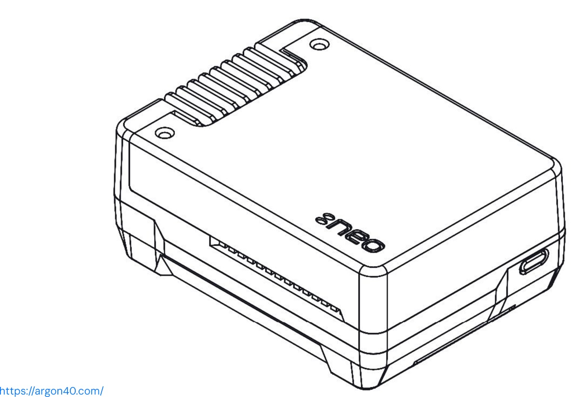
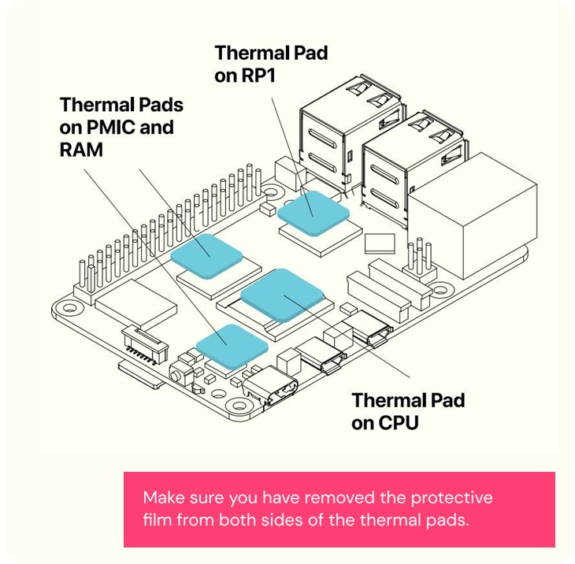
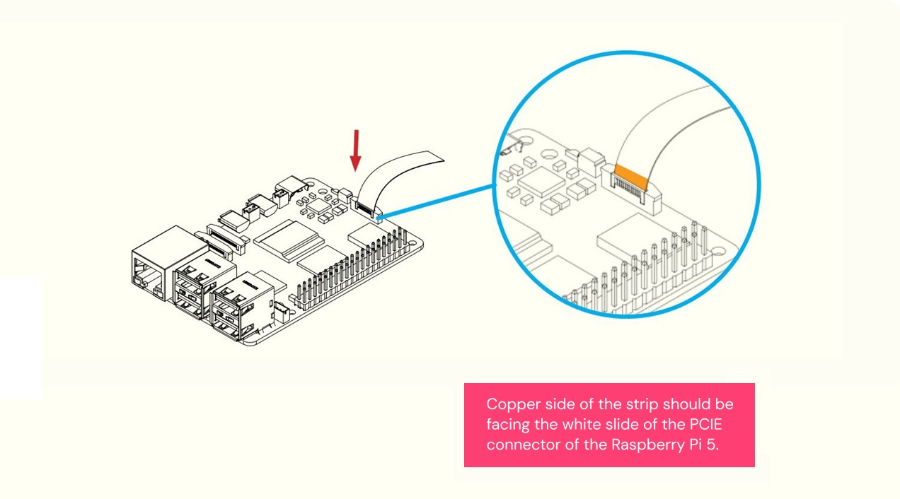
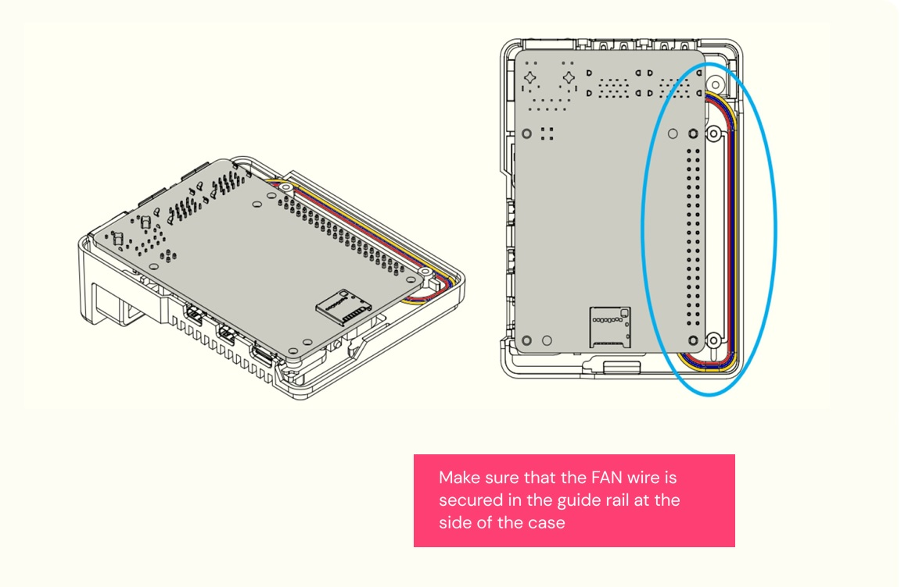
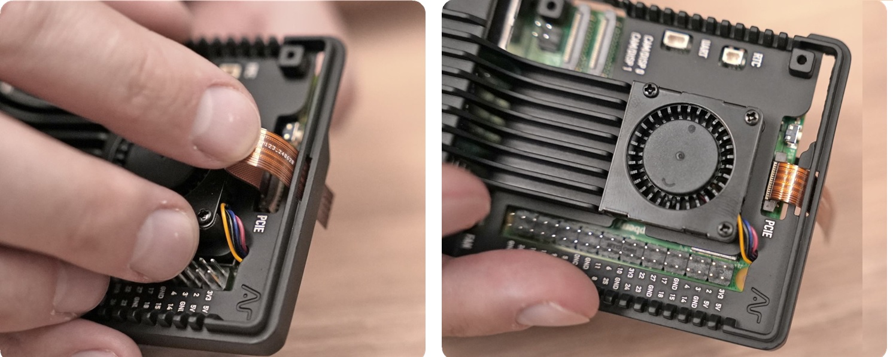
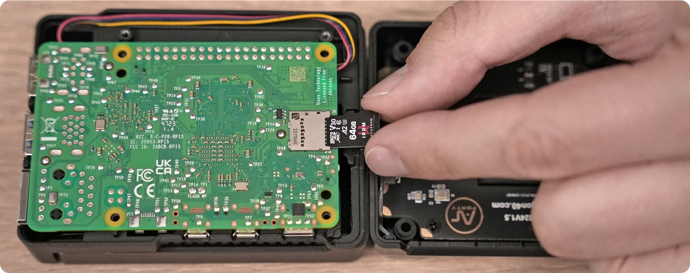
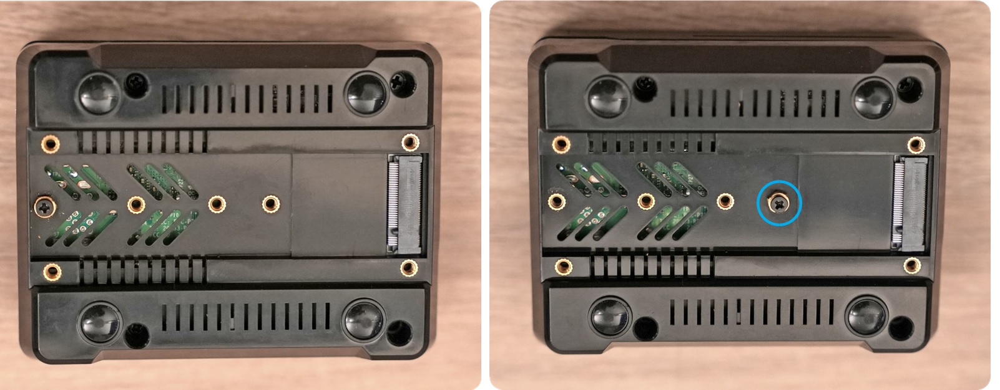
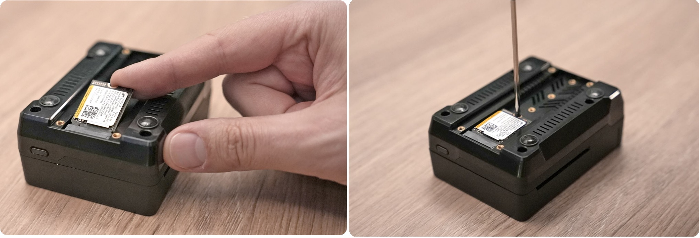
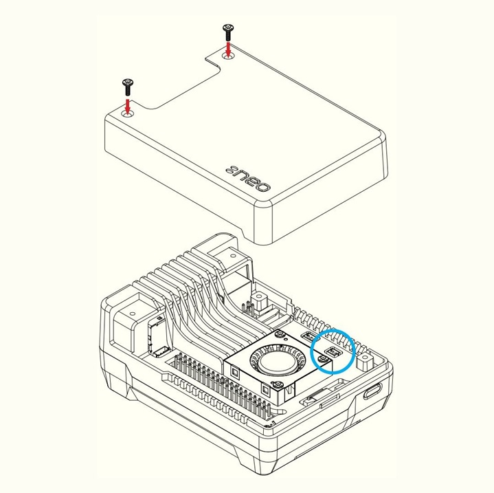
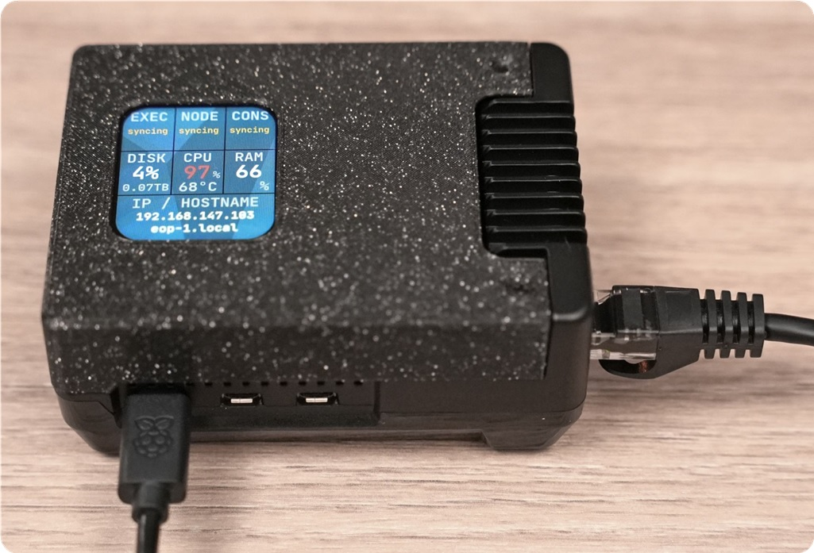

# Web3 Pi: Hardware Assembly

This assembly guide is primarily aimed at assembling the components included in the Welcome Box, but will also be useful for anyone assembling their own hardware.

⚠️ To avoid errors during the first setup, please follow the instructions precisely. ⚠️

Please also see the [video instructions](https://www.youtube.com/watch?v=-3Bj0rSCskk) for more information.

If you have a Welcome box, unpack the contents and check them against the components listed [here](../welcome-box.md).

Source of case images and assembly diagrams: [Argon Neo Manual](https://argon40.com/blogs/argon-resources/argon-neo-5-m-2-nvme-pcie-case-for-rpi-5-manual)

## Argon Neo Parts List

## Assembly Instructions

Open the Argon Neo case by removing the top cover containing the logo, and make sure you have all the parts shown in the diagram above. 

There should be a book of assembly instructions included. You can refer to this if any of the following instructions need clarifying, but please work according to this guide, since a few steps are unique to Web3 Pi.

Some parts are in two zipper bags. Open them and carefully pour out the contents. You will find:

- Screws: 5 longer and 2 shorter

- Rubber feet

- Two ribbon cables. You need one: the other is a spare.

- Either two or four thermal pads.

Pass the fan cable through the vertical gap in the case. There is a groove for the cable.

Take care when removing the Raspberry Pi from the box, and avoid thermostatic damage when handling it.

| Instructions                                                                                                                                                                                                                                                                                                                                                                                                                                                                                                                                                |                                                                                    |
| ----------------------------------------------------------------------------------------------------------------------------------------------------------------------------------------------------------------------------------------------------------------------------------------------------------------------------------------------------------------------------------------------------------------------------------------------------------------------------------------------------------------------------------------------------------- | ---------------------------------------------------------------------------------- |
| **1.** Place the thermal   pads on the CPU,  RP1,  RAM  and   PMIC chip of the  Raspberry Pi.  Make sure you remove  the protective film from  both sides.   There are different  versions of this case  on the market: - If you have 4  thermal pads,  place them in  the areas marked  in blue. - If you have 2  thermal pads,  place them on the  CPU and PMIC (bottom  left corner, near  the USB-C connector).   It doesn't matter if the pads   are larger than the chips. |    |
| **2.** Connect the NEO 5  fan to the fan  connector as shown in  the image. Please pay  attention to how the  cable is routed.  NB: There may be a  small plug inserted  in the fan connector.  Remove it.                                                                                                                                                                                                                                                                                                                       |    |
| **2a.** Diagrammatic View                                                                                                                                                                                                                                                                                                                                                                                                                                                                                                                                   |   |
| **3.** Connect the PCI  flat ribbon cable to  the Raspberry Pi 5  PCIe port. Be careful  when handling the brown  PCIe flip/cover. Pull  up the brown flip to  release the lock.  Copper side of the  strip should face the  white side of the PCI  connector of the RP5.  At this stage, don't connect   the ribbon cable to the case.                                                                                                                                                                           |    |
| **3a.** Make sure the fan  wire is secured in the  guide rail at the side  of the case                                                                                                                                                                                                                                                                                                                                                                                                                                                             |   |
| **4.**  Thread the PCIe flat ribbon   cable through the larger hole  in the case as shown in the picture. Drop the RPi 5  inside the **Argon NEO**  **5 M.2 NVMe Case**  After inserting and  pressing the RPi 5  into the central part of  the case, they will adhere  due to the stickiness of  the thermal pads. To ensure  good thermal conductivity,  do this once, and avoid  removing the RPi 5 from  this part of the case again.                                                             |    |
| **5.** Pass the ribbon cable  through the opening on the  case closer to the fan.  Pull the brown tabs open  and carefully connect  the PCIe flat ribbon cable  to the Argon Neo 5 M 2  NVMe Carrier Board case  with copper facing up.  Close the tabs.                                                                                                                                                                                                                                                                         |    |
| **6.** Insert the MicroSD  card you previously  flashed with the Web3  Pi image. The copper   contacts should facce  the board.                                                                                                                                                                                                                                                                                                                                                                                                              |    |
| **7.** Close the case and   secure the bottom  cover with 4 screws  as shown in the image.  Do not apply excessive  force to avoid stripping  or damaging the thread.                                                                                                                                                                                                                                                                                                                                                                     |    |
| **8.** The following sub-steps   describe how to connect your  M.2 NVME drive to the Argon  Neo 5 M.2 NVMe Carrier  Board. This board will accept  M.2 Key M and M.2 Key  B+M NVMe Storage Drives.                                                                                                                                                                                                                                                                                                                                        |    |
| **8a.** Remove the "THRMK  M2 Heatsink" cover by  unscrewing the four  screws at its corners. Remove the thermal pad.   Move the screw point  on the board to the  appropriate size of  your storage drive.                                                                                                                                                                                                                                                                                                                      |    |
| **8b.** Insert the NVMe  drive into the M.2  slot with the label  facing up as shown in  the picture.  Ensure the drive lies flat  in the case and tighten  the screw as shown in  the picture.                                                                                                                                                                                                                                                                                                                                  |   |
| **8c.** Mount the thermal  pad on the NVMe drive.  There is no need to  shorten it. Remember  to remove the protective  film from both sides.  Mount the metal  cover and screw it  in using four screws with conical heads.                                                                                                                                                                                                                                                                                                  |   |
| **9.** Insert the rubber feet  in the round indentations  in the bottom of the case.                                                                                                                                                                                                                                                                                                                                                                                                                                                                  |  |

**If you don't have the LCD dashboard and cover:**

| Instructions                                                                                                                    |                                                                                   |
| ------------------------------------------------------------------------------------------------------------------------------- | --------------------------------------------------------------------------------- |
| **10.** If you don't have  the optional LCD screen  and cover, then secure  the aluminium top cover  with 2 screws. |  |
| **12b.** The completed assembly  should look like this.                                                                      |  |

**If you do have the LCD dashboard and cover:**

| Instructions                                                                                                                                                                                                                                                                                                                                                                                                             |                                                                                   |
| ------------------------------------------------------------------------------------------------------------------------------------------------------------------------------------------------------------------------------------------------------------------------------------------------------------------------------------------------------------------------------------------------------------------------ | --------------------------------------------------------------------------------- |
| **13.** If you have the  optional plastic cover  with [LCD display](https://github.com/Web3-Pi/web3-pi-dashboard),  connect it instead  of the original  aluminium cover.  Please follow the  diagram for connection  instructions.  Pay attention to the  position of the cables  when mounting the cover  to ensure they don't  mechanically obstruct  the fan blades. |  |
| **13b.** The completed  assembly including  the LCD screen should  look like this.                                                                                                                                                                                                                                                                                                                              |  |

You have now completed the hardware assembly. 

## ⚠️

**Please don't turn on the power until you've connected to the network as described in the installation and monitoring guide. Web3 Pi will attempt to carry out the installation as soon as power is connected.**

## ⚠️

Installation requires the network. Syncing will begin immediately after installation, which takes about 19 hours to complete.

[Continue to Installation and Monitoring Guide](monitoring-installation.md)

[Return to Setup menu](./menu.md)

[Return to Documentation Index](../index.md)
