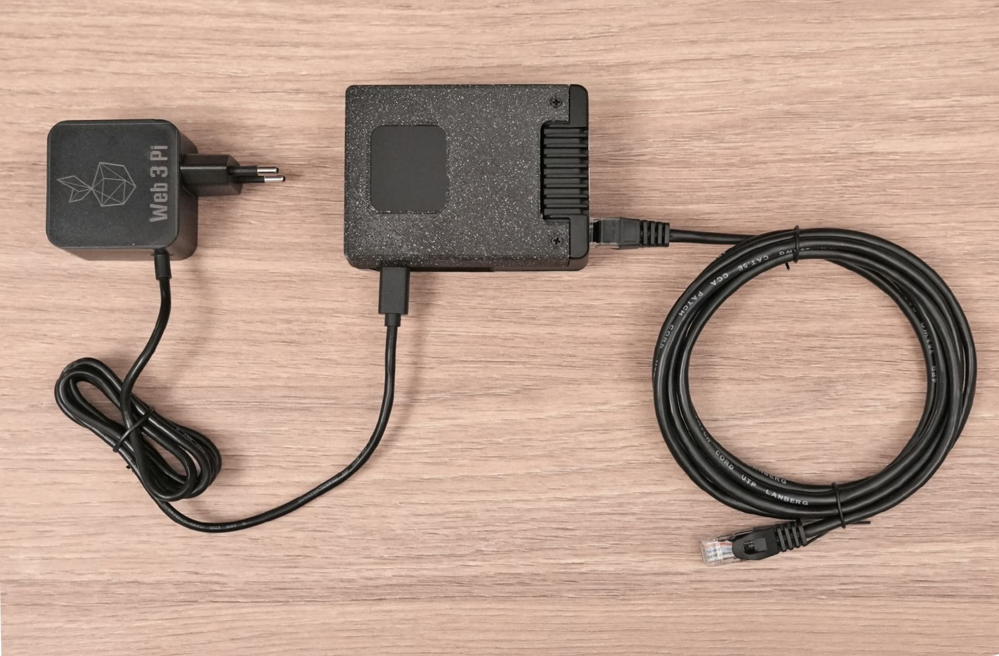

# Web3 Pi Installation Monitoring Guide

Once you have flashed the boot card and assembled the hardware, you're ready to install and activate Web3 Pi.

⚠️ To avoid errors during the first setup, please follow the instructions precisely. ⚠️

Your assembled device should look like this.

Before you connect power, make sure the ethernet cable is connected with DHCP. Internet connection is required during the installation process. 

## Connecting to the Network

Please make sure your network is set up as per the image below. Your network must include the Raspberry Pi and a control PC, which you will use to monitor the installation process.


## Pre-installation Checklist

- Ensure your Raspberry Pi has active cooling and at least 2 TB SSD storage

- Make sure the SD card you flashed with the Web3 Pi software is inserted into the device

- Make sure the device is protected against power surges with a UPS

- Connect the Raspberry Pi using Ethernet cables to your network, and ensure the network is connected to the Internet.

## Installation

Installation will begin automatically as soon as you connect the power cable. The actual installation should take about 15 minutes, depending on the speed of your Internet connection.

After the installation, the software will proceed to sync with the Ethereum network, which takes about 19 hours.

Please don't unplug the power until this process is complete.

You can monitor the installation from your control PC as detailed below.

## Monitoring the Installation

A few minutes after the process begins, Web3 Pi will make available a monitoring dashboard at the network address http://eop-1.local assuming you used the hostname eop-1 when you flashed the SD card. Otherwise, use the hostname you provided.

This is an HTTP server running at Port 80 on the Raspberry Pi.

**If the page is not available at any time, keep refreshing: the installation goes through several stages and the page will sometimes not be online.**

The page will look like this:


The page contains:

- The installation stage

- The hostname and IP address of the device

- The full installation log

- Uptime

- A link to the Grafana dashboard and a JSON status file

The installation is divided into stages.


The installation is complete when you see: "STAGE 100: Installation completed.


At this point, the software is installed, and it then begins syncing the node. You can monitor the sync process using the Grafana dashboard.

### Grafana Monitoring

To access Grafana, click the link labeled 'Grafana Monitoring' in the page shown above.

If the installation was successful, you should see the login panel as shown below. 

The default username is 'admin', and the password is 'admin'. You will be
required to change the password upon first login.


You'll then see the Grafana dashboard as shown below.


You can access this dashboard on [http://eop-1.local:3000](http://eop-1.local:3000) (or the hostname you configured) at any time to monitor the status of your node.

You will see the node status and the status of each client near the top on the left.

While the node is syncing, **pay attention to the status of the consensus and execution clients. Initially, both will be 'inactive'.**

Next, the execution client will change to 'waiting', then both will transition to the 'syncing' state.


At this point, the blockchain synchronization process has begun, and will take approximately 19 hours.

The CPU load will increase until it reaches its maximum possible value. Disk usage will grow to around 1.2TB.

When syncing has completed, the Grafana status will look like this:


You'll notice that both the execution and the consensus client have turned green.

You'll now be able to use SSH to access the Raspberry Pi on `<hostname>.local`, for example `eop-1.local`. You can also use the IP address if you know it.

The username will be **ethereum**. Initially, the password will also be **ethereum**, but you'll be required to change it when you fist log in. 

The password should be treated as highly confidential, since it will allow access to an ethereum node. Keep it safe, as you won't be able to access the node without it.

If you're using PuTTY, you'd configure it as shown in the image below.


### Network Configuration Verification

To check that the network is working correctly, SSH into the Rasberry Pi and run a `ping` command:

```
ping -c 4 google.com
```

You should see the following response:

```
PING google.com (142.250.186.206) 56(84) bytes of data.
64 bytes from waw07s05-in-f14.1e100.net (142.250.186.206): icmp_seq=1 ttl=59 time=2.83 ms
64 bytes from waw07s05-in-f14.1e100.net (142.250.186.206): icmp_seq=2 ttl=59 time=3.62 ms
64 bytes from waw07s05-in-f14.1e100.net (142.250.186.206): icmp_seq=3 ttl=59 time=2.23 ms
64 bytes from waw07s05-in-f14.1e100.net (142.250.186.206): icmp_seq=4 ttl=59 time=3.73 ms

--- google.com ping statistics ---
4 packets transmitted, 4 received, 0% packet loss, time 3005ms
rtt min/avg/max/mdev = 2.229/3.102/3.734/0.614 ms
```

You now have a fully operational Ethereum node running Geth and Nimbus.

For more information on managing, configuring and troubleshooting your node, please refer to the [Managing Your Node](../managing/menu.md) menu.

You may like to look into also running the Web3 Pi Reverse Proxy: https://docs.proxy.web3pi.io/


[Return to Menu](./menu.md)

[Return to Main Index](../index.md)
