## Web 3 Pi: Flashing the Boot Card: Dual Device Node

In this step, you'll create boot cards for two Raspberry Pis containing the Web3 Pi software for:

- The Consensus Client;
- The Execution Client.

Web3 Pi provides separate images for the Execution Client and the Consensus Client. Each contains a preconfigured Linux distribution. The Execution Client will run Geth, whereas the Consensus Client offers the choice of running Nimbus or Lighthouse.

You can use a Linux, Mac or Windows PC to flash the boot card using a USB SD Card Reader/Writer.

On Linux and MacOS, you'll use the official Raspberry Pi imager to flash the card. There is a Web 3 Pi imager available for Windows.

⚠️ To avoid errors during the first setup, please follow the instructions precisely. ⚠️

## Index

[Instructions for Linux and MacOS](#linux-and-macos)

[Instructions for Windows](#windows)

[Initial Configuration (Optional)](#initial-configuration)

[Back to Menu](./menu.md)

## Linux and MacOS

You'll need to download:

- The [Raspberry Pi Imager](https://www.raspberrypi.com/software/) from the official Raspberry site, choosing the version for the operating system you're working on;

- The two Web3 Pi images from the latest release of the [Github Repository](https://github.com/Web3-Pi/Ethereum-On-Raspberry-Pi/releases/latest).
  
  - For Linux, download both:
    
    - The **Web3Pi_Dual_Devices_Execution** .img
    - The **Web3Pi_Dual_Devices_Consensus** .img
  
  - For download both:
    
    - The **Web3Pi_Dual_Devices_Execution** .dmg
    - The **Web3Pi_Dual_Devices_Consensus** .dmg

### Writing the Images: Linux and MacOS

You'll need two microSD cards and a reader/writer. Connect the reader to your PC. You may need a microSD to SD adaptor.

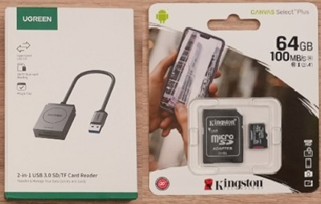

For each of the files you downloaded (Consensus and Execution Client), follow the instructions below, paying attention to the different configuration settings provided for each image.

1. Open the Raspberry Pi Imager on your PC, and insert a blank microSD card in the reader.

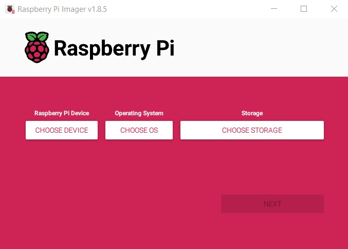

2. Select 'Choose Device'. Select your device type from the list.

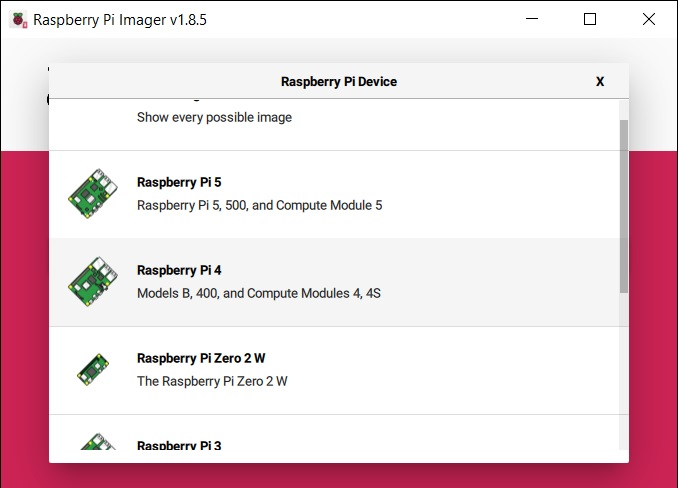

3. Select 'Choose OS' and scroll down to 'Custom Image' at the bottom. This will open a file chooser, so you can browse to the Web 3 Pi image you downloaded, and select it.

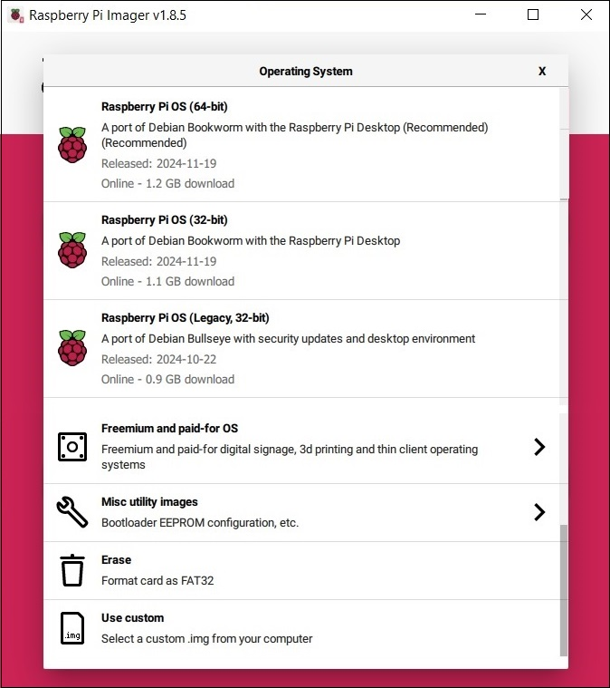

For the first card, choose the Execution Client that you downloaded. For the second card, choose the Consensus Client.

4. Select 'Choose Storage'. This shows a list of removable devices available. Provided your SD Card reader/writer is mounted, you will be able to select it.

!!! note

    Warning: All data on the device you select will be overwritten. Make sure you choose the right device. Always check the storage capacity, which should be either 32GB or 64GB for the microSD card

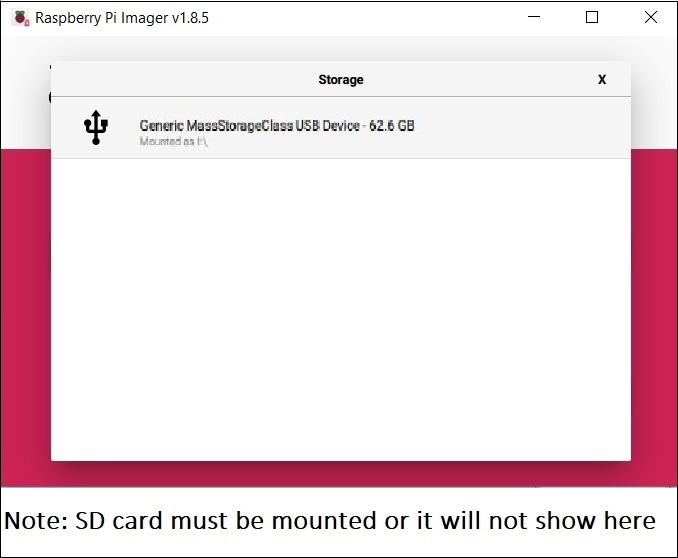

5. Click 'Next'. You'll see a pop-up dialog box as shown below. Choose 'Edit Settings.'

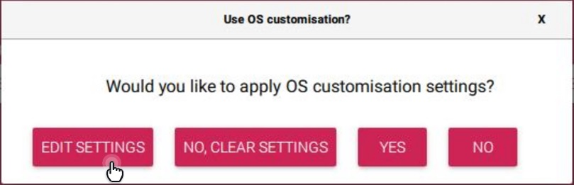

6. You'll next see the settings dialog box as shown in the expanded image below.

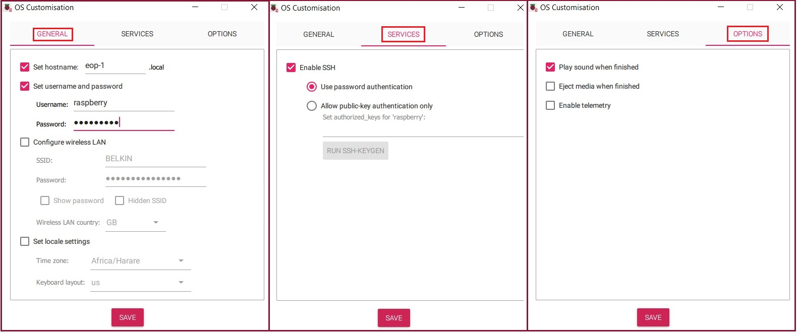

Edit the settings as follows:

On the **General** tab:

- Hostname: We suggest using eop-exec for the execution client and eop-consensus for the consensus client. If you choose different host names, they must be unique within your network, and you will need to keep a note of them in a safe place.

- Set the user name and password to 'raspberry'. The Web3 Pi software expects these settings, and won't work if you use something different. **Note:** After installation, this username and password will be changed to 'ethereum'.

- Unless you will be connecting via wireless LAN, leave the Wireless LAN settings unchecked. We strongly advise using Ethernet cables with DHCP rather than wireless LAN, which can be unreliable.

- Check that your locale settings are correct.

On the **Services** tab:

- Tick 'Enable SSH' and 'Use Password Authentication'.

On the **Options** tab:

- Ensure 'Eject Media when Finished' and 'Enable Telemetry' are unchecked. The reason you don't want to eject the media when finished is because you may need to edit the configuration file after you've flashed the card.

Click 'Save' to continue to the next step.

7. You'll be returned to the dialog box below. Click 'Yes'.


8. You're now ready to write to the SD card. If you're sure all your options are correct, and the SD card can be overwritten, click 'Yes' in the dialog box below.

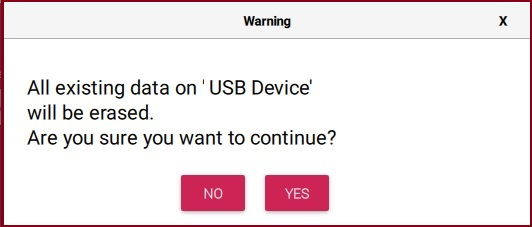

9. The imager will then begin flashing, then verifying the card. Don't interrupt this process at any stage. It may take some time, depending on the speed of your SD Card Reader/Writer. When it's finished, you'll see the dialog box below. Click 'Continue' to finish the program.

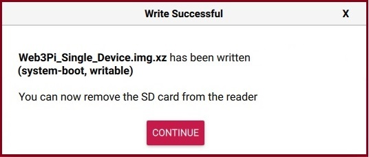

10. For advanced users, you can, if you wish, [adjust the configuration](#initial-configuration) file as needed.

11. Remove the card from the reader.

Once you've followed these instructions for both cards, your boot cards will have been created successfully.

For more information on the Rasberry Pi imager, visit the Raspberry Pi [official documentation](https://www.raspberrypi.com/documentation/computers/getting-started.html#raspberry-pi-imager).

You can now proceed with the installation as described in the [Installation Guide](./monitoring-installation-dual.md).

[Back to Index](#index)

## Windows

Download the Web 3 Pi Imager from our [webpage](https://www.web3pi.io/products/imager)

### Writing the Image: Windows

1. You'll need the microSD card and reader. Connect the reader to your PC: you may need a microSD to SD adaptor. Insert the card in the reader.


2. Open the Web3 Pi Imager on your PC and choose 'Dual Mode Device'.

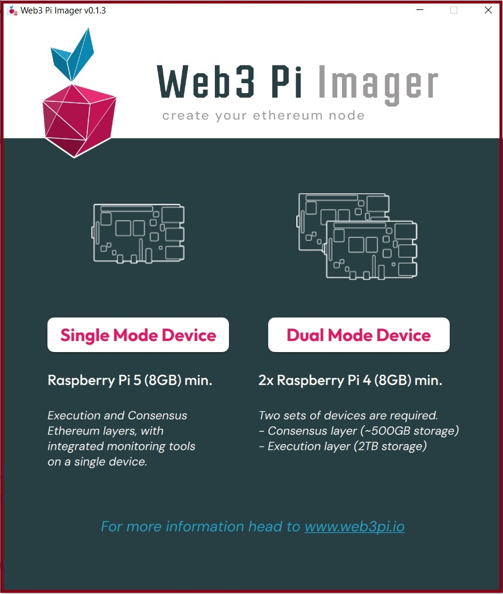

3. Next you'll be asked for some configuration details:

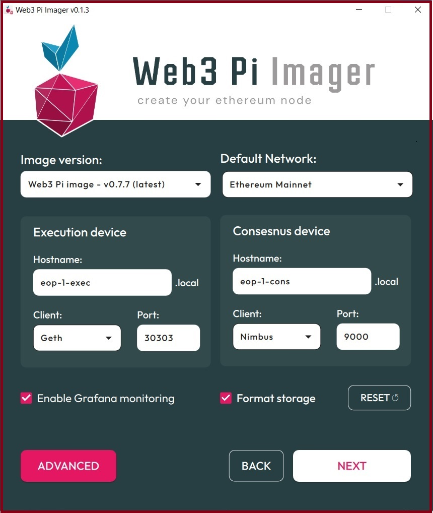

Normally, you wouldn't need to change these, unless you're an advanced user with specific goals in mind.

The settings are:

- Image version: The version of Web3 Pi that you want to install.
- Default network: The Ethereum network you want to connect your node to. Mainnet is the live Ethereum network; the others are test networks.
- Execution Device:
  - Hostname: If you change this, please keep a note of this setting as you will need it for monitoring the node
  - Client: You would leave this set to Geth
  - Port: You wouldn't usually change this
- Consensus Device:
  - Hostname: If you change this, please keep a note of this setting as you will need it for monitoring the node
  - Client: You have a choice between Nimbus and Lighthouse. Nimbus is a lightweight client better suited to the Raspberry Pi.
  - Port: You wouldn't usually change this.
- Enable Grafana: Grafana is used to display analytics. It should be enabled.
- Format storage: This should be enabled.

Optionaly, you can click 'Advanced' to change more settings as shown in the image below. If you're using WLAN, you'd need to enter your connection details here. **Note**: WLAN is not recommended. Ethernet is more stable and less prone to issues.

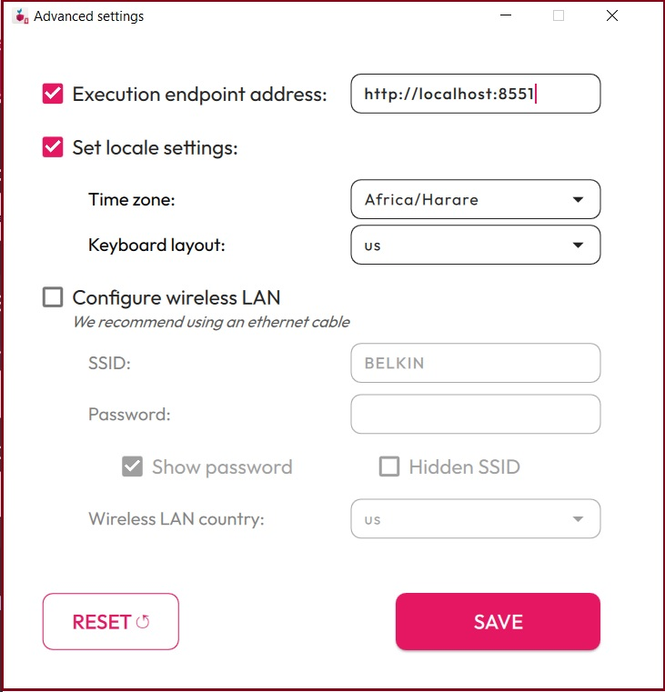

When done, click 'Save'. Click 'Next' on the main settings screen. 

4. You'll see a list of removable devices available on your PC. Provided your SD Card reader/writer is mounted, you will be able click it to select it. Make sure the SD card for the Execution Client is in the reader.

!!! note

    Warning: All data on the device you select will be overwritten. Make sure you choose the right device. Always check the storage capacity, which should be either 32GB or 64GB for the microSD card


5. You're now ready to write to the SD card. If you're sure all your options are correct, and the SD card can be overwritten, click 'Yes' in the dialog box below.

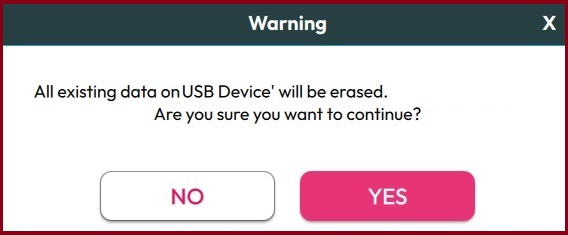

6. The imager will begin flashing and verifying your card, showing the progress screen below. Please don't interrupt this process.

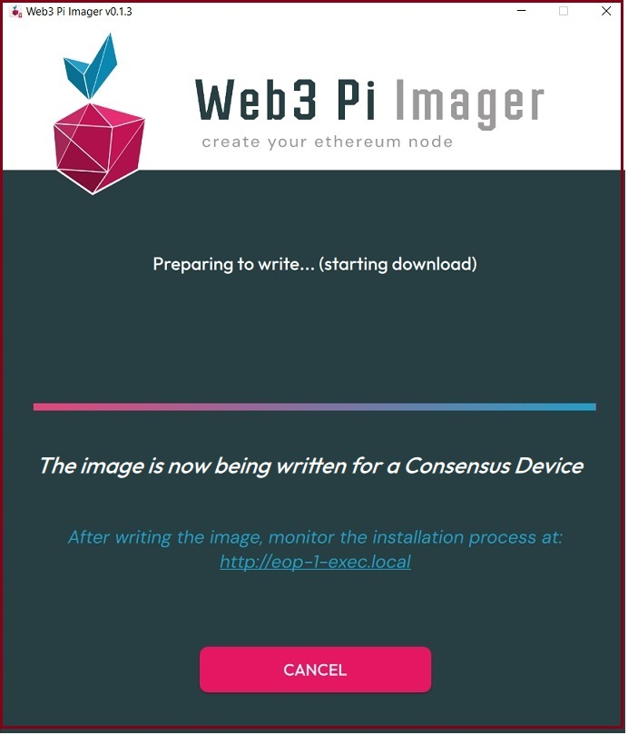

7. When it's finished, you'll see the dialog box below. Remove the SD card, and insert the card for the Consensus Client before clicking 'Next'.

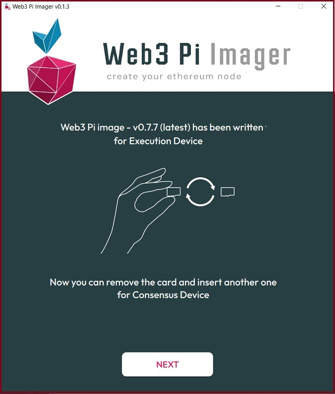

8. You will then be asked to select the storage device for writing the Consensus Client, as per the screen below.

!!! note

    Warning: All data on the device you select will be overwritten. Make sure you choose the right device. Always check the storage capacity, which should be either 32GB or 64GB for the microSD card

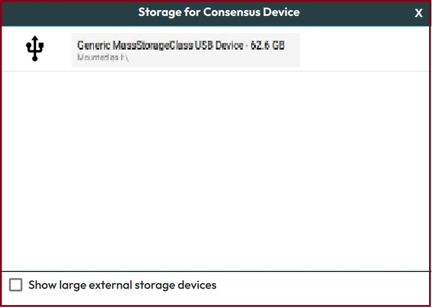

9. You're now ready to write to the SD card. If you're sure all your options are correct, and the SD card can be overwritten, click 'Yes' in the dialog box below.


10. The imager will then begin flashing, then verifying, the card. Don't interrupt this process at any stage. It may take some time, depending on the speed of your SD Card Reader/Writer. The screen will show progress as per the image below.


11. When it's finished, you'll see the dialog box below. Remove the SD card and click 'Next'.

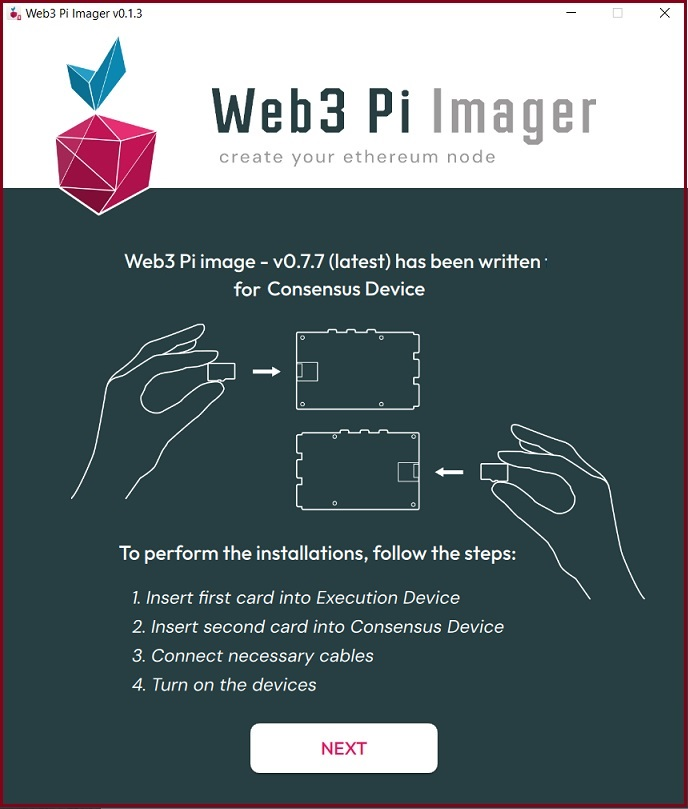

12. Finally, you'll see the dialog box shown in the image. Click 'Finish'.

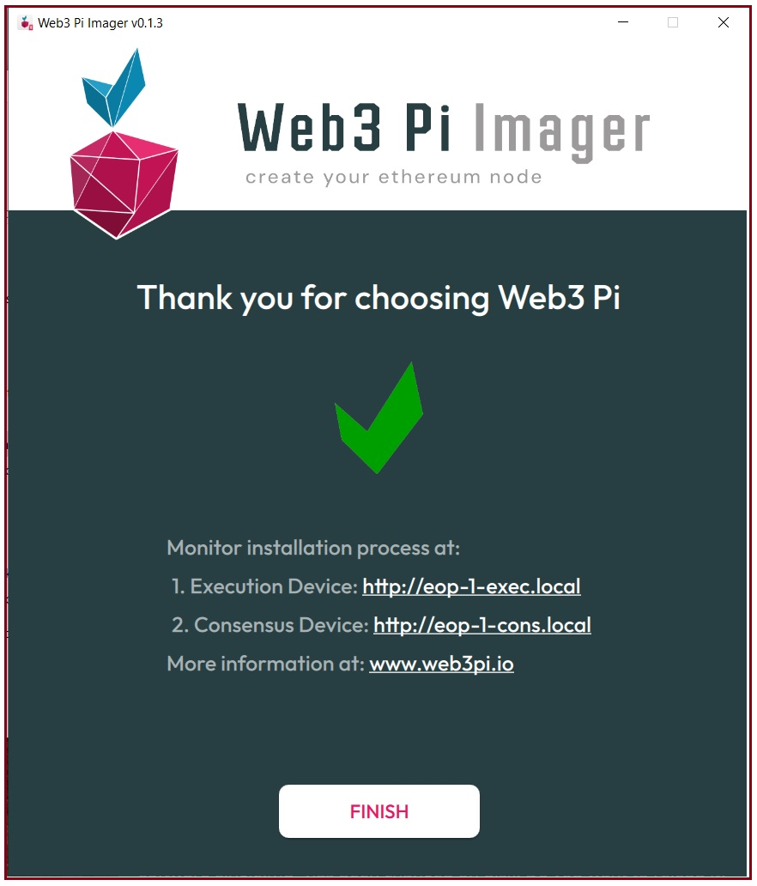

Your boot cards have now been created successfully.

**Note: Windows may attempt to open the drive at this point. If so, it will, in fact, try to open two drives, since the card now has two partitions. It won't recognize the formatting on the second partition, and will request to format it. Cancel this request!**

You can now follow the [Installation Guide](./monitoring-installation-dual.md) to install Web3 Pi on the two machines.

[Back to Index](#index)

## Initial Configuration

Web3 Pi is preconfigured with working settings. However, users with a good understanding of Ethereum nodes and software configuration may like to adjust the configuration before installation.

The imager creates a `config.txt` file. Once your boot card has been created, and before you eject the media, you can edit this with any text editor.

After writing the image to the SD card, there will be two partitions on the card:

- `boot` - this is `FAT32` and will be visible from Windows, Mac and Linux

- `root` - this is `exFAT`. This should be visible in Linux.

The `config.txt` will be in the `boot` partition. This is, in fact, the Raspberry Pi configuration, but Web3 Pi adds its own sections to it.

The sections relevant to Web3 Pi look like this:

```sh
# Web3 Pi config - single node
[web3pi]
geth=true
nimbus=true
lighthouse=false

# Monitoring
influxdb=true
grafana=true
bsm=true
bnm=true

#Execution endpoint address
exec_url=http://localhost:8551

# Ethereum network: mainnet/holesky/sepolia
eth_network=mainnet

[geth]
geth_port=30303

[nimbus]
nimbus_port=9000

[lighthouse]
lighthouse_port=9000

# End of Web3 Pi config
```

Here you can choose which services will automatically start during boot.

**true** = service enabled

**false** = service disabled

Any other value, or absent parameter, will leave the defaults unchanged.

The services are:

- **geth**: The execution client. This should always run on single device nodes.

- **nimbus**: A lightweight consensus client. Either Nimbus or Lighthouse but not both must run on single device nodes. Nimbus is more suitable then Lighthouse for small devices such as the Raspberry Pi.

- **lighthouse**: A popular consensus client. If you have a specific preference for it, you can enable it instead of Nimbus.

- **influxdb**: A lightweight database used to store diagnostics etc. This should always be running.

- **grafana**: A comprehensive tool that allows you to monitor your node's status and performance.

- **bsm**: The [Basic System Monitor](https://github.com/Web3-Pi/basic-system-monitor) that makes available operating system diagnostics such as temperature and CPU/RAM usage.

- **bnm**: The [Basic Node Monitor](https://github.com/Web3-Pi/basic-eth2-node-monitor) writes node monitoring information to the Influx database for use by Grafana.

Optionally, the file may contain a setting that specifies the Ethereum network that the software will connect to. If this line doesn't exist, the default is Ethereum **mainnet.**

If you wish to connect to one of the test networks, you can add or amend these lines accordingly:

```
# Ethereum network: mainnet/holesky/sepolia
eth_network=sepolia
```

The file also configures the ports for the various services. It's not recommended to change these.

For more information, see the [Configuration Guide](../managing/configuration.md).

[Back to Index](#index)
