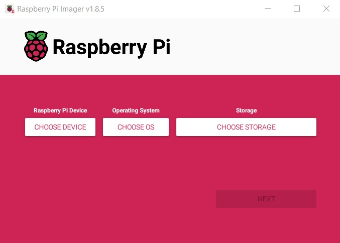
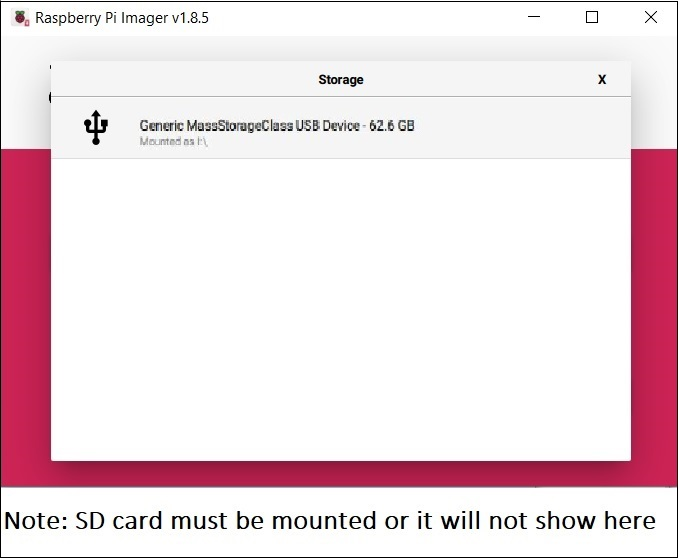
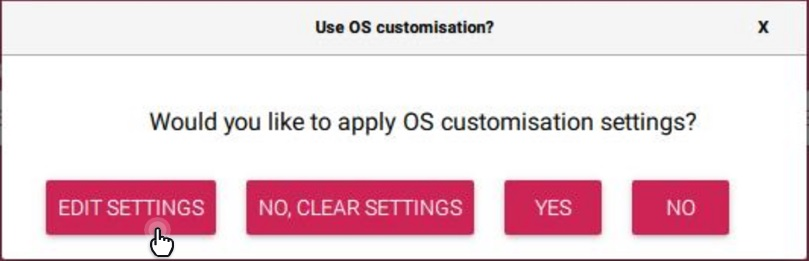
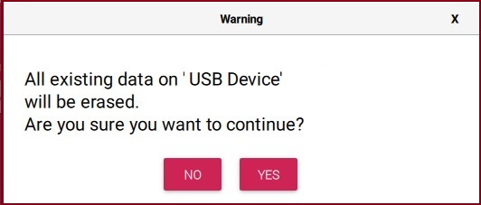
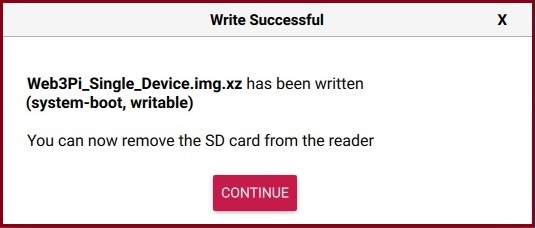
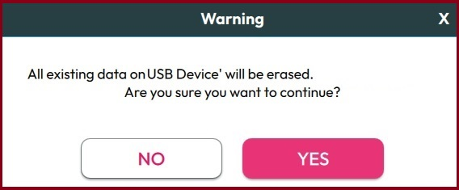

# Web 3 Pi: Flashing the Boot Card: Single Device Node

To create a boot card, you'll use the Web3 Pi image, which contains a preconfigured Linux distribution capable of running an **Ethereum Node**.

You can use a Linux, Mac or Windows PC to flash the boot card using a USB SD Card Reader/Writer.

On Linux and MacOS, you'll use the official Raspberry Pi imager to flash the card. There is a Web 3 Pi imager available for Windows.

## Index

[Instructions for Linux and MacOS](#linux-and-macos)

[Instructions for Windows](#windows)

[Initial Configuration (Optional)](#initial-configuration)

[Back to Menu](./menu.md)

## Linux and MacOS

You'll need to download:

- The [Raspberry Pi Imager](https://www.raspberrypi.com/software/) from the official Raspberry site, choosing the version for the operating system you're working on;

- The Web3 Pi image from the latest release of the  [Github Repository](https://github.com/Web3-Pi/Ethereum-On-Raspberry-Pi/releases/latest).
  
  - For Linux, choose the **single device** .img download.
  
  - For MacOs, choose the **single device** .dmg download.

### Writing the Image: Linux and MacOS

1. You'll need the microSD card and reader. Connect the reader to your PC: you may need a microSD to SD adaptor. Insert the card in the reader.


2. Open the Raspberry Pi Imager on your PC. 



3. Select 'Choose Device'. Select your device type from the list. If you have the Welcome Box, the device will be Raspberry Pi 5.


Select 'Choose OS' and scroll down to 'Custom Image' at the bottom. This will open a file chooser, so you can browse to the Web 3 Pi image you downloaded, and select it.


4. Select 'Choose Storage'. This shows a list of removable devices available. Provided your SD Card reader/writer is mounted, you will be able to select it.



5. Click 'Next'. You'll see a pop-up dialog box as shown below. Choose 'Edit Settings.'



6. You'll next see the settings dialog box as shown in the expanded image below.


Edit the settings as follows:

On the **General** tab:

- Hostname: We suggest using eop-1. If you choose another host name, it must be unique within your network, and you will need to keep a note of it in a safe place.

- Set the user name and password to 'raspberry'. The Web3 Pi software expects these settings, and won't work if you use something different.

- Unless you will be connecting via wireless LAN, leave the Wireless LAN settings unchecked. We strongly advise using Ethernet cables with DHCP rather than wireless LAN, which can be unreliable.

- Check that your locale settings are correct.

On the **Services** tab:

- Tick 'Enable SSH' and 'Use Password Authentication'. 

On the **Options** tab:

- Ensure 'Eject Media when Finished' and 'Enable Telemetry' are unchecked. The reason you don't want to eject the media when finished is because you will need to check the configuration file after you've flashed the card.

Click 'Save' to continue to the next step.

7. You'll be returned to the dialog box below. Click 'Yes'.


8. You're now ready to write to the SD card. If you're sure all your options are correct, and the SD card can be overwritten, click 'Yes' in the dialog box below.



9. The imager will then begin flashing, then verifying the card. Don't interrupt this process at any stage. It may take some time, depending on the speed of your SD Card Reader/Writer. If you haven't already assembled your hardware, you can do this while you're waiting. When it's finished, you'll see the dialog box below. Click 'Continue' to finish the program.



Your boot card has now been created successfully. 

For more information on the Rasberry Pi imager, visit the Raspberry Pi [official documentation](https://www.raspberrypi.com/documentation/computers/getting-started.html#raspberry-pi-imager).

Advanced users may wish to make [initial configuration changes](#initial-configuration) before ejecting the boot card.

Once your hardware has been assembled, you can proceed with the installation.

[Back to Index](#index)

## Windows

Download the Web 3 Pi Imager from the latest release of the [Github Repository]([Release Web3 Pi image - v0.7.6 · Web3-Pi/Ethereum-On-Raspberry-Pi · GitHub](https://github.com/Web3-Pi/Ethereum-On-Raspberry-Pi/releases/latest).

### Writing the Image: Windows

1. You'll need the microSD card and reader. Connect the reader to your PC: you may need a microSD to SD adaptor. Insert the card in the reader.


2. Open the Web3 Pi Imager on your PC and choose 'Single Mode Device'. 

Next you'll be asked for some configuration details:


Normally, you'd leave these settings unchanged, unless you're an advanced user creating an image to specific specs.

If you change the hostname, please keep a note of it safely, as you'll use this later to access the Raspberry Pi after installation.

The 'Advanced' button shows more options that you wouldnt normally change:


If you plan to connect via Wifi, you would use this screen to configure your wireless LAN before clicking 'Save'. This is not recommended: Ethernet cable connections are less likely to result in performance issues later.

Click 'Next' from the main configuration screen.

4. Next, you'll see a list of removable devices available on your PC. Provided your SD Card reader/writer is mounted, you will be able click it to select it.


5. You're now ready to write to the SD card. If you're sure all your options are correct, and the SD card can be overwritten, click 'Yes' in the dialog box below.



6. The imager will then begin flashing, then verifying, the card. Don't interrupt this process at any stage. It may take some time, depending on the speed of your SD Card Reader/Writer. If you haven't already assembled your hardware, you can do this while you're waiting. The screen will show progress as per the image below.


7. When it's finished, you'll see the dialog box below. Click 'Continue' to finish the program.


Your boot card has now been created successfully. 

Once your hardware has been assembled, you can proceed with the installation.

[Back to Index](#index)

## Initial Configuration

Web3 Pi is preconfigured with working settings. However, users with a good understanding of Ethereum nodes and software configuration may like to adjust the configuration before installation.

Web3 Pi image uses the classic `boot/firmware/config.txt` as its **config** file. Once your boot card has been created, and before you eject the media, you can edit this with any text editor.

After writing the image to the SD card, you should see a new drive in your PC. You will find the `config.txt` file in this drive. This is, in fact, the Raspberry Pi configuration, but Web3 Pi adds its own sections to it.

The sections relevant to Web3 Pi look like this:

```sh
# Web3 Pi config - single node
[web3pi]
geth=true
nimbus=true
lighthouse=false

# Monitoring
influxdb=true
grafana=true
bsm=true
bnm=true

#Execution endpoint address
exec_url=http://localhost:8551

[geth]
geth_port=30303

[nimbus]
nimbus_port=9000

[lighthouse]
lighthouse_port=9000

# End of Web3 Pi config
```

Here you can choose which services will automatically start during boot.

**true** = service enabled 

**false** = service disabled

Any other value, or absent parameter, will leave the defaults unchanged.

The services are:

- **geth**: The execution client. This should always run on single device nodes.

- **nimbus**: A lightweight consensus client. Either Nimbus or Lighthouse but not both must run on single device nodes. Nimbus is more suitable then Lighthouse for small devices such as the Raspberry Pi.

- **lighthouse**: A popular consensus client. If you have a specific preference for it, you can enable it instead of Nimbus.

- **influxdb**: A lightweight database used to store diagnostics etc. This should always be running.

- **grafana**: A comprehensive tool that allows you to monitor your node's status and performance.

- **bsm**: The [Basic System Monitor](https://github.com/Web3-Pi/basic-system-monitor) that makes available operating system diagnostics such as temperature and CPU/RAM usage.

- **bnm**: The [Basic Node Monitor](https://github.com/Web3-Pi/basic-eth2-node-monitor) writes node monitoring information to the Influx database for use by Grafana.

The file also configures the ports for the various services. It's not recommended to change these.

For more information, see the [Configuration Guide](../managing/configuration.md).

[Back to Index](#index)