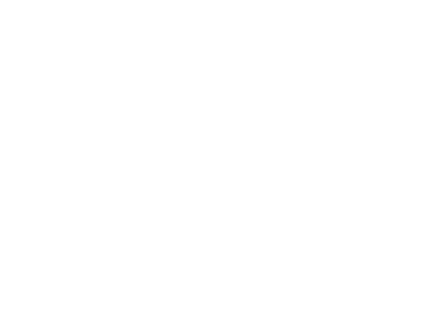

---
hide:
  - navigation
  - toc
---

    

        <h1 class="title">Web3 Pi</h1>
        Your Ethereum Node on Raspberry Pi.
        <a href="/prerequisites" class="md-button md-button--primary">
            Get started
        </a>
    

    

<!-- prettier-ignore-start -->

## Learn

Learn more about the Web3 Pi project and benefits of running an Ethereum node on a Raspberry Pi.

-   :fontawesome-solid-book: __Before You Begin__

    ---
    Essential information before starting your Web3 Pi journey

    [:fontawesome-solid-arrow-right: Before you start](before.md)

## Setup & Configuration

Get started with running your very own Ethereum node on a Raspberry Pi.

-   :fontawesome-solid-microchip: __Prerequisites__

    ---
    Hardware and software requirements to run an Ethereum node

    [:fontawesome-solid-arrow-right: Prerequisites](prerequisites.md)

-   :fontawesome-solid-box-open: __Welcome Box__

    ---
    Get all the required hardware in one beginner friendly package

    [:fontawesome-solid-arrow-right: The Welcome Box](welcome-box.md)

-   :fontawesome-solid-terminal: __Configuration__

    ---
    Complete setup guides and connection instructions

    [:fontawesome-solid-arrow-right: Setup guide](full-setup/menu.md)

-   :fontawesome-solid-network-wired: __Connecting to Ethereum__

    ---
    Learn how to connect to Ethereum and sync your node

    [:fontawesome-solid-arrow-right: Connecting to Ethereum](connect-ethereum.md)

## Maintenance & Management

Tips and tricks to keep your node running smoothly.

-   :fontawesome-solid-server: __Node Management__

    ---
    Learn how to manage and maintain your node

    [:fontawesome-solid-arrow-right: Managing your node](managing/menu.md)

<!-- prettier-ignore-end -->
