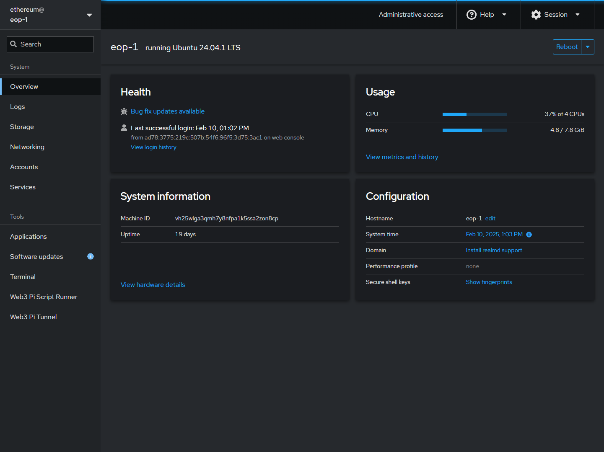

# Cockpit Dashboard

## What is Cockpit?

Web3 Pi comes with [**Cockpit**](https://cockpit-project.org/) pre-installed. Cockpit is a free, open-source, web-based graphical interface for servers and Linux systems. It allows you to monitor and administer your Raspberry Pi's underlying operating system (Ubuntu) directly from your web browser.

Think of it as a user-friendly dashboard for managing the system itself.

## What Can You Do with Cockpit on Web3 Pi?

While Grafana dashboards focus specifically on monitoring your Ethereum node clients (EL/CL), Cockpit focuses on the **operating system** level. Common uses include:

- Checking CPU, RAM, and network usage trends.
- Viewing available disk space on your system drive and attached USB drive.
- Inspecting system logs (`journald`).
- Checking the status of system services (be cautious about stopping essential services!).
- Viewing network interface configurations.

## How to Access Cockpit

1.  Find the **IP address** or **hostname** of your Raspberry Pi.
    - [How to find your node's IP address or hostname](../../support/cheatsheet.md#how-to-find-your-nodes-ip-address-or-hostname)
2.  Navigate to `http://<your-pi-ip-address>:9090` (replace `<your-pi-ip-address>` with the actual IP address or hostname).
3.  You may see a security warning because Cockpit uses a self-signed SSL certificate by default. It's safe to proceed (usually under an "Advanced" or "Proceed anyway" option).
4.  Log in using the username `ethereum` and password you selected. If this is your first time accessing your Web3 Pi, use the default password. You will be required to change the password upon first login.

!!! note

    The default password is `ethereum`. Change it as soon as possible to prevent unauthorized access.

Now you can explore the Cockpit interface and monitor your Web3 Pi's system health!

## Official Web3 Pi Plugins

The Web3 Pi project maintains a number of official plugins for Cockpit.

- [Web3 Pi Updater](web3-pi-updater.md) - Manages Web3 Pi and Ethereum packages.
- [Web3 Pi Link](web3-pi-link.md) - Allows you to expose your Ethereum node (and more) to the internet.
- [Script Runner](web3-pi-script-runner.md) - Allows you to run pre-installed scripts on your Web3 Pi.
- [Basic Ethereum Node Monitor](../../monitoring/grafana.md) - Monitors your Ethereum node (EL/CL) and pushes data to InfluxDB.
- [Basic System Monitor](../../monitoring/system-monitor.md) - Exposes a simple HTTP API for monitoring your Web3 Pi.
- [LCD Dashboard](../../monitoring/lcd.md) - Adds an LCD display to your Web3 Pi.
- [Installation Status](../../monitoring/installation-monitor.md) - Provides a comprehensive overview of your Web3 Pi installation.
