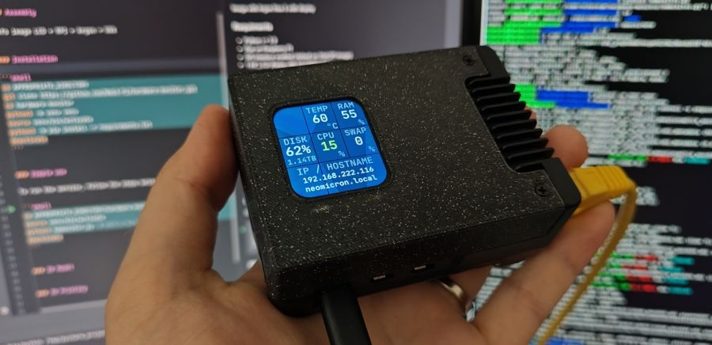

## Web3 Pi: LCD Dashboard

To add an LCD dashboard to your Raspberry Pi, you will need:

- A dashboard cover for mounting;

- A suitable LCD display;

- Software to run the LCD.

## Dashboard Cover

The Web3 Pi LCD Dashboard project offers a suitable cover available for 3D printing.

This is designed for installation of a colorful LCD in the Argon Neo 5 enclosure. We have designed our own 3D model of the enclosure cover with a space for the display. The assembly is simple, using snap-fits, with no tools required. The models are open-source, so anyone can print them on a 3D printer. The source code is also open-source, allowing users to add new functionalities, customize it to their needs, or add support for new displays.

For more information, see [Web 3 Pi Dashboard](https://github.com/Web3-Pi/web3-pi-dashboard) documentation.

## LCD Display

The LCD display should be 1.69" with ST7789V2 Driver. Suitable models are:

- Waveshare 24382 - [See product page](https://www.waveshare.com/1.69inch-lcd-module.htm)

- Seeed Studio 104990802 - [See product page](https://www.seeedstudio.com/1-69inch-240-280-Resolution-IPS-LCD-Display-Module-p-5755.html)

## Software

The software is included in the Web3 Pi image, and can also be downloaded separately from the [Web 3 Pi Dashboard Project](https://github.com/Web3-Pi/web3-pi-dashboard).
