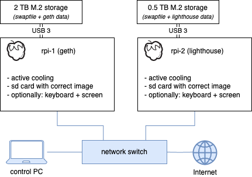
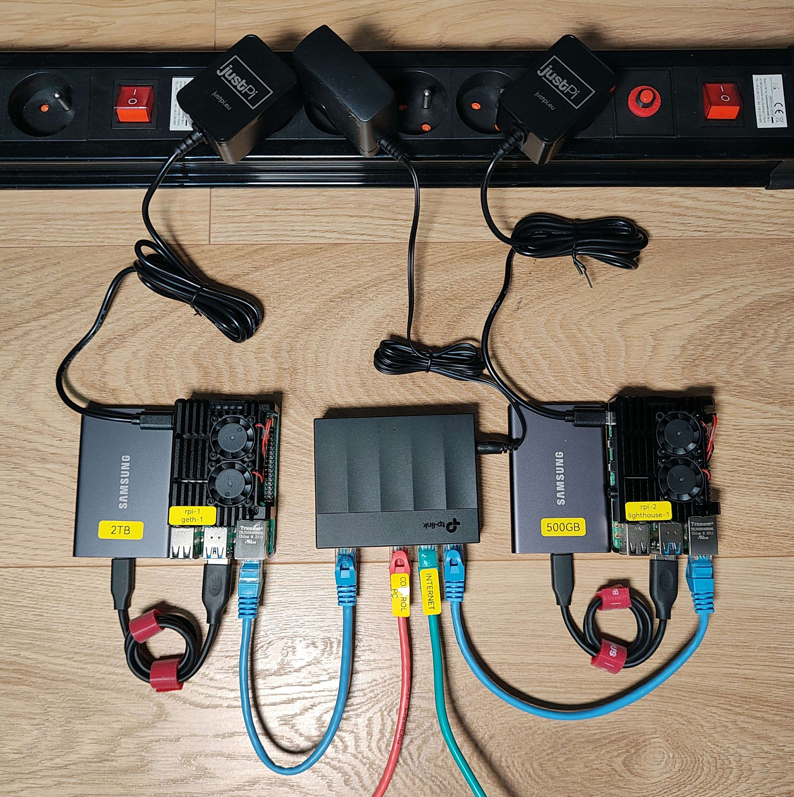

# Web3 Pi: Hardware Assembly (Dual-Device Mode)

Assembling the hardware for a dual-device Web3 Pi node involves building **two separate Raspberry Pi systems**: one designated as the **Execution Layer (EL) Node** and the other as the **Consensus Layer (CL) Node**.

While the assembly steps for _each individual device_ are identical to the [Single-Device Hardware Assembly Guide](../single-mode/hardware-assembly.md), managing two builds requires careful attention, especially regarding component placement (SSDs) and labeling.

!!! warning "Follow Instructions Carefully"

    Read through these instructions and the single-device guide before starting. Ensure you have all components for **both** devices laid out and organized.

## Before You Start

1.  **Gather Components:** Ensure you have all the necessary hardware components for **two complete Raspberry Pi setups** as outlined in the [Dual-Device Hardware Checklist](./hardware-checklist.md) and [Recommendations](./hardware-recommendations.md). This includes two Pis, two power supplies, two enclosures/cooling solutions, two microSD cards, and two SSDs (one 2TB+, one 256GB+).
2.  **Prepare SD Cards:** You should have already flashed **two separate microSD cards** using the Web3 Pi Imager in Dual-Device mode – one configured for the EL node and one for the CL node. Keep them clearly identifiable.
3.  **Reference Guide:** Keep the [Single-Device Hardware Assembly Guide](../single-mode/hardware-assembly.md) open in another tab or window. You will follow those detailed steps _twice_, once for each device.

## Assembly Steps

### Step 1: Decide and Label Your Devices (Crucial!)

Before assembling anything, decide which Raspberry Pi will be your EL Node and which will be your CL Node.

!!! danger "Label Everything Clearly"

     Use sticky notes, labels, or markers to clearly label each Raspberry Pi board, enclosure/case, and the corresponding EL and CL microSD cards.
    This labeling will prevent you from inserting the wrong SD card or SSD into the wrong device.

### Step 2: Assemble the Execution Layer (EL) Node

1.  Take the Raspberry Pi and enclosure you designated as the **EL Node**.
2.  Follow the **detailed steps** outlined in the [Single-Device Hardware Assembly Guide](../single-mode/hardware-assembly.md) precisely.
3.  **Critical Check - SSD:** When you reach the step to install the storage drive, ensure you install the **larger (2TB or greater) SSD** into this EL Node device.
4.  **Critical Check - SD Card:** When you reach the step to insert the microSD card, ensure you insert the card specifically flashed and labeled for the **EL Node**.
5.  Complete the assembly for the EL Node as per the single-device guide.

### Step 3: Assemble the Consensus Layer (CL) Node

1.  Take the Raspberry Pi and enclosure you designated as the **CL Node**.
2.  Follow the **detailed steps** outlined in the [Single-Device Hardware Assembly Guide](../single-mode/hardware-assembly.md) precisely, just as you did for the EL node.
3.  **Critical Check - SSD:** When you reach the step to install the storage drive, ensure you install the **smaller (256GB or greater) SSD** into this CL Node device.
4.  **Critical Check - SD Card:** When you reach the step to insert the microSD card, ensure you insert the card specifically flashed and labeled for the **CL Node**.
5.  Complete the assembly for the CL Node as per the single-device guide.

### Step 4: Final Check

You should now have two fully assembled Raspberry Pi devices:

- One labeled "EL Node" containing the larger SSD and the EL microSD card.
- One labeled "CL Node" containing the smaller SSD and the CL microSD card.

Double-check your labels and component placement one last time.

#### Hardware connections

Once you have both devices assembled, connect them as follows:

!!! warning 

    For the mDNS mechanism to work, both devices must be connected to the same local network. It's recommended to use one network switch for both devices. 

Refer to the following image to verify your setup:

Ensure all cables and storage devices are securely connected before proceeding.

## Next Steps

With both devices assembled correctly, you are ready to connect them to your network and begin the software installation and synchronization process.
