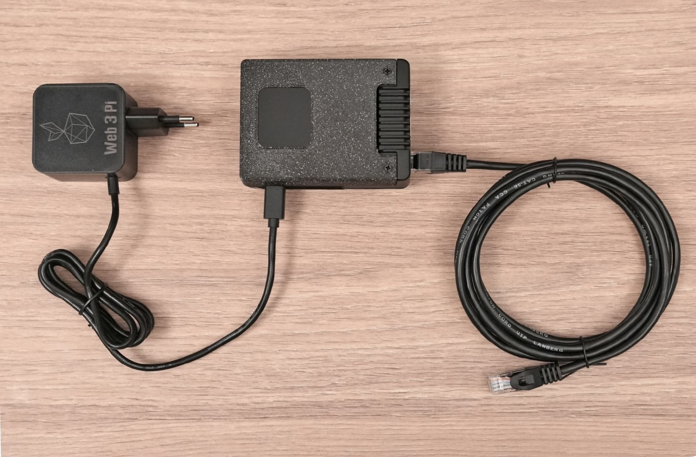
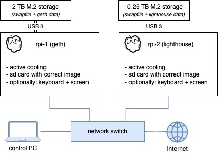

# Web3 Pi: Installation Monitoring Guide - Dual Device Node

Once you have flashed the boot cards and assembled the hardware, you're ready to install and activate Web3 Pi in dual device mode.

⚠️ To avoid errors during the first setup, please follow the instructions precisely. ⚠️

Your assembled devices should look like this.



**Before you connect power to your devices, make sure the ethernet cable is connected with DHCP. Internet connection is required during the installation process.**

## Connecting to the Network

Please make sure your network is set up as shown in the diagram below. Your network must include the two Raspberry Pis and a control PC, which you will use to monitor the installation process.



## Pre-installation Checklist

- Ensure your Raspberry Pis have active cooling.

- The Execution Client should have at least 2 TB SSD storage. The Consensus Client needs at least 256 GB.

- You should have flashed two boot cards. Make sure the boot card for the Execution Client is loaded into the machine with the larger SSD drive, and the Consensus Client boot card is inserted into the smaller one.

- Make sure the devices are protected against power surges with a UPS

- Connect the Raspberry Pis using Ethernet cables to your network, and ensure the network is connected to the Internet.


## Installation

Installation will begin automatically as soon as you connect the power cable. The actual installation should take about 15 minutes, depending on the speed of your Internet connection.

After the installation, the software will proceed to sync with the Ethereum network, which takes about 19 hours.

Please don't unplug the power until this process is complete.

You can monitor the installation from your control PC as detailed below.

### Installation verification

You can check the progress of the installation via your browser on the control PC.

Assuming you used the recommended hostnames when you flashed the SD cards, the URL for the Execution Client is:

http://eop-exec.local:7197/node/system/status

The URL for the Consensus Client is:

http://eop-consensus.local:7197/node/system/status

This will return a JSON reply if the installation has reached the stage of making the URL available.

When the installation is complete, the JSON will look like this:

```shell
{"host_name": "eop-exec", "num_cores": 4, "cpu_percent": 14.9, "mem_total": 8324055040, "mem_used": 6542295040, "mem_free": 503726080, "mem_percent": 81.8, "swap_total": 0, "swap_used": 4642058240, "swap_free": 12537806848, "swap_percent": 27.0, "disk_used": 1207331737600}
```

If the site is not available, **please wait and try again**. The installation can take up to 15 minutes.

**Note:** The mDNS service needs some time to start.

If you use the Raspberry Pi's IP address, the URL will be available quicker than if you use the host name.

mDNS should be available in less than **15 min** from the start.

### Account verification

To verify that the installation was successful, you will need to test logging into both devices using an SSH client.

Assuming you didn't change the hostnames when flashing the cards, the login machine names will be:

- Execution Client: `eop-exec-local`

- Consensus Client: `eop-consensus-local`

The username and password are `ethereum`. The password must be changed on first login. **The password should be treated as highly confidential, since it will allow access to an ethereum node. Keep it safe, as you won't be able to access the node without it.**

If the *ethereum* user does not exist, it means that the installation failed unexpectedly. If this happens, [contact Web3 Pi support](https://www.web3pi.io/contact).

## Secure Communication

The two devices have to establish a secure communication channel. This is achieved by creating a common JWT secret file shared by the two clients.

The installation script has already generated a common directory structure to store the JWT secret file.

To finish the configuration, the secret file has to be populated across devices.

Once both devices have completed the installation, you will need to copy across the JWT secret file as per the instructions below.

1. Log in to *eop-consensus.local* using an SSH client.
2. Once you've logged in, issue the following commands:

```shell
cd
scp clients/secrets/jwt.hex eop-exec.local:~/clients/secrets
```

3. You will see a warning message as shown below. Type `yes` to continue.

```shell
The authenticity of host 'eop-exec.local (192.168.X.X)' can't be established.
ED25519 key fingerprint is SHA256:<<<<key>>>>>>
This key is not known by any other names.
Are you sure you want to continue connecting (yes/no/[fingerprint])?
```

4. You'll then see a warning similar to the one below:

```shell
Warning: Permanently added 'eop-exec.local' (ED25519) to the list of known hosts.Connection closed by 192.168.X.X port 22scp: Connection closed
```

5. The `scp` command will ask you for the password for the *eop-exec.local* device. Use the new password you set when you tested the login.

After executing the above action, the devices can be connected and run as a single **Ethereum Node**.

### Starting the Node

The Consensus Client starts automatically, but the Execution Client can only be started after you've copied across the JWT secret file, as per the previous step.

To activate the Execution Client,

1. Log in to *eop-exec.local* using an SSH client.
2. Edit  the configuration file `config.txt` file in order to activate the Geth service:

```shell
sudo nano /boot/firmware/config.txt
```

4. Change `geth=false` to `geth=true`

5. Save the file by pressing Ctrl+X, then confirm by pressing `y`.

6. Restart the system using the command:

```shell
sudo ./scripts/reboot.sh
```

The system will reboot, then start the Geth service automatically.

**TIP:** Service output can be monitored using the command:

`sh sudo journalctl -xefu w3p_geth.service`

### Grafana Monitoring verification

Grafana, InfluxDB, and Basic Node Monitor (BNM) are disabled in pair devices mode. After you have manually configured them, they can be enabled and used. Please see the [Configuration Guide](../../management/ssh.md).

### Network configuration verification

Log in via SSH to each of the Raspberry Pi devices, and run the command:

```shell
ping -c 4 google.com
```

You should see the following response if the network is working correctly:

```shell
PING google.com (142.250.186.206) 56(84) bytes of data.64 bytes from waw07s05-in-f14.1e100.net (142.250.186.206): icmp_seq=1 ttl=59 time=2.83 ms64 bytes from waw07s05-in-f14.1e100.net (142.250.186.206): icmp_seq=2 ttl=59 time=3.62 ms64 bytes from waw07s05-in-f14.1e100.net (142.250.186.206): icmp_seq=3 ttl=59 time=2.23 ms64 bytes from waw07s05-in-f14.1e100.net (142.250.186.206): icmp_seq=4 ttl=59 time=3.73 ms--- google.com ping statistics ---4 packets transmitted, 4 received, 0% packet loss, time 3005msrtt min/avg/max/mdev = 2.229/3.102/3.734/0.614 ms
```

If you're seeing any issues, you can [contact Web3 Pi support](https://www.web3pi.io/contact).

## Summary

At this point, the devices are configured and ready to host an **Ethereum Node**.

Unless you've disabled them in `config.txt`, the Geth and Nimbus services will start automatically, and will sync with the network.

For more information on configuring or modifying elements of the Web3 Pi installation, please see the [Configuration Guide](../../management/ssh.md).
