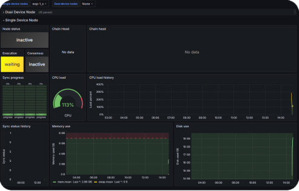

# Web3 Pi: Installation Monitoring Guide - Dual Device Node

Once you have flashed the boot cards and assembled the hardware, you're ready to install and activate Web3 Pi in dual device mode.

!!!note

    To avoid errors during the first setup, please follow the instructions precisely.

Your assembled devices should look like this.

!!!warning

    Before you connect power to your devices, make sure the ethernet cable is connected with DHCP. Internet connection is required during the installation process.**

## Connecting to the Network

Please make sure your network is set up as shown in the diagram below. Your network must include the two Raspberry Pis and a control PC, which you will use to monitor the installation process.

## Pre-installation Checklist

- Ensure your Raspberry Pis have active cooling.

- The Execution Client should have at least 2 TB SSD storage. The Consensus Client needs at least 256 GB.

- You should have flashed two boot cards. Make sure the boot card for the Execution Client is loaded into the machine with the larger SSD drive, and the Consensus Client boot card is inserted into the smaller one.

- Make sure the devices are protected against power surges with a UPS

- Connect the Raspberry Pis using Ethernet cables to your network, and ensure the network is connected to the Internet.

## Installation

Installation will begin automatically as soon as you connect the power cable.

You can monitor the installation on both devices by entering the corresponding addresses in your browser, based on the
previously defined hostnames. The default values are:

- [http://eop-1-exec.local](http://eop-1-exec.local)
- [http://eop-1-cons.local](http://eop-1-cons.local)
- 
The monitoring should start working approximately three minutes after the device is first switched on.

Replace `eop-1-exec` and `eop-1-cons` with your hostnames that you entered during the microSD card burning process.

After approximately 3 minutes from powering on the device for the first time, you should see a similar page - for both devices.

{ width=700px }

!!!note

    Leave the device for about 8-15 minutes to complete the installation process.
    Do not disconnect power during this time.
    The time may vary depending on the bandwidth of the internet connection.

## Grafana Dashboard Access

{ width=400px }

Next, click the link to the Grafana dashboard. If everything has gone smoothly, you should see the login panel. The default username is **'admin'**, and the password is **'admin'**. You will be required to change the password upon first login.

In the Grafana Panel, click on the **dashboard** named **'Ethereum Nodes Monitor'**.

!!!note
    
    Pay attention to the status of the consensus and execution clients. Initially, both will be 'inactive'

In the next step, the execution client will change to 'waiting'.

Then both will transition to the 'syncing' state.

Grafana URL: [http://eop-1-exec.local:3000](http://eop-1.local:3000)

## Blockchain Synchronization

At this point, the **blockchain synchronization process** will begin and will take approximately 19 hours.

The CPU load will increase until it reaches its maximum possible value.

Disk usage will grow to around 1.2TB.

## Synchronization Complete

Full synchronization will be achieved when the status of both the execution and consensus clients turns green ("synced").

## SSH Access

{ width=500px }

After the installation completes successfully, you should have SSH access to the Web3 Pi node.

Username: **ethereum**  
Password: **ethereum**

You can use **[your-hostname].local** as the SSH address or the **IP address** if you know it.

If the 'ethereum' user does not exist, it means the installation failed unexpectedly (in such case, please contact support).

By default, the `ethereum` user is required to change the password during the first login.
