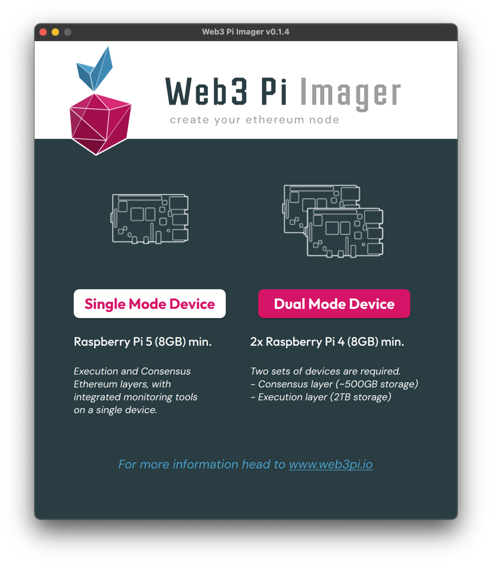
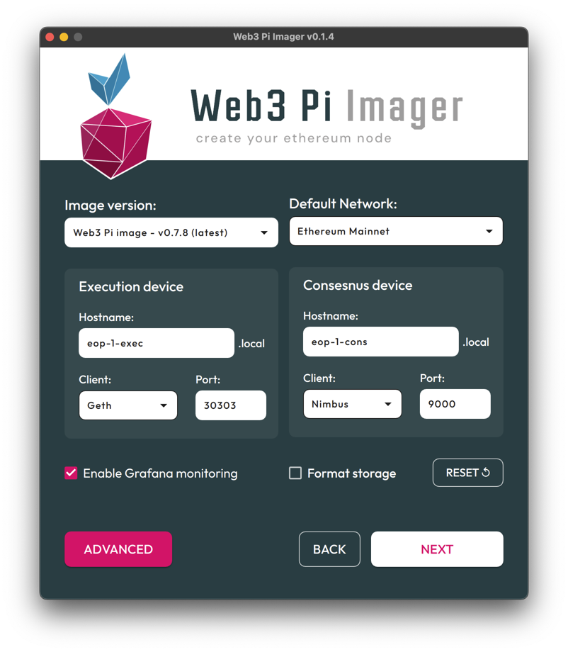
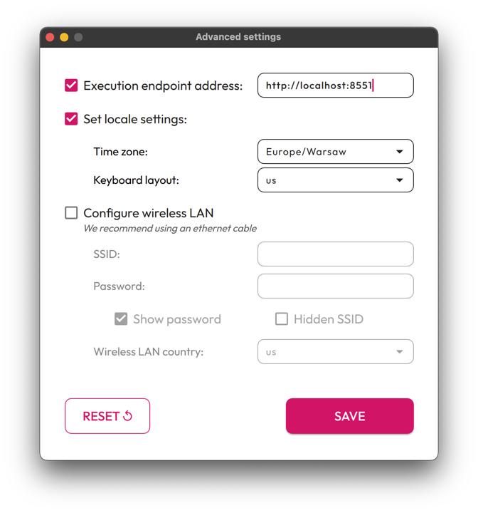
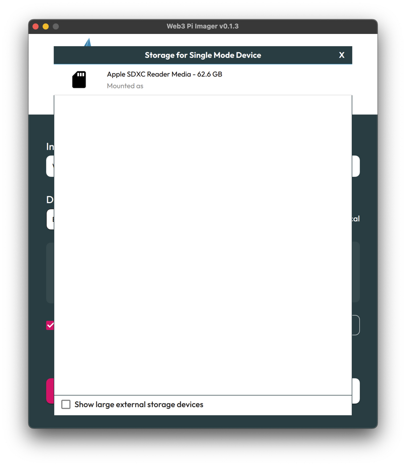
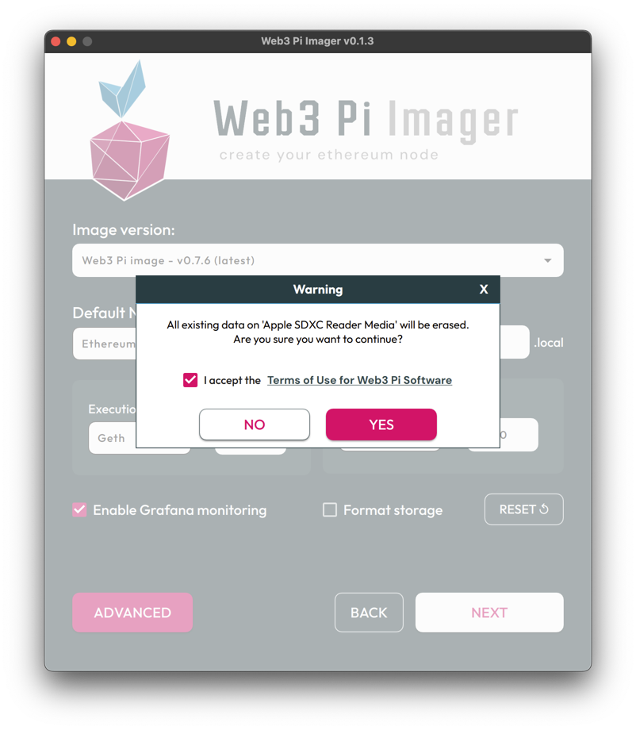
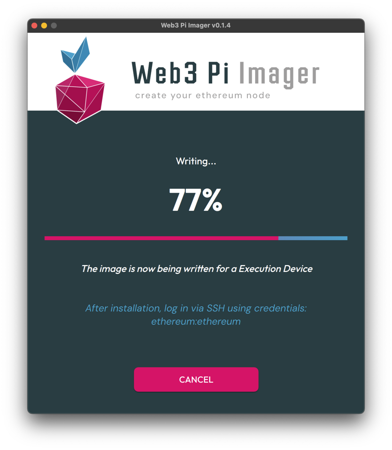
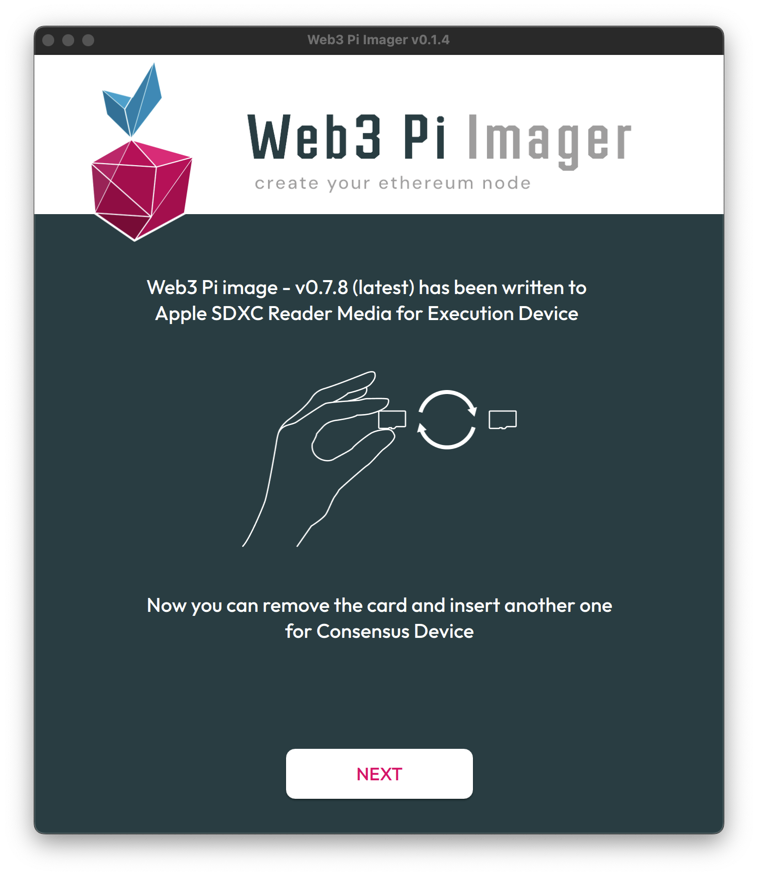
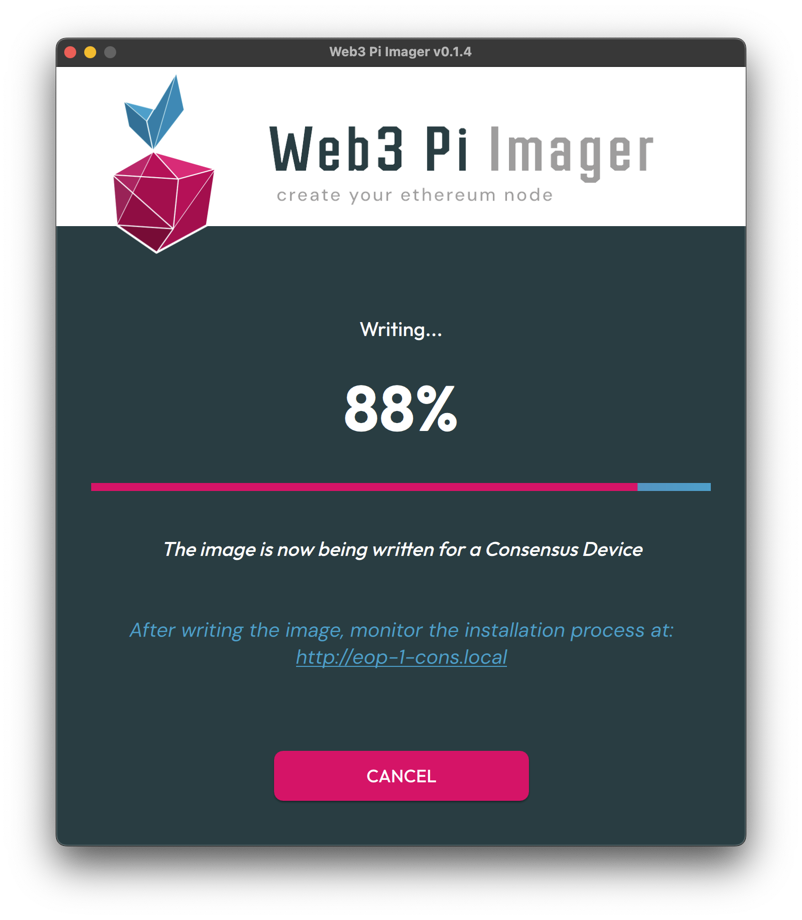
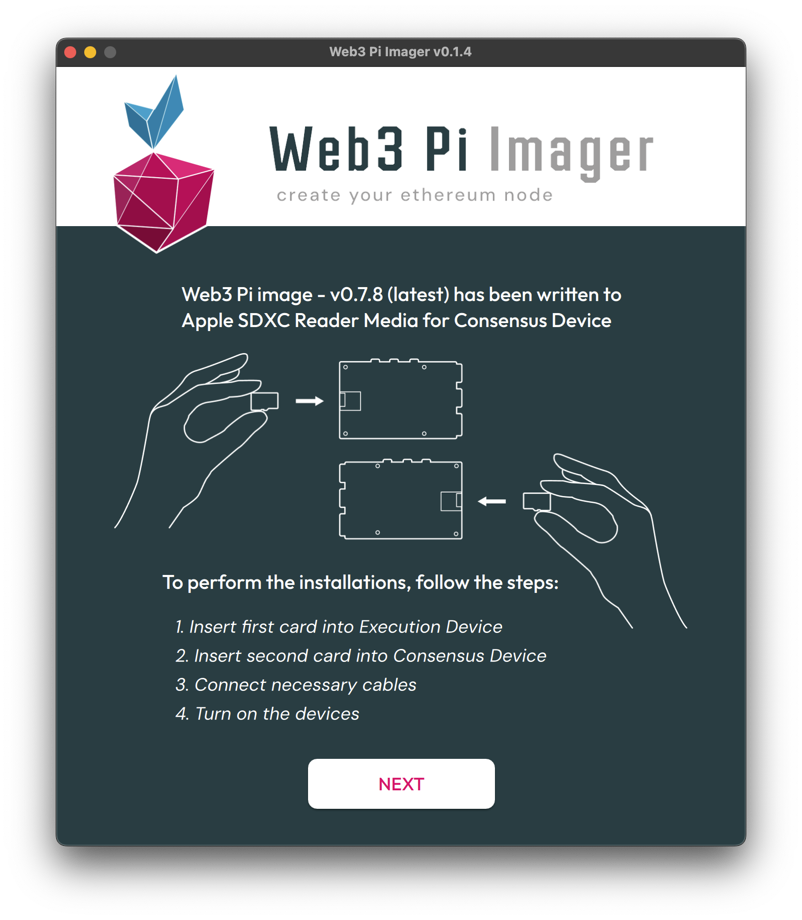
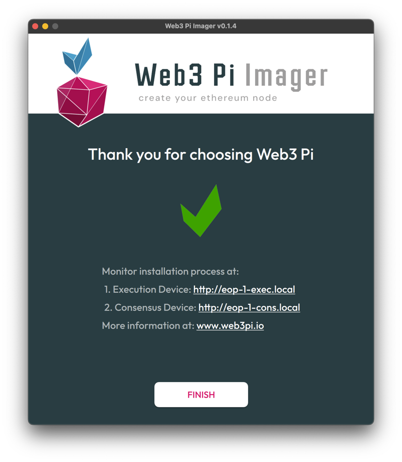

# Web3 Pi Image Installation Guide

This guide will walk you through the process of writing the Web3 Pi image to a microSD card using the Web3 Pi Imager tool.

## Getting Started

Follow the instructions below to write images on the microSD card:

1. Download and install [Web3 Pi Imager](https://github.com/Web3-Pi/web3-pi-imager/releases/latest){ target="_blank" }
2. Insert the microSD card into the card reader and connect the reader to your PC
3. Open the **Web3 Pi Imager** on your PC
4. Choose the **Single Mode Device**

{ width=700px }

## Configuration Options

For Dual Mode device, the following settings can be configured. In this mode, we set separate hostnames, clients, and ports for the execution layer device and the consensus layer device:

* **Image version:** Default is the latest version of Web3 Pi Image
* **Default Ethereum Network:** Choice between `Mainnet`, `Sepolia`, or `Holesky`
* **Execution device hostname:** Use a unique hostname for the execution layer device. Default is `eop-1-exec.local`
* **Consensus device hostname:** Use a unique hostname for the consensus layer device. Default is `eop-1-cons.local`
* **Execution client:** Choose between `Geth` or `Disabled` for the execution layer device
* **Execution Port for Geth:** `30303` for the execution layer device
* **Consensus Client:** Choose between `Nimbus` or `Lighthouse` for the consensus layer device
* **Consensus Client Port:** `9000` for the consensus layer device
* **Enable Grafana Monitoring:** Turn on the advanced monitoring system by Grafana
* **Format storage:** Option to format external storage during installation

{ width=700px }

## Advanced Options

If you click the Advanced button, you can configure these additional options. These advanced settings will be applied to both the execution layer device and the consensus layer device:

* **Execution endpoint address:** Optional custom endpoint for execution client
* **Locale settings:** Including:
    * Time zone selection
    * Keyboard layout
* **Wireless LAN configuration:** Including:
    * SSID
    * Password
    * Wireless LAN country selection

!!! note

    Wired Ethernet connection is recommended over Wi-Fi to ensure better synchronization.

{ width=600px }

## Drive Selection

After setting up the configuration and clicking "Next", a dialog box will appear allowing you to select the drive where the image with settings will be saved.

* **Drive selection:** The list shows available storage devices
* **Display options:**
    * By default, only drives smaller than 300GB are displayed
    * Checking the "Show large external storage device" option will display devices larger than 300GB

!!! note
    
    Make sure you select the correct drive to avoid data loss on other devices

{ width=700px }

## Accepting Terms of Use

After selecting your target drive, a warning dialog will appear informing you that all data on the selected device will be erased.

* Confirms that all existing data on the selected drive will be permanently deleted
* You must accept the terms to proceed (the "Yes" button remains disabled until accepted). The full Terms of Use can be found at [www.web3pi.io/terms](https://www.web3pi.io/terms){ target="_blank" }.

!!! note

    This is your final confirmation before the write process begins - ensure you have selected the correct device

{ width=700px }

## Writing Process - Execution Device

After confirmation, the writing process for execution device begins.

* **Writing process:** The progress bar displays the current writing status
* **Verification phase:** After the writing completes, the verification process automatically starts. This step ensures data integrity and proper image installation.

!!! note

    Do not disconnect or remove the storage device until both the writing and verification processes are complete

{ width=700px }

## Replacing cards

At this point, you need to switch the SD cards. Remove the card that has been written for the execution layer device and insert a new card for the consensus layer device.
Select the appropriate storage destination for the consensus device image and confirm by clicking "Yes" to proceed with the writing process.

{ width=700px }

## Writing Process - Consensus Device

Now the process of writing the card for the consensus layer device will begin.

* **Writing process:** The progress bar displays the current writing status
* **Verification phase:** After the writing completes, the verification process automatically starts. This step ensures data integrity and proper image installation.

!!! note

    Do not disconnect or remove the storage device until both the writing and verification processes are complete

{ width=700px }

## Final Steps

Now that you have both cards prepared, you will see a message about the possibility of installing the prepared cards in the appropriate devices.
At this stage, you can click "Next" and complete the process. In the following steps, you will be able to assemble both devices and install the prepared cards in the corresponding slots.

{ width=700px }
{ width=700px }

