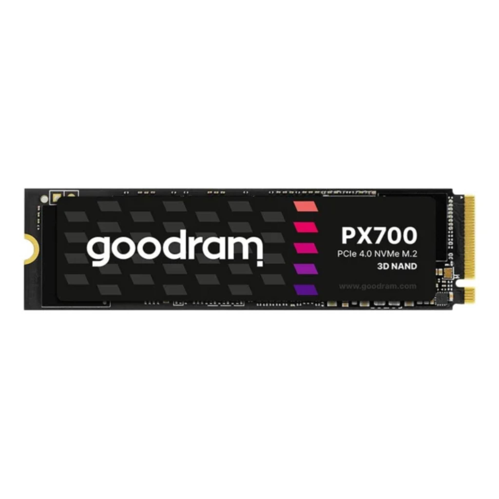
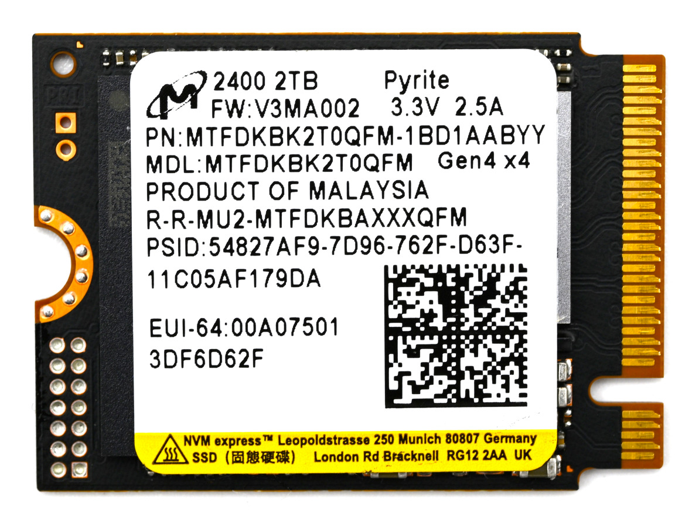

# Web3 Pi: Recommended Hardware

## SSD Drive

**2 TB** fast drive is required.

**For the Raspberry Pi 5**, you have three options for storage:

- external USB SSD drive (wide availability)
- m.2 NVMe drive with NVMe HAT for Raspberry Pi 5 (max performance)
- m.2 NVMe drive with USB m.2 adapter

Raspberry Pi 5 has a PCIe x1 connector on board so with a special adapter m.2 NVMe drive can be used.
This option gives the maximum possible performance.

**For the Raspberry Pi 4**, you have two options for storage:

- external USB SSD drive (wide availability)
- SSD drive with USB adapter

!!! note

    If you use USB always choose USB 3.0 ports (blue)

!!! warning

    Do NOT use HDD drives!

### Recommended SSD Hardware

#### USB Drive

|                                                                                                 | Brand/Model                 | Comment                                                                                 | Link                                                                                                                  |
| ----------------------------------------------------------------------------------------------- | --------------------------- | --------------------------------------------------------------------------------------- | ---------------------------------------------------------------------------------------------------------------------- |
| { width="150" }                                            | **Samsung T7 2TB USB 3.2**  | **Recommended for RPi4 users. Compatible with Raspberry Pi 4 and 5** | [More Info](https://tweakers.net/pricewatch/1560668/samsung-portable-ssd-t7-2tb-grijs/specificaties/)      |

!!! tip

    Some external disks consume more power than Raspberry Pi can deliver via USB. For Raspberry Pi 5, the max power output of the USB ports is 600mA if you're using a 3A supply, and 1600mA if you're using a 5A supply. You can edit `/boot/firmware/config.txt` and add `usb_max_current_enable=1` to disable the current limit. Please read the documentation: [Link](https://www.raspberrypi.com/documentation/computers/raspberry-pi.html)

#### NVMe Drive

These drives need adapters.

|                                                                        | Brand/Model                      | Controller                    | Comment                                                                                              | Link                                                                                                                  |
| ---------------------------------------------------------------------- | -------------------------------- | ----------------------------- | ---------------------------------------------------------------------------------------------------- | ---------------------------------------------------------------------------------------------------------------------- |
| { width="150" }        |  **Lexar NM790 2TB m.2 2280** | Maxiotek MAP1602A         | single side design  4TB available     | [Product page](https://americas.lexar.com/product/lexar-nm790-m-2-2280-pcie-gen-4x4-nvme-ssd/)  [More Info](https://www.techpowerup.com/ssd-specs/lexar-nm790-2-tb.d1494)|
| { width="150" }             |  **Goodram PX700 2TB m.2 2280**     | Maxiotek MAP1602A      | single side design  4TB available    | [Product page](https://www.goodram.com/en/products/goodram-px700-ssd-2/)|
| { width="150" }               |  **Micron 2400 2TB m.2 2230**         | Silicon Motion SM2269XT    | single side design  ~4 W (Max) small 2230 form factor low power consumption low heat     | [Product page](https://www.micron.com/products/storage/ssd/client-ssd/2400-ssd)  [More Info](https://www.techpowerup.com/ssd-specs/micron-2400-2-tb.d810)|
| { width="150" }            |  **Samsung 980 Pro 2TB m.2 2280**         | Samsung Elpis (S4LV003)    | single side design  7.2 W (Max)                                                                   | [Product page](https://www.samsung.com/pl/memory-storage/nvme-ssd/980-pro-2tb-nvme-pcie-gen-4-mz-v8p2t0bw/)  [More Info](https://www.techpowerup.com/ssd-specs/samsung-980-pro-2-tb.d52)|

!!! note

    Double-sided NVMe m.2 memory modules (with memory chips on both sides of the PCB) may not be fully compatible with every enclosure due to physical dimensions, specifically the height of the m.2 slot in the adapter/enclosure.

#### NVMe Hat

##### NVMe HAT for Raspberry Pi 5

| Brand                       | Link                                                                                                |
| --------------------------- | --------------------------------------------------------------------------------------------------- |
| Pimoroni                    | [Product page](https://shop.pimoroni.com/products/nvme-base?variant=41219587178579) |
| Raspberry Pi m.2 Hat        | [Product page](https://www.raspberrypi.com/products/m2-hat-plus/)                                                   |
| Pineboards HatDrive: Bottom | [Product page](https://pineberrypi.com/products/hatdrive-bottom-2230-2242-2280-for-rpi5)                           |
| Pineboards HatDrive: Top    | [Product page](https://pineboards.io/products/hat-top-2230-2240-for-rpi5)                                           |
| Pineboards HatDrive: Nano   | [Product page](https://pineboards.io/products/hatdrive-nano-nvme-2230-2242-gen-3-for-raspberry-pi-5)                |
| Waveshare 26583             | [Product page](https://www.waveshare.com/pcie-to-m.2-hat-plus.htm)                                                  |

We do not recommend the following:

- **KAmodRPi5 PCIe-M.2**

- **Geekworm X1001**

## SD Card Reader and Writer

You will use this on your PC for flashing the boot card. Since this operation takes time, we recommend a high-speed device.

## MicroSD Card

Flashing a microSD card takes time, but it can be reduced by using a fast device. Additionally, using a fast micro SD card results in a shorter booting time.

You will require at least 32GB capacity.

A few examples:

- [Silicon Power 3D NAND](https://www.tomshardware.com/best-picks/raspberry-pi-microsd-cards#section-best-microsd-card-overall)
- [SanDisk Extreme Pro](https://www.tomshardware.com/best-picks/raspberry-pi-microsd-cards#section-great-speeds-best-for-pi-3)
- [SanDisk Ultra](https://www.westerndigital.com/en-ap/products/memory-cards/sandisk-ultra-uhs-i-microsd-120-mbps?sku=SDSQUA4-064G-GN6MA)
- [SanDisk Max Endurance](https://www.westerndigital.com/en-ap/products/memory-cards/sandisk-max-endurance-uhs-i-microsd?sku=SDSQQVR-064G-GN6IA)
- [Kingston Canvas React](https://www.tomshardware.com/best-picks/raspberry-pi-microsd-cards#section-fastest-booting-raspberry-pi-microsd)
- [Samsung 64 Evo Plus](https://www.samsung.com/pl/memory-storage/memory-card/evo-plus-128gb-microsd-card-2021-mb-mc128ka-eu/)
- [Lexar Professional 1000X](https://www.amazon.com/Lexar-Professional-1000x-UHS-II-LSD64GCRBNA1000/dp/B00PLENZX4)

[**More Information**](https://www.tomshardware.com/best-picks/raspberry-pi-microsd-cards)

## Enclosures

### Enclosures for Raspberry Pi 5

|                                                                             | Brand/Model                  | Comment                                                                                 | Link                                                                                                                  |
| --------------------------------------------------------------------------- | ---------------------------- | --------------------------------------------------------------------------------------- | ---------------------------------------------------------------------------------------------------------------------- |
| { width="150" }            |  **Argon NEO 5 M.2 NVMe**    | +good cooling +metal -inconvenient access to the microSD card -m.2 slot not compatible with double side NVMe (easy modification possible with utility knife)   | [Product page](https://argon40.com/products/argon-neo-5-m-2-nvme-for-raspberry-pi-5?_pos=1&_psq=Argon+NEO+5+M.2+NVME+PCIE+Case+for+Raspberry+Pi+5&_ss=e&_v=1.0)  [Shop](https://botland.store/raspberry-pi-5-cases/24397-argon-neo-5-m2-nvme-pcie-case-for-raspberry-pi-5-with-fan-and-heatsink-aluminum-black-860011360049.html)|
| { width="150" }                         |  **Argon NEO 5**             | +easy acces to microSD card +good cooling +metal                                  | [Product page](https://argon40.com/products/argon-neo-case-for-raspberry-pi-5)  [Shop](https://botland.store/raspberry-pi-5-cases/24095-argon-neo-5-bred-case-for-raspberry-pi-5-with-fan-black-and-red-6974297861856.html) |
| { width="150" }         |  **Argon ONE V3 M.2 NVMe**   | +good cooling +metal -m.2 slot not compatible with double side NVMe (easy modification possible with utility knife)   | [Product page](https://argon40.com/products/argon-one-v3-m-2-nvme-case?_pos=1&_sid=44da22b52&_ss=r)  [Shop](https://botland.store/raspberry-pi-5-cases/24396-argon-one-v3-m2-nvme-pcie-case-for-raspberry-pi-5-with-fan-and-heatsink-aluminum-black-860011360032.html)|
| { width="150" }                     |  **Argon ONE V3**            | +good cooling +metal                                                                 | [Product page](https://argon40.com/products/argon-one-v3-case-for-raspberry-pi-5?_pos=1&_psq=Argon+ONE+V3+Case+for+Raspberry+Pi+5&_ss=e&_v=1.0)  [Shop](https://botland.store/raspberry-pi-5-cases/24395-argon-one-v3-case-for-raspberry-pi-5-with-fan-and-heatsink-aluminum-black-860011360025.html) |

### Enclosures for Raspberry Pi 4B

|                                                              | Brand/Model                 | Comment       | Link                                                                                                                  |
| ------------------------------------------------------------ | --------------------------- | ------------- | ---------------------------------------------------------------------------------------------------------------------- |
| { width="150" }   |  **Case justPi**            | [assembly instructions](https://www.youtube.com/watch?v=qEsSK9WIRM4) | [Product page](https://botland.store/raspberry-pi-4b-cases/15106-case-justpi-for-raspberry-pi-4b-aluminum-with-dual-fan-black-lt-4b02-5903351242660.html)  [Shop](https://botland.store/raspberry-pi-4b-cases/15106-case-justpi-for-raspberry-pi-4b-aluminum-with-dual-fan-black-lt-4b02-5903351242660.html)|
| { width="150" }        |  **Argon One V2**           | Fan control needs additional configuration as described by the manufacturer [manual](https://cdn.shopify.com/s/files/1/0556/1660/2177/files/AR1_PI4-V2_INSTRUCTION_MANUAL_20200922.pdf?v=1646125923)  | [Product page](https://argon40.com/products/argon-one-v2-case-for-raspberry-pi-4)  [Shop](https://botland.store/raspberry-pi-4b-cases/15391-raspberry-pi-4-aluminum-case-with-fan-argon-one-v2-grey-5904422301347.html) |
| { width="150" } |  **Argon One V2 m.2**       | Fan control needs additional configuration as described by the manufacturer [manual](https://cdn.shopify.com/s/files/1/0556/1660/2177/files/AR1_NVME_INSTRUCTION_MANUAL_20220531.pdf?v=1659581194)  | [Product page](https://argon40.com/products/argon-one-m-2-case-for-raspberry-pi-4)  [Shop](https://botland.store/raspberry-pi-4b-cases/17273-raspberry-pi-4-aluminum-case-with-fan-argon-one-m2-grey-5904422328597.html) |
