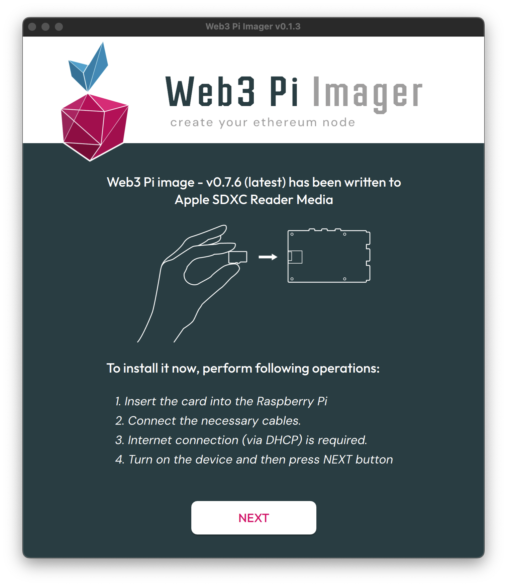
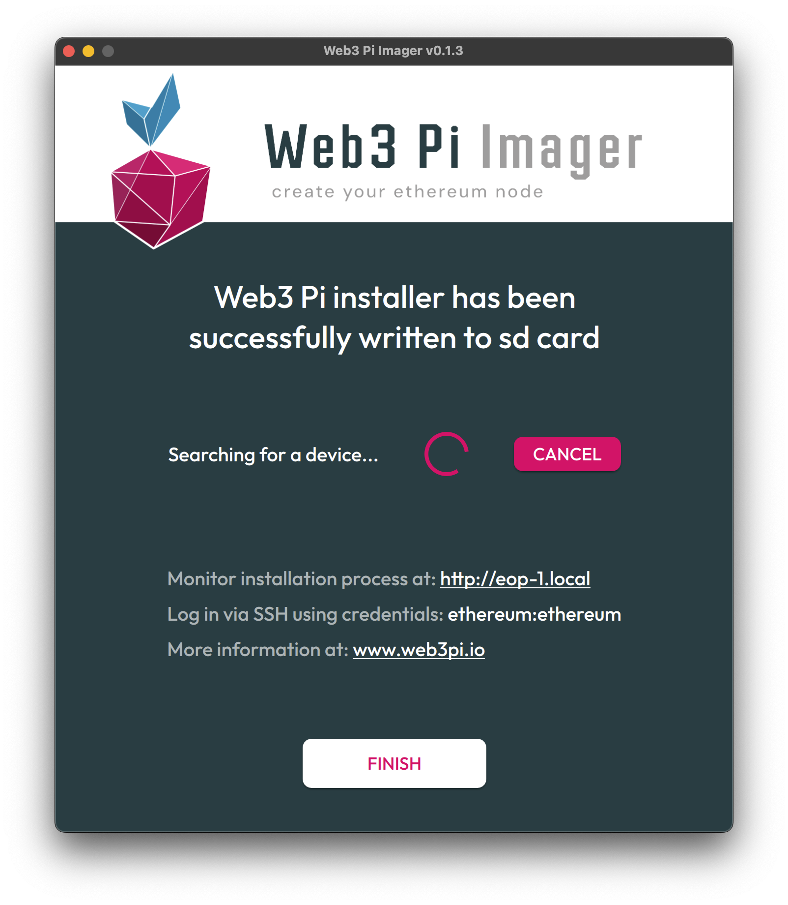
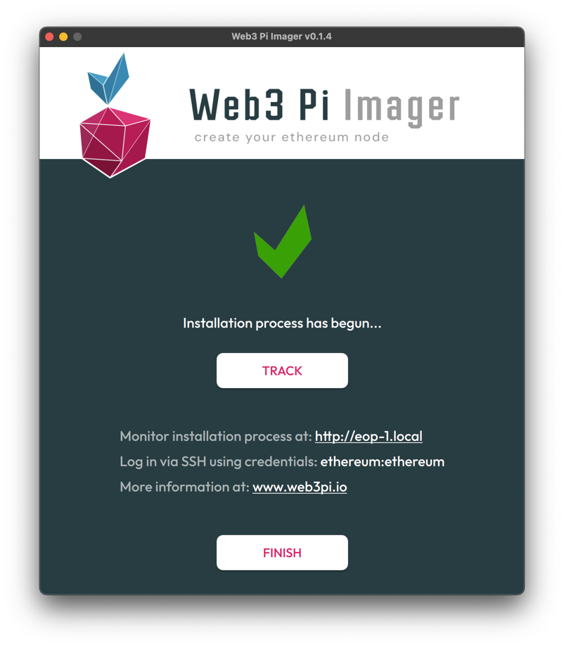
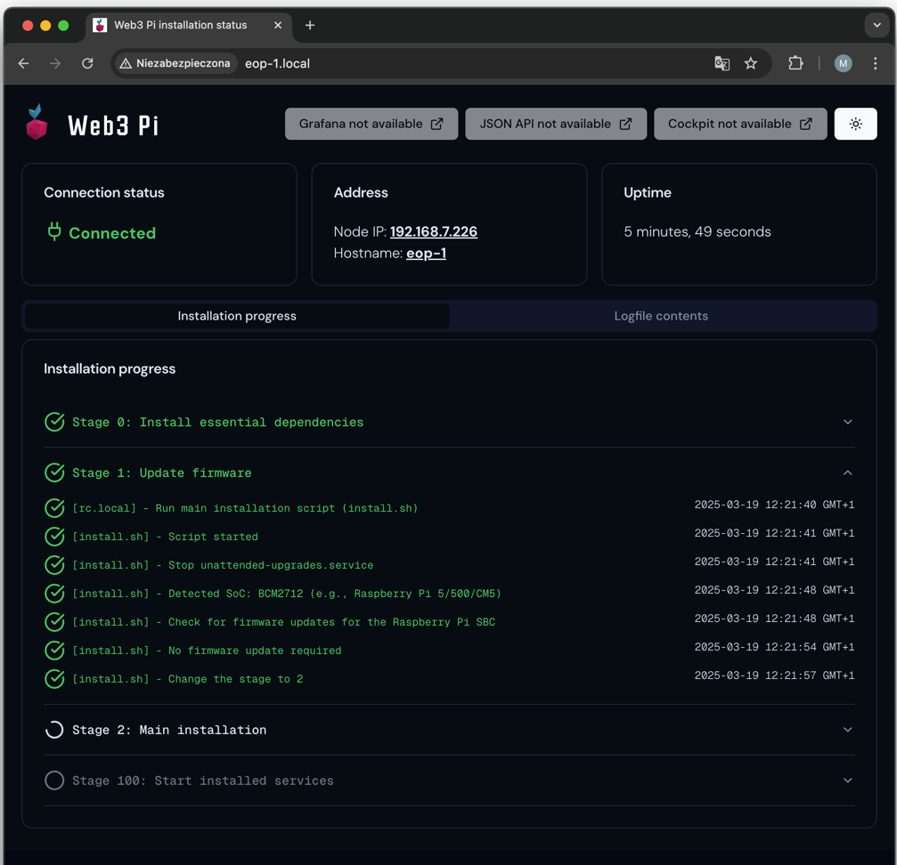
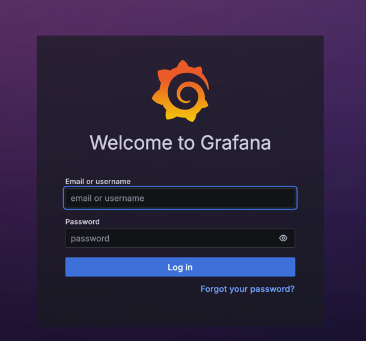
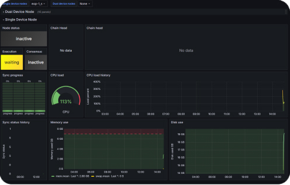
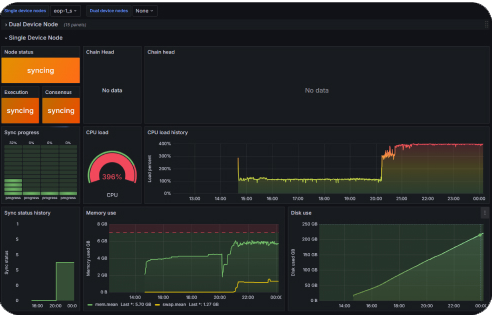
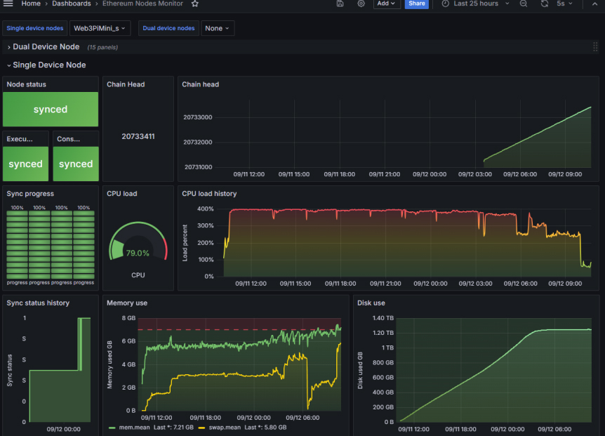
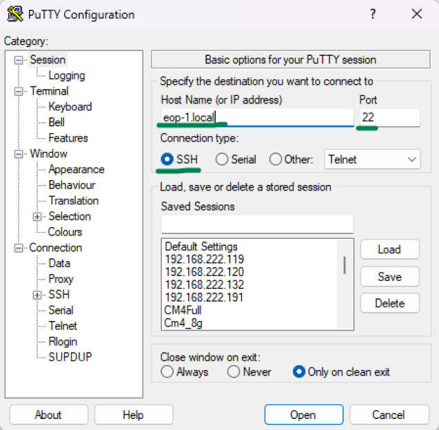

# Web3 Pi: Installation Monitoring Guide - Single Device Node

Now that the device is assembled and the card is inside, go back to the Web3 Pi Imager and follow the instructions:

1. Connect the necessary cables.
2. Ensure Internet connection (via DHCP) is available.
3. Turn on the device and then press the **NEXT** button.

{ width=650px }

## SD Card Installation Complete


- Web3 Pi installer has been successfully written to the SD card.
- At this point, the card is ready, and the installation process on the device begins.
- Now the device is being searched on the network - this may take about 2 minutes, after which the user will be able to monitor the further installation process.

{ width=700px }

## Track Installation Progress

Now you can click the "Track" button - a page with the software installation process on the device will open.

{ width=700px }

!!!note
    
    From this point, the user can log in via SSH using the credentials **ethereum:ethereum**

## Monitor Installation


You can monitor the installation process through a dedicated website:
[http://eop-1.local](http://eop-1.local)

The monitoring should start working approximately three minutes after the device is first switched on.

Replace `eop-1` with your hostname that you entered during the microSD card burning process in Web3 Pi Imager, if you used a name other than `eop-1`.

After approximately 3 minutes from powering on the device for the first time, you should see a similar page.


{ width=700px }


!!!note

    Leave the device for about 8-15 minutes to complete the installation process.
    Do not disconnect power during this time.
    The time may vary depending on the bandwidth of the internet connection.

## Installation Web Interface

The Raspberry Pi with the Web3 Pi image on port 80 hosts an HTTP server that continuously displays the following in the web browser:

- The installation stage
- The hostname and IP address of the device
- The full installation log and uptime
- A link to the Grafana dashboard and a JSON status file


The installation is divided into stages. The installation is complete when you see: "STAGE 100: Installation completed." This status is shown in the following screenshot.

## Grafana Dashboard Access

{ width=400px }

Next, click the link to the Grafana dashboard. If everything has gone smoothly, you should see the login panel. The default username is **'admin'**, and the password is **'admin'**. You will be required to change the password upon first login.

In the Grafana Panel, click on the **dashboard** named **'Ethereum Nodes Monitor'**.



!!!note
    
    Pay attention to the status of the consensus and execution clients. Initially, both will be 'inactive'



In the next step, the execution client will change to 'waiting'.

Then both will transition to the 'syncing' state.

Grafana URL: [http://eop-1.local:3000](http://eop-1.local:3000)

## Blockchain Synchronization

At this point, the **blockchain synchronization process** will begin and will take approximately 19 hours.

The CPU load will increase until it reaches its maximum possible value.

Disk usage will grow to around 1.2TB.

## Synchronization Complete



Full synchronization will be achieved when the status of both the execution and consensus clients turns green ("synced").

## SSH Access

{ width=500px }

After the installation completes successfully, you should have SSH access to the Web3 Pi node.

Username: **ethereum**  
Password: **ethereum**

You can use **[your-hostname].local** as the SSH address or the **IP address** if you know it.

If the 'ethereum' user does not exist, it means the installation failed unexpectedly (in such case, please contact support).

By default, the `ethereum` user is required to change the password during the first login.


## Network Configuration Verification

To check that the network is working correctly, SSH into the Rasberry Pi and run a `ping` command:

```shell
ping -c 4 google.com
```

You should see the following response:

```shell
PING google.com (142.250.186.206) 56(84) bytes of data.
64 bytes from waw07s05-in-f14.1e100.net (142.250.186.206): icmp_seq=1 ttl=59 time=2.83 ms
64 bytes from waw07s05-in-f14.1e100.net (142.250.186.206): icmp_seq=2 ttl=59 time=3.62 ms
64 bytes from waw07s05-in-f14.1e100.net (142.250.186.206): icmp_seq=3 ttl=59 time=2.23 ms
64 bytes from waw07s05-in-f14.1e100.net (142.250.186.206): icmp_seq=4 ttl=59 time=3.73 ms

--- google.com ping statistics ---
4 packets transmitted, 4 received, 0% packet loss, time 3005ms
rtt min/avg/max/mdev = 2.229/3.102/3.734/0.614 ms
```

You now have a fully operational Ethereum node running Geth and Nimbus.

For more information on managing, configuring and troubleshooting your node, please refer to the [Managing Your Node](../../management/ssh.md) menu.

