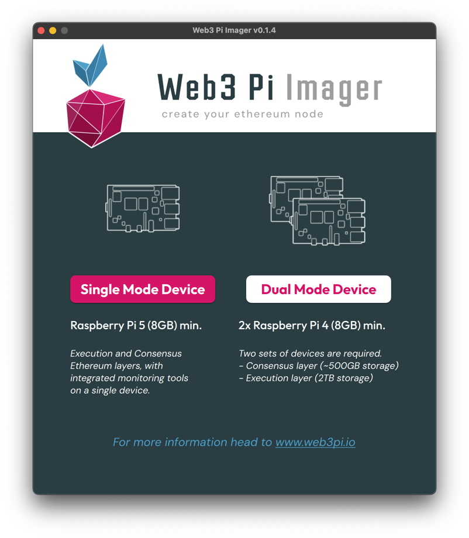
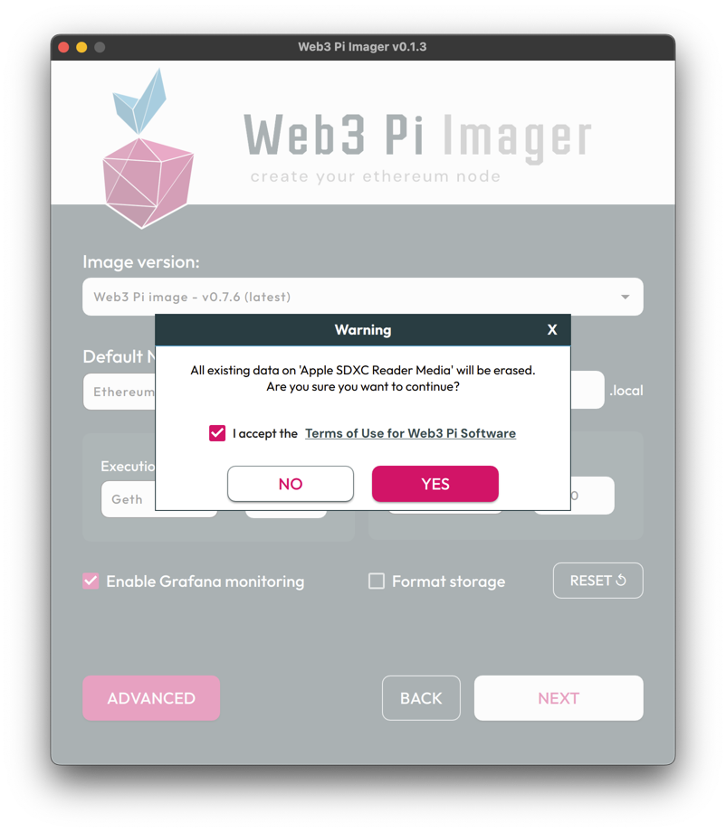
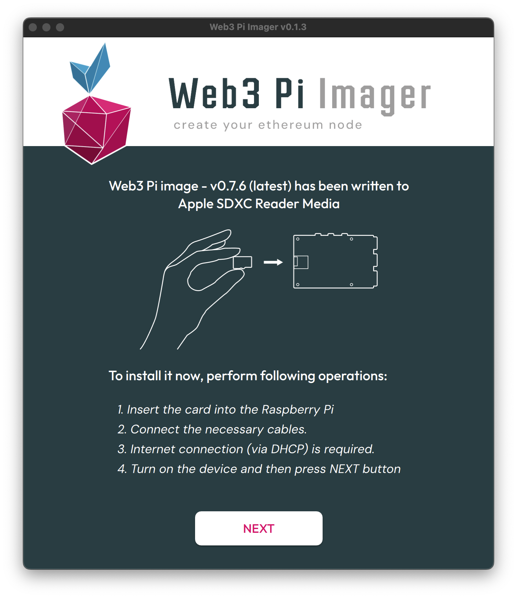

# Web3 Pi Image Installation Guide

This guide will walk you through the process of writing the Web3 Pi image to a microSD card using the Web3 Pi Imager tool.

## Getting Started

Follow the instructions below to write images on the microSD card:

1. Download and install [Web3 Pi Imager](https://github.com/Web3-Pi/web3-pi-imager/releases/latest){ target="_blank" }
2. Insert the microSD card into the card reader and connect the reader to your PC
3. Open the **Web3 Pi Imager** on your PC
4. Choose the **Single Mode Device**

{ width=700px }

## Configuration Options

For Single Mode device, the following settings can be configured:

* **Image version:** Default is the latest version of Web3 Pi Image
* **Default Ethereum Network:** Choice between `Mainnet`, `Sepolia`, or `Holesky`
* **Hostname for Raspberry Pi:** Use a unique hostname. Default is `eop-1.local`
* **Execution client:** Choose between `Geth` or `Disabled`
* **Execution Port for Geth:** `30303`
* **Consensus Client:** Choose between `Nimbus` or `Lighthouse`
* **Consensus Client Port:** `9000`
* **Enable Grafana Monitoring:** Turn on the advanced monitoring system by Grafana
* **Format storage:** Option to format external storage during installation

{ width=700px }

## Advanced Options

If you click the **ADVANCED** button, you can configure these additional options:

* **Execution endpoint address:** Optional custom endpoint for execution client
* **Locale settings:** Including:
    * Time zone selection
    * Keyboard layout
* **Wireless LAN configuration:** Including:
    * SSID
    * Password
    * Wireless LAN country selection

!!! note

    Wired Ethernet connection is recommended over Wi-Fi to ensure better synchronization.

{ width=600px }

## Drive Selection

After setting up the configuration and clicking **NEXT**, a dialog box will appear allowing you to select the drive where the image with settings will be saved.

* **Drive selection:** The list shows available storage devices
* **Display options:**
    * By default, only drives smaller than 300GB are displayed
    * Checking the "Show large external storage device" option will display devices larger than 300GB

!!! note
    
    Make sure you select the correct drive to avoid data loss on other devices

{ width=700px }

## Accepting Terms of Use

After selecting your target drive, a warning dialog will appear informing you that all data on the selected device will be erased.

* Confirms that all existing data on the selected drive will be permanently deleted
* You must accept the terms to proceed (the "Yes" button remains disabled until accepted). The full Terms of Use can be found at [www.web3pi.io/terms](https://www.web3pi.io/terms){ target="_blank" }.

!!! note

    This is your final confirmation before the write process begins - ensure you have selected the correct device

{ width=700px }

## Writing Process

After confirmation, the writing process to the selected storage device begins.

* **Writing process:** The progress bar displays the current writing status
* **Verification phase:** After the writing completes, the verification process automatically starts. This step ensures data integrity and proper image installation.

!!! note

    Do not disconnect or remove the storage device until both the writing and verification processes are complete

{ width=700px }

## Final Steps

Now after the card has finished writing you will see a screen informing you about installing the prepared card to the device.

{ width=700px }

Keep Web3 Pi Imager open at this step and now we will start assembling the device. We will come back to this step after we finish assembling.
