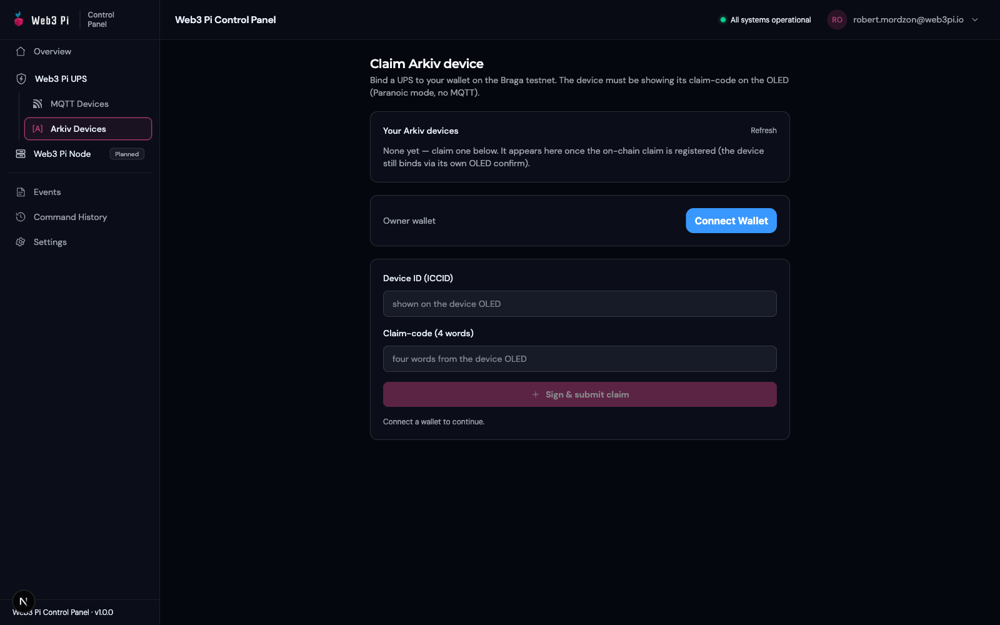

# Arkiv Mode

Arkiv mode is an alternative telemetry backend for units fitted with the [LTE-M module](index.md). Instead of the Web3 Pi cloud, the UPS writes encrypted telemetry to the **Arkiv Braga testnet** — a tamper-evident, independently verifiable record of your device's power history. Ownership is bound to your crypto wallet, and only that wallet can decrypt the data — the panel server never holds the key.

!!! note "MQTT is the recommended default"
    Arkiv mode is a niche option for audit and compliance use cases — it adds wallet management and gas costs. For day-to-day monitoring, stay in MQTT mode and use the [web panel](web-panel.md).

The device has its **own on-chain wallet** and pays gas (GLM) for every write, and it is the final authority on ownership: binding to your wallet must be physically confirmed on the UPS itself.

## Enabling Arkiv Mode

1. On the Home screen, hold **LEFT** for 2 s to open the menu, then select **Network** (see [Display & Menu](../hardware/display-menu.md)).
2. Choose **Mode**, then **ARKIV**.
3. The setting is saved and the LTE-M module reboots. Telemetry drops out for about 30 seconds; power to the Pi and battery backup are unaffected.

The mode persists across reboots, and the panel moves the device to its **Arkiv Devices** list automatically.

## Claiming Your Device

An unclaimed device in Arkiv mode shows its **ICCID** and a **4-word claim code** on the OLED. The code rotates every 15 minutes, so use the one currently displayed.

{: .img-center }

1. In the panel, open **Arkiv Devices** → claim page and **Connect Wallet**.
2. Enter the ICCID and the four claim-code words, then click **Sign & submit claim**. Your wallet prompts for two signatures; you pay the claim gas.
3. The device verifies the claim and displays a **4-word owner fingerprint** with a short checksum; the panel shows the identical string.
4. Compare **every word, in order**. If they match, hold **both buttons** on the UPS for 5 seconds to confirm the binding.

The binding survives reboots; a factory reset (menu → **Network** → **Reset**) clears it.

## Funding the Device Wallet

- **Wallet** → **Address** shows the device's address (alternating with a QR code); **Wallet** → **Balance** shows its current GLM balance.
- Send testnet GLM to that address. If the wallet runs dry, telemetry writes fail until you top it up — the panel warns you when the balance is low.
- **Wallet** → **Regen** generates a new device wallet, invalidating the existing identity and claim — only use it if you intend to re-claim the device.

## What Works and Current Limitations

| Works today | Limitations |
|---|---|
| Encrypted telemetry every 30 s; decrypt in the panel via **Unlock telemetry** (one signature per session) | Braga is a **testnet** — there is no mainnet deployment |
| Remote commands from the panel — same command set as MQTT, one wallet signature each | Command acknowledgements may show as *submitted on-chain* rather than *confirmed by device* |
| Events and command history in the panel | Telemetry stops whenever the device wallet is unfunded |
| Owner-only privacy — nobody without your wallet can read the data | You need the owner wallet connected to view any telemetry |

Prefer running against your own infrastructure instead? See [HTTP mode](http-mode.md).
