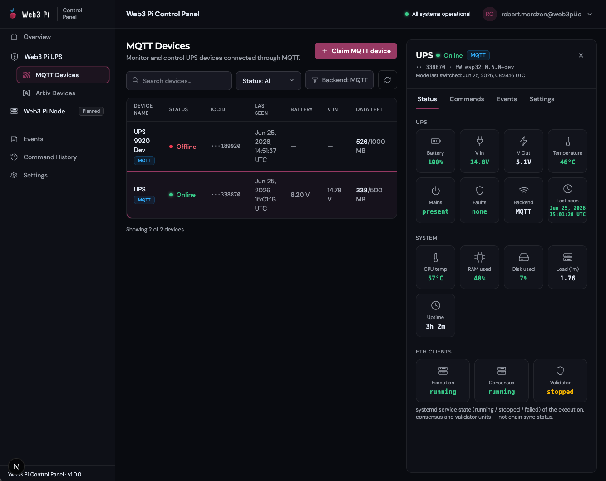

# Web Panel

[panel.web3pi.io](https://panel.web3pi.io){:target="_blank"} is the cloud dashboard for your Web3 Pi UPS: claim your unit, watch its telemetry and events, and send remote commands — even when the power or your home network is down. It requires the [LTE-M module](index.md); out of the box the device reports in MQTT mode, which needs no configuration on the device at all.

## Create an Account

1. Open `https://panel.web3pi.io`. You are redirected to the Web3 Pi sign-in page at `auth.web3pi.io`.
2. Click **Need an account? Sign up.** and register with your email address.
3. Confirm the verification link sent from `noreply@web3pi.io` — the account is active only after verification.
4. Sign in. Optional two-factor authentication (authenticator apps, passkeys/security keys, backup codes) is available under your avatar menu → **Account settings**.

After signing in you land on the **Overview** page; your devices live under **Web3 Pi UPS → MQTT Devices**:

{: .img-center }

## Claim Your Device

A device only shows up in your panel after you claim it.

=== "MQTT (default)"

    1. Go to **Web3 Pi UPS → MQTT Devices** and click **Claim MQTT device**.
    2. Enter the **ICCID** (19–20 digits, printed on the SIM tray) and the **claim token** (format `XXXXX-XXXXX`) included with your UPS.
    3. Confirm — the device appears in your list and its telemetry lands within about 30 seconds.

=== "Arkiv"

    Arkiv devices are claimed under **Web3 Pi UPS → Arkiv Devices** with a crypto wallet and the **4-word claim code** from the device OLED, and the binding is confirmed on the UPS itself. Follow the walkthrough in [Arkiv mode](arkiv-mode.md#claiming-your-device).

!!! note "One device, one owner"
    A device belongs to exactly one account. For MQTT devices the claim token stays valid for the device's whole life: to sell or hand a unit over, open its **Settings** tab and use **Release device** — the new owner claims it with the same ICCID and token. Arkiv devices are bound to a wallet instead; releasing in the panel does not clear that binding — a factory reset on the device does (see [Arkiv mode](arkiv-mode.md)).

## What You See

The sidebar lists your units by backend mode (**MQTT Devices**, **Arkiv Devices**), plus fleet-wide **Events** and **Command History**. The device list shows each unit's name, online state (online = reported within the last 3 minutes), battery and input voltage, last-seen time, and remaining SIM data. Click a device to open its detail pane with **Status**, **Commands**, **Events**, and **Settings** tabs.

The **Status** tab updates live:

- **UPS** — battery charge, input/output voltage, temperature, mains present, fault state.
- **System** — host stats from the [companion service](../host-integration.md): CPU temperature, RAM, disk, load, uptime.
- **ETH Clients** — execution / consensus / validator shown as running, stopped, or failed. This is the service state on the Pi, not chain sync status.

Devices report roughly every 30 seconds over LTE, but power-loss and fault events are pushed immediately — an outage shows up in the panel within seconds.

## Remote Commands

The **Commands** tab targets the selected device:

| Group | Commands | Notes |
|---|---|---|
| UPS output | Power on · Power off · Cycle output | Cycle cuts output for 1.5 s — hard-reboots the Pi |
| Raspberry Pi | Reboot OS · Shutdown OS | Graceful shutdown; the UPS keeps supplying power |
| Diagnostics | Request status · Beep / self-test | |
| Ethereum clients | Start · Restart · Stop per client | Acts on the whitelisted services on the Pi |

Destructive commands ask for confirmation. On MQTT devices every command is tracked from *accepted* to *confirmed by device* (or *failed* / *timed out*). On Arkiv devices each command requires one wallet signature and may show as *submitted on-chain* rather than confirmed — see [Arkiv mode](arkiv-mode.md).

## Events and Command History

**Events** collects power and host alerts from your whole fleet — mains lost/restored, battery low/full, faults, imminent host shutdown, low disk, backend-mode changes — filterable by device, severity, and date. **Command History** logs every issued command with its status, latency, and the account that sent it.

## Settings

Per-device settings live in the device's **Settings** tab: rename the unit, review backend details (full ICCID, remaining data, hardware revision, firmware version, claim date), and release it in the **Danger zone**. Account-level settings (password, two-factor, active sessions) are managed in your Web3 Pi account via the avatar menu → **Account settings**.

!!! tip "Running your own backend?"
    Devices switched to [HTTP mode](http-mode.md) report to your own server instead — the panel can still list them, but live telemetry and commands go through your server.
