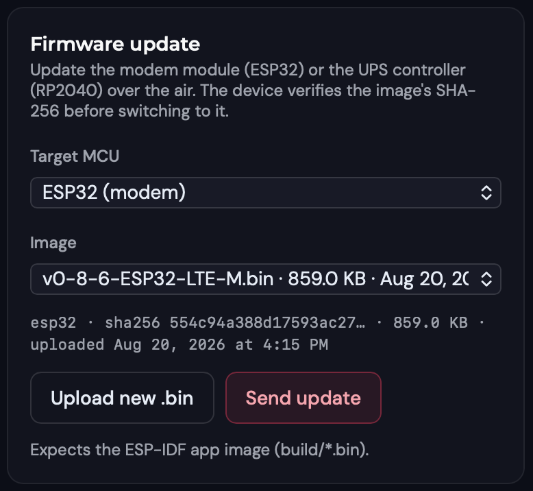
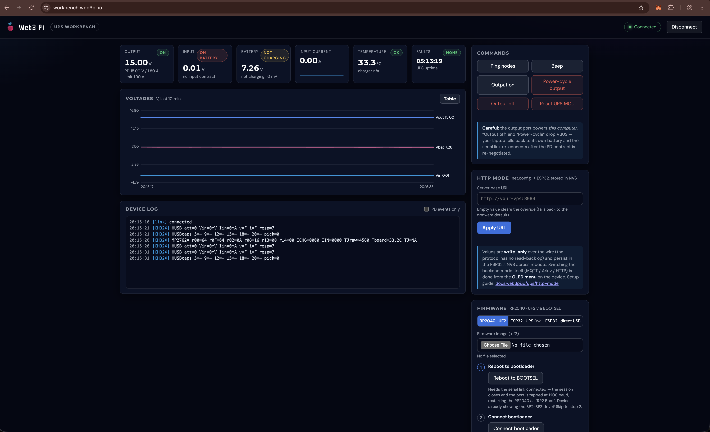
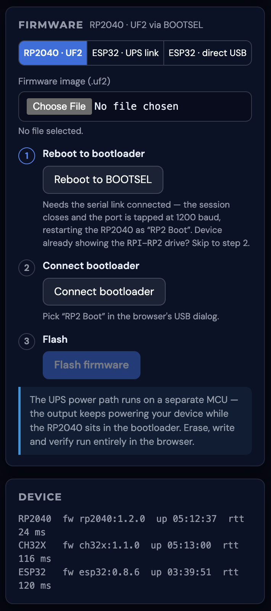

# Firmware Updates

The Web3 Pi UPS contains three microcontrollers, and two of them can be updated by you — remotely from the [web panel](connectivity/web-panel.md), or locally from a browser over USB. Firmware versions use the form `<chip>:<version>`, e.g. `esp32:0.8.6`.

| Chip | Role | How it updates |
|---|---|---|
| **ESP32** | LTE-M modem module (the M.2 card) | Over the air from the panel, or over USB via the Workbench |
| **RP2040** | UPS controller — display, buttons, telemetry, host link | Over the air from the panel (relayed internally), or over USB via the Workbench |
| **CH32X** | Power path — PD negotiation, charging, failover | Not user-updatable — it ships final, so power delivery never depends on an update |

Firmware images are published by the Web3 Pi team. For panel updates the current images are already in the panel's image list; for USB flashing the image files come from the open [firmware repository](https://github.com/Web3-Pi/Web3-Pi-UPS){:target="_blank"}.

## Checking Your Firmware Version

- **Web panel** — the device header shows the ESP32 version next to the ICCID, and **Settings → Firmware (ESP32)** shows it too. It refreshes each time the module connects, so about a minute after power-on. The panel shows the ESP32 version only.
- **Workbench** — connect the UPS over USB (below) and the **Device** card lists all three chips with their exact versions, within seconds.

## Updating from the Web Panel (over LTE)

Units with the [LTE-M module](connectivity/index.md) update over the air — no cables, no ladder to the shelf the UPS sits on.

1. Open your device in the panel and go to the **Commands** tab → **Firmware update** card.
2. Pick the **Target MCU** — **ESP32 (modem)** or **RP2040 (UPS controller)** — and an image (the newest is preselected).
3. Click **Send update** and confirm. The device downloads the image over LTE and applies it; the panel's success message points you to the **Events** tab, where progress arrives as `fw_update` events (started → progress → verifying → rebooting, plus a final `done` for RP2040 updates — an ESP32 update ends at `rebooting` and then simply reconnects on the new version).

{: .img-center style="max-width: 420px;"}

What to expect:

- **It takes a while.** The download runs at cellular IoT speeds — expect roughly **10 minutes** for an ESP32 image, less for the smaller RP2040 image. "Stuck at 25 %" for a few minutes is normal.
- **The Pi never loses power.** An ESP32 update reboots only the modem module (telemetry pauses a minute or two). An RP2040 update shows a **FW UPDATE** progress screen on the OLED (buttons disabled), then the controller reboots with its startup melody — the power path is handled by the CH32X and stays up throughout.
- **It is rollback-safe.** Every image is SHA-256-verified before it is applied, and the previous firmware is kept: if the new ESP32 image cannot get back online within 10 minutes — or the new RP2040 image misbehaves — the device automatically returns to the old version. A failed update therefore looks like "device came back on the old version": retry with good signal.
- **Confirming it took**: for ESP32, the version in the panel header/Settings updates after the module reconnects; for RP2040, look for the `fw_update.done` event.

!!! note "Mode matters"
    Panel updates work in MQTT mode and in Arkiv mode. The walkthrough above describes MQTT; in Arkiv mode the card is titled **Firmware update (OTA over LTE)** with a **Sign & update** button (one owner-wallet signature, like any Arkiv command), it requires device firmware `esp32:0.8.2` or newer, and no progress events appear on the Events tab — confirm success by the version bump instead. In [HTTP mode](connectivity/http-mode.md) there are no panel updates — switch the device to MQTT from the OLED menu for the update, or flash it over USB.

!!! tip "During an update"
    Keep the unit powered, send one update at a time, and don't switch backend modes mid-update. Each attempt downloads the full image (~1 MB for ESP32) from the SIM's metered data plan.

## Local Updates over USB (Workbench)

[workbench.web3pi.io](https://workbench.web3pi.io){:target="_blank"} is a browser tool for the UPS — live telemetry, commands, and firmware flashing with nothing to install. It runs in desktop Chrome, Edge, Firefox 151+, or Opera (Safari and mobile browsers are not supported); the RP2040 flashing step specifically needs a Chromium browser (Chrome/Edge/Opera), while Firefox can do everything else, including both ESP32 flashing modes.

**Connect**: run a USB-C cable from the UPS **OUT** port to your computer. The UPS keeps powering your laptop while handing it the data link, and shows up as `Web3_Pi_UPS` (on macOS, click **Allow** on the accessory prompt). Click **Connect** on the page and pick the device. Only one program can hold the serial link — close any `ups-live` or terminal session first.

{: .img-center }

Besides the live dashboard and command buttons, the **Device** card shows every chip's firmware version, and the **Firmware** card flashes two targets:

- **RP2040 (`.uf2` file)** — one click reboots the controller into its built-in bootloader, you pick **RP2 Boot** in the browser prompt, and the page flashes and byte-for-byte verifies the image. The UPS output keeps powering your computer the whole time.
- **ESP32 (`.bin` file) via the UPS link** — flashes the modem module through the same cable, no access to the module needed. The transfer takes a few minutes and is rollback-safe, exactly like a panel update.

A third mode — **ESP32 · direct USB** — talks to the M.2 module's own USB port (under the service flap) and is only needed to recover a module or migrate very old firmware; the page walks you through it.

{: .img-center style="max-width: 420px;"}

!!! warning "Never erase the ESP32's flash"
    The ESP32 carries factory per-device provisioning data. The Workbench never erases it — but if you ever flash with other tools (e.g. `esptool.py`), do not use `erase_flash` on a provisioned unit.

## Related Pages

- [Web Panel](connectivity/web-panel.md) — claiming, commands, and the Events tab where update progress lands
- [Troubleshooting](troubleshooting.md) — what a slow or rolled-back update looks like
- [Host Integration](host-integration.md) — the USB link the Workbench uses
