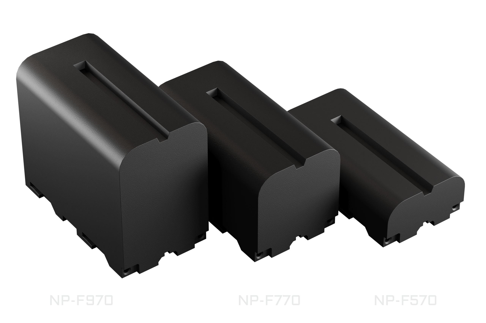

# Battery

The Web3 Pi UPS uses Sony NP-F series batteries — 7.2 V Li-Ion camera packs that are cheap, widely available, and user-replaceable. The pack slides onto a standard NP-F rail on top of the unit.

{: .img-center style="max-width: 560px;"}

## Supported Models

| Model | Capacity | Runtime |
|---|---|---|
| NP-F570 | 2600 mAh (18.7 Wh) | Shortest — most compact |
| NP-F770 | 5200 mAh (38.5 Wh) | Mid-range |
| NP-F970 | 9600 mAh (71 Wh) | Longest |

Runtime depends on your Raspberry Pi's workload; other NP-F-compatible packs also fit. Capacities above are for the recommended **Newell** packs — see [Specifications](../reference/specifications.md#battery) for links.

!!! warning "Use packs with internal protection"
    The UPS relies on the battery's own built-in protection circuit (BMS) for cell-level and deep-discharge protection. Use quality NP-F packs that include one — virtually all genuine and reputable third-party packs do.

## Inserting and Removing

- **Insert**: set the battery on the top rail offset by about half its length — NP-F packs engage the rail from roughly their midpoint — then slide it on until the red **PUSH** latch clicks.
- **Remove**: press the red **PUSH** latch on the side edge and slide the battery off the rail.

## Hot-Swap

The battery can be swapped **while external power is present** (USB-C **IN** or the barrel jack) — the output to the Pi stays up the whole time.

!!! tip "Check before you pull"
    Before swapping, confirm the unit is not running on battery: the Home screen mode should read anything other than `DSC` (discharging). Removing the battery while it is the only power source cuts power to the Pi.

## Charging

Charging is fully automatic — there is nothing to configure:

- Whenever external power is present and the pack is below full, the UPS charges it.
- Charging is deliberately gentle: a modest charge current and a ~8.1 V "gentle full" target (below the pack's maximum) extend battery lifespan.
- When the pack is full, charging stops: the mode label shows `FUL`, then `IDL`. On external power the Pi is always fed from the input, so a full pack simply rests — and takes over seamlessly if the input fails.
- When power returns after an outage, charging resumes on its own.

## Reading Charge State on the OLED

The **Home** screen shows a battery icon (fill level = charge, scrolling bars while charging, blinking below 10 % on battery), the charge percentage, and a mode label. The **BATTERY** [debug screen](display-menu.md#debug-screens) (current firmware only) adds battery voltage and charge current.

| Label | Meaning |
|---|---|
| `DSC` | Discharging — running on battery |
| `PRE` | Pre-charge (deeply discharged pack) |
| `CHG` | Charging |
| `FUL` | Full |
| `IDL` | On external power, not charging |

On battery, the buzzer beeps once every 30 s below 20 % charge and twice every 5 s below 10 %; the companion service can shut the Pi down safely before the battery runs out — see [Host Integration](../host-integration.md).

!!! note
    The charge percentage is estimated from battery voltage and can read optimistically while charging.

See [Display & Menu](display-menu.md) for the full screen reference and [Power](../power.md) for failover and charging behavior in detail.
