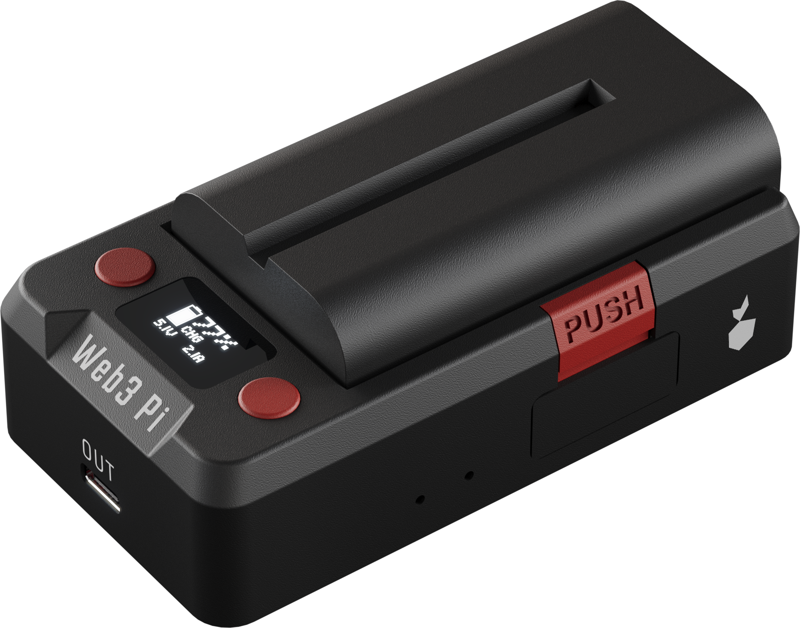

# Display & Menu

The UPS has a 64 × 32 monochrome OLED and two red buttons, one on each side of the display. On power-up it plays a short melody and shows a splash screen for a few seconds while readings stabilize, then lands on the **Home** screen.

{: .img-center style="max-width: 480px;"}

## Status Screens

The **Home** screen is the main display: a battery icon (fill = charge level, animates while charging), charge %, mode label, battery voltage, plus input and output voltage.

Mode labels: `DSC` discharging (on battery) · `PRE` pre-charge · `CHG` charging · `FUL` full · `IDL` on external power, not charging.

<!-- TODO(release): the four debug screens below are removed from production firmware — delete this subsection and the debug-screen mentions in battery.md, troubleshooting.md, and reference/specifications.md before release. -->

### Debug Screens

!!! note "Not in the production release"
    Current firmware additionally has four debug screens. They will be removed from the production firmware.

Cycled with short button presses; a small position strip in the bottom-right corner shows where you are, and the display returns to **Home** automatically after 20 s without a button press.

| Screen | Shows |
|---|---|
| **INPUT** | Input voltage, negotiated USB-C PD contract and its wattage, active source (**USB-C** / barrel / off) |
| **OUTPUT** | Measured output voltage, the PD contract offered to the Pi, current limit |
| **BATTERY** | Battery voltage and charge %, mode label, charge current |
| **SYSTEM** | Uptime, board and charger temperatures, fault code |

!!! note "BAD PSU screen"
    If the input supply is present but out of range, the display switches to a flashing **BAD PSU** warning (with alarm beeps) until you connect an adequate charger. This overrides all other screens.

## Buttons

| Context | **LEFT** | **RIGHT** |
|---|---|---|
| **Home** / debug screens | Short press: previous [debug screen](#debug-screens). Hold 2 s on **Home**: open the menu | Short press: next [debug screen](#debug-screens) |
| Menu | Move cursor down (wraps) / toggle the highlighted option | Select / activate |
| Confirmation prompts (device claiming) | Hold **both** buttons for the on-screen countdown to confirm; release to abort | |

Every press gives a short click from the buzzer (unless sound is off).

## Local Menu

Hold **LEFT** for 2 s on the **Home** screen. Navigate with **LEFT** (down) and **RIGHT** (select); the menu closes itself after 60 s of inactivity, saving any pending change.

| Entry | What it does |
|---|---|
| **Bright** | Display brightness, 6 levels with live preview — **RIGHT** cycles, **LEFT** saves and returns |
| **Sound** | Toggles the buzzer **ON**/**OFF** with **RIGHT**, saved immediately |
| **Info** | Read-only: uptime and board/charger temperatures; any button returns |
| **Output** | Shows the output state; **Turn OFF** asks for confirmation (`CUT PWR TO PI?`) before cutting power to the Pi, **Turn ON** is immediate |
| **Network** | Opens the connectivity menu of the optional LTE-M module — backend mode selection, HTTP key, device wallet, and factory reset (**Reset**). See [Connectivity](../connectivity/index.md). Without the module fitted it shows a brief **NO MODEM** notice |
| **Exit** | Closes the menu |

**Bright** and **Sound** persist across power cycles and battery swaps. A factory reset (in the **Network** menu) restores both to defaults.

!!! warning "Sound OFF mutes everything"
    Turning **Sound** off silences all audio, including the power-loss and low-battery alarms — not just button clicks.
