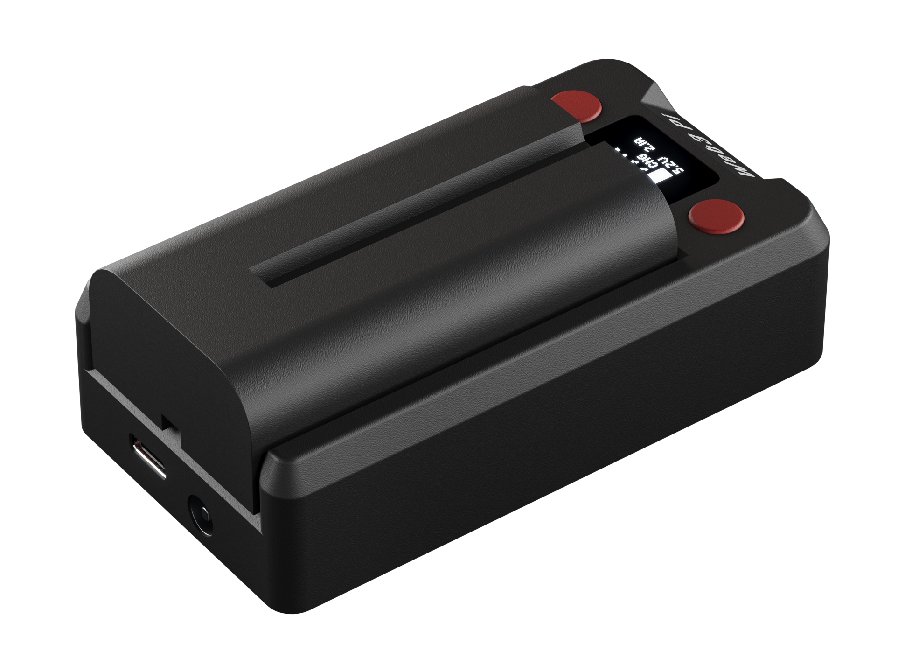

# Power & Failover

This page explains how the UPS behaves through a power outage — failover, the low-battery sequence, and recovery. For ports and internals see [Hardware](hardware/index.md); for the shutdown/restart service on the Pi see [Host Integration](host-integration.md).

## Three Power Sources

| Source | Range | Role |
|--------|-------|------|
| **IN** — USB-C PD | 12–20 V, 26 W minimum (45–65 W recommended) | Primary input, profile auto-negotiated |
| **DC jack** — barrel | 12–20 V DC | Alternative external input |
| Battery — Sony NP-F | 7.2 V Li-Ion, hot-swappable | Backup during outages |

The two external inputs are combined passively — whichever presents the higher voltage powers the UPS, with nothing to configure, and if the active input fails the other takes over seamlessly. The battery carries the load only when neither external input is available, and is bypassed entirely once full while external power is present (no pointless charge cycles, less wear). Output is maintained as long as **any one** of the three sources is available, so you can even [hot-swap the battery](hardware/battery.md) while on external power.

{: .img-center style="height: 300px;"}

## USB-C PD Capabilities

| Port | PD profiles |
|------|-------------|
| **IN** (sink) | 12–20 V fixed profiles, best available selected automatically |
| **OUT** (source) | 5.1 V / 5 A · 9 V / 3 A · 12 V / 2.25 A · 15 V / 1.8 A |

A Raspberry Pi 5 negotiates the native **5.1 V / 5 A** profile automatically — the UPS identifies itself as a 27 W-class Raspberry Pi supply, which unlocks the Pi 5's full 5 A mode. A 5 A contract requires an e-marked USB-C cable. Full electrical details are in [Specifications](reference/specifications.md).

!!! note "Weak or out-of-range supply"
    If input power is present but unusable, the OLED shows a flashing **BAD PSU** screen and the buzzer beeps until it is fixed. Chargers below 45 W still run the Pi, but cannot sustain the full 27 W output with charging headroom.

## When Mains Fails

Switchover to battery happens in hardware — the output is never interrupted, so the Pi keeps running with no reboot or brownout. What you notice:

- a one-time descending three-tone buzzer alarm,
- the charge state on the OLED changes to **DSC** (discharging),
- a **MAINS_LOST** event appears in the [web panel](connectivity/web-panel.md) event log, with telemetry pushed immediately.

## As the Battery Drains

| Level (on battery) | Behavior |
|--------------------|----------|
| Below 20 % | Single beep every 30 s |
| Below 10 % | Double beep every 5 s; battery icon blinks |
| Below the service threshold (default 10 %) | The host service starts a 30 s grace countdown, then shuts the Pi down cleanly — Ethereum services stopped, disks synced, system halted. Cancelled automatically if power returns in time. |
| Pack empty | The battery's internal protection cuts off, preventing deep discharge |

The UPS itself never cuts its output on low battery — it keeps powering the (halted) host until the pack's own protection trips. Graceful shutdown is the job of the companion service on the Pi; see [Host Integration](host-integration.md).

!!! warning "Two things to check"
    Without the companion service the Pi receives no shutdown signal and will eventually lose power uncleanly. Also: turning **Sound** off in the [local menu](hardware/display-menu.md) mutes *all* alarms, including the critical-battery warning.

## When Power Returns

- Charging resumes automatically, a **MAINS_RESTORED** event is logged, and all alarms re-arm for the next outage.
- If the node stayed up (it usually does), there is nothing to restore — the output never dropped.
- If the host shut itself down while the battery still had charge (the usual case — shutdown triggers around 10 %), the halted Pi remains powered and **stays halted**. Restart it manually: the Pi's power button, **Output** off/on in the [local menu](hardware/display-menu.md), or a remote power cycle from the [web panel](connectivity/web-panel.md).
- Only if the pack ran completely empty and its internal protection cut the rail does the Pi boot automatically when external power returns.
