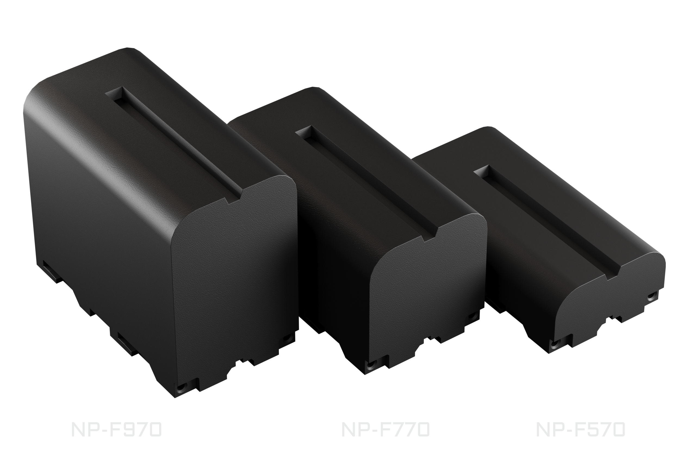
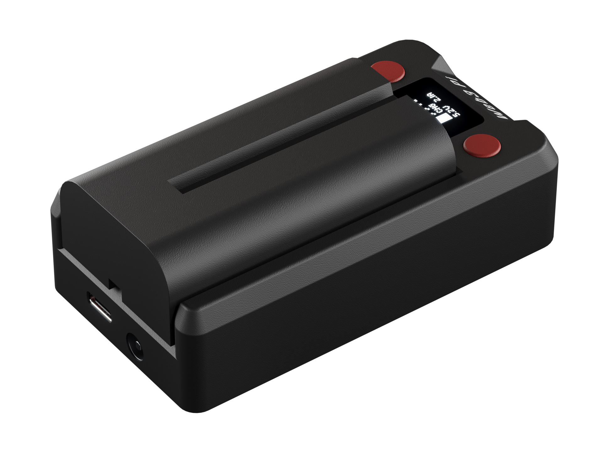

# Specifications

Reference data for the Web3 Pi UPS — a true DC UPS (no AC inverter) for the Raspberry Pi 5 and other USB-C PD devices. For behavior details see [Power & Failover](../power.md); for the data link see [Host Integration](../host-integration.md) and the [Protocol Reference](protocol.md).

## Power Output

| Parameter | Value |
|---|---|
| Output port | USB-C **OUT** — power + data over a single cable |
| Native Raspberry Pi 5 profile | 5 V / 5 A (27 W peak) — the UPS identifies itself as a 27 W supply, unlocking the Pi 5's full power envelope |
| USB-C PD output profiles | 5 V / 5 A · 9 V / 3 A · 12 V / 2.25 A · 15 V / 1.8 A, auto-negotiated |
| Designed workload | A Raspberry Pi 5 running a Web3 Pi node/validator — typically well under 15 W, sustained indefinitely |
| Cable requirement | E-marked USB-C cable recommended for 5 A operation — the UPS cannot detect an under-rated cable |

!!! note "Peak vs. sustained load"
    The 27 W profile covers the Pi 5's power peaks. The UPS is a compact, fanless device built around a node/validator workload, which it powers around the clock; it is not meant as a general-purpose charger, and sustained loads above ~20 W (e.g. charging a laptop) can build up heat, especially in warm surroundings.

!!! warning "OUT is output only"
    Never feed power into the **OUT** port.

## Power Input

| Parameter | Value |
|---|---|
| USB-C PD input (**IN**) | 9–20 V, auto-negotiated (15 V preferred), 26 W minimum |
| DC barrel jack | 12–20 V DC, 5.5/2.5 mm connector |
| Recommended source | **45 W or more** — a supply rated at least 45 W is required to deliver the full 27 W (5 V / 5 A) output; extra headroom also charges the battery under full load |
| Source selection | Automatic — with both external inputs connected, the higher voltage supplies the load |
| Power sources | 3 (USB-C PD, DC jack, battery) with seamless switching; output is maintained while any single source is available |
| Power path | Active — battery is bypassed when full and external power is present (less battery wear); instant failover to battery |

## Battery

| Parameter | Value |
|---|---|
| Battery type | Sony NP-F series, 2S Li-Ion, 7.2 V nominal |
| Replaceable | Yes — user-replaceable, hot-swappable under external power |
| Charging | Automatic when external power is present; gentle-full target ≈ 8.1 V, modest charge current by design |
| Protection | Pack's internal protection circuit required — use quality NP-F packs |

Compatible battery options — runtime depends on your Raspberry Pi's workload. Use batteries from reputable manufacturers with a built-in protection circuit (BMS); we recommend **Newell** packs:

| Battery | Capacity | Runtime |
|---|---|---|
| [Newell NP-F570](https://shop.newell.pro/pl/akumulatory-do-aparatow-fotograficznych-i-kamer/842-akumulator-newell-zamiennik-np-f570-do-sony-5901891109528.html){:target="_blank"} | 2600 mAh (18.7 Wh) | Shortest |
| [Newell NP-F770](https://shop.newell.pro/pl/akumulatory-do-aparatow-fotograficznych-i-kamer/1233-akumulator-newell-zamiennik-np-f770-do-sony-5901891108774.html){:target="_blank"} | 5200 mAh (38.5 Wh) | Mid-range |
| [Newell NP-F970](https://shop.newell.pro/pl/akumulatory-do-aparatow-fotograficznych-i-kamer/870-akumulator-newell-zamiennik-np-f970-do-sony-5901891100822.html){:target="_blank"} | 9600 mAh (71 Wh) | Longest |

{: .img-center style="max-width: 560px;"}

See [Battery](../hardware/battery.md) for charging behavior and swap procedure.

## Interfaces

| Interface | Details |
|---|---|
| USB serial | Over the **OUT** cable; the UPS enumerates on the Pi as a `Web3_Pi_UPS` serial device — telemetry, event logging, graceful low-battery shutdown, and remote restart commands via the companion service |
| Display | 64 × 32 px monochrome OLED status display |
| Buttons | 2 push-buttons — screen navigation and local settings menu |
| Buzzer | Audible alarms (power loss, low battery) and UI feedback; can be muted |
| LTE-M module | Internal M.2 card with an ESP32-S3 controller and a SIMCom SIM7080G modem (LTE-M / Cat-M1); pre-installed on production units together with a 1NCE nano-SIM and data plan. The UPS is fully functional without it — remote monitoring details in [Connectivity](../connectivity/index.md) |

## Physical

| Parameter | Value |
|---|---|
| Cooling | Passive — fanless, silent |
| Form factor | Compact standalone enclosure; connects by cable only (no GPIO header, no HAT stacking) |
| Enclosure compatibility | Works with any Raspberry Pi 5 case |
| Rear panel | USB-C **IN** + DC barrel jack |

{: .img-center style="max-width: 480px;"}
