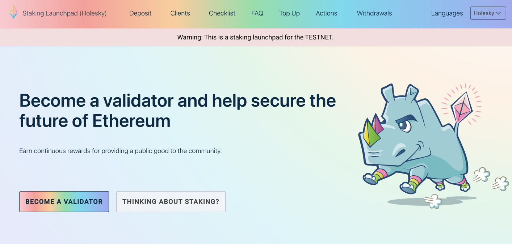
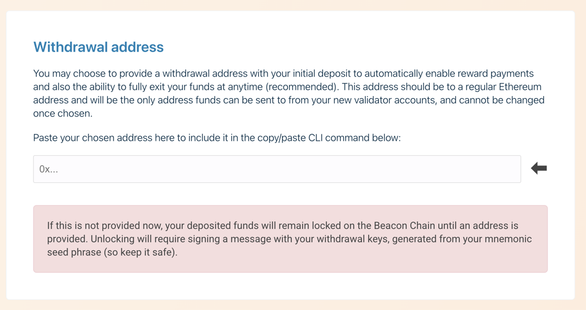

# Solo Staking on Web3 Pi

## 1. Introduction

### Overview

Solo staking on the Ethereum network involves active participation in the Proof-of-Stake consensus mechanism. By running your own validator node, you help secure the network by proposing and attesting to new blocks. In return for this service, you receive rewards in ETH. Choosing a dedicated, energy-efficient device like the Web3 Pi for solo staking supports network decentralization, provides full control over your keys and operations, and minimizes energy consumption compared to traditional computers.

### Purpose of this Guide

This guide provides detailed, manual, step-by-step instructions on how to configure solo staking on the Web3 Pi device. It assumes that the basic setup of the Web3 Pi has already been completed and the device is accessible on your local network. We will focus on configuration via an SSH connection, using the pre-installed clients: Geth as the Execution Layer (EL) client and Nimbus as the Consensus Layer (CL) client.

### Client Selection

The Web3 Pi comes with pre-installed Ethereum clients: Geth, Nimbus, and Lighthouse. This guide focuses on the preferred combination of Geth + Nimbus.

## 2. Important: Warnings, Recommendations, and Prerequisites

### Warning (Disclaimer)

**Running an Ethereum validator involves significant financial risk and technical responsibility. By following this guide, you acknowledge that you are doing so entirely at your own risk.**

Potential risks include, but are not limited to:

- **Slashing:** Loss of part or all of your deposited ETH due to incorrect validator configuration or actions contrary to the network protocol (e.g., double signing blocks/attestations).
- **Inactivity Penalties:** Gradual loss of deposited ETH if your validator is offline or fails to perform its duties (e.g., attestations) on time.
- **Hardware Failure:** Potential downtime or data loss in case of Raspberry Pi, hard drive/SSD, or SD card failure.
- **Connectivity Issues:** Interruptions in Internet access can lead to inactivity penalties.
- **Software Bugs:** Issues in EL or CL clients can cause unexpected behavior, downtime, or penalties.
- **Security Breaches:** Compromise of the validator machine could lead to loss of funds (if withdrawal keys are compromised in the future) or slashing (if an attacker gains control of the validation process).

The Web3 Pi project nor the authors of this guide bear any responsibility for any losses incurred as a result of using these instructions or running a validator.

### Recommendation: Uninterruptible Power Supply (UPS)

**We strongly recommend connecting your Web3 Pi device and essential network equipment (such as your router/modem) to an uninterruptible power supply (UPS).**

A UPS protects against voltage fluctuations and short power outages, which are common causes of node downtime, potential data corruption on the disk, and can lead to inactivity penalties for your validator (in Solo Staking).

### Prerequisites

Before starting the configuration, ensure you meet the following requirements:

- **32 ETH:** You must have access to exactly 32 ETH for each validator you intend to run. These funds will be locked as your deposit (stake). This is a requirement of the Ethereum protocol.
- **Configured Web3 Pi:** A fully assembled and operational Web3 Pi device, connected to your local network, with the Web3 Pi operating system and Ethereum clients installed. We assume the basic device configuration has already been completed according to the main Web3 Pi documentation.
- **SSH Access:** You need an SSH client installed on your computer (e.g., Terminal on macOS/Linux, PuTTY or Windows Terminal on Windows) and the ability to connect to your Web3 Pi via SSH using its IP address and the `ethereum` user credentials.

## 3. Network Selection

Before you begin synchronization, choose which network you want to sync with (`mainnet` for real staking, `holesky` or `hoodi` for testnets). Edit the `config.txt` file:

```bash
sudo nano /boot/firmware/config.txt
```

Find the `eth_network` key and set it to your preferred network (`mainnet`, `holesky`, or `hoodi`). Save the changes (Ctrl+X, then Y, then Enter). Restart the Pi to load the new configuration:

```bash
sudo reboot
```

!!! warning

    If you previously started synchronization with a different network, remove the old downloaded data with the command: `sudo rm -r /mnt/storage/.ethereum`

## 4. Configure the Execution Layer Client (Geth)

The script to run the Geth client is located in the directory:
`/home/ethereum/clients/geth/geth.sh`. Staking does not require any changes to the Geth configuration.

A full list and description of all available Geth command-line options can be found in the official Geth documentation: <https://geth.ethereum.org/docs/interface/command-line-options>

## 5. Configure the Consensus Layer Client (Nimbus)

The script to run the Nimbus client is located in the directory:
`/home/ethereum/clients/nimbus/nimbus.sh`. Properly configured staking requires setting the address where rewards for newly proposed blocks will be sent.

Open the script in a text editor:

```bash
nano /home/ethereum/clients/nimbus/nimbus.sh
```

Find the place where the `nimbus_beacon_node` command is executed (towards the end of the file). Look for the line that starts with `nimbus_beacon_node --non-interactive --tcp-port...`

Add your fee recipient address as a new argument at the end of that line:
` --suggested-fee-recipient='0xYOUR_ETHEREUM_ADDRESS'`

Replace `0xYOUR_ETHEREUM_ADDRESS` with your actual Ethereum address.

### Saving and Closing the Editor

Save the changes and close the editor (Ctrl+X, then Y, then Enter).

### Fee Recipient Address

Ensure the address provided in `--suggested-fee-recipient` is secure and you have access to it.

More details about Nimbus configuration options can be found in the official Nimbus documentation (Nimbus Book): <https://nimbus.guide/options.html>

## 6. Generate Validator Keys using Ethereum Launchpad

### Official Tool

Validator keys **must** be generated using the official Staking Launchpad website.

=== "Mainnet"

    Go to the official Staking Launchpad site for Mainnet:<br>
    <https://launchpad.ethereum.org/>

    

=== "Holesky"

    Go to the official Staking Launchpad site for the Holesky testnet:
    <https://holesky.launchpad.ethereum.org/>

    

=== "Hoodi"

    Go to the official Staking Launchpad site for the Hoodi testnet:
    <https://hoodi.launchpad.ethereum.org/>

    

### Proceed through the advisories checklist

Make sure to read all the contents carefully before proceeding through each step.
Don't skip anything unless you're absolutely sure what each step entails.


### Choose your clients

The launchpad is aimed at a general user and there are various considerations for choosing
specific execution and consensus layer clients. Due to mechanics of the global staking ecosystem,
to strengthen the network and limit the impact of potential attacks, it's generally recommended 
to choose a minority client.

However, while the above is true, and while the launchpad enables you to choose any
of the available clients, the default, battle-tested configuration for the Web3 Pi 
includes `geth` and `nimbus` specifically. 

We have devoted a considerable effort to finding the setup that's optimally suited to
the characteristics of a such a small-footprint device as Raspberry Pi 5 and 
this is the pair of clients which we both recommend and, by extension, include 
in our default Web3 Pi image.

So, unless you're sure you wish to choose differently, and are willing to reconfigure
the device, this is the pair that you should also choose.


### Generate key pairs

Now you're ready to generate the key pairs, which control your Ether stake and which 
bind the stake to a given validator. 

#### Security considerations

We cannot stress enough how important it is to execute this step in a secure manner.
Given that once you submit your deposit, your validator keys are directly bound to 
your stake, an attacker with malicious intent and in possession of these keys, can,
in the least cause you to lose your staking rewards, and at most, even trigger
a complete loss of your stake through slashing.

That's why, once you download and install the chosen key generator tool, 
it is recommended to run it on a machine that's disconnected from the network.

Please also ensure you keep your mnemonic phrase safe and out of reach of anybody but you.
This is the only way to regenerate your validator key if it gets lost.

#### Provide the withdrawal address 

We strongly recommend setting the withdrawal key right away when generating the validator keys.
Although it is optional and can be performed later on, it can also be performed only once.
Setting it at this stage ensures that even if an attacker were to take control of your validator
keys, they will never be able to override the address to which your stake and the rewards are withdrawn.



#### Generate the keys

Once you fill in the number of validators and the withdrawal address, you proceed with the key
generation itself. You're free to choose whichever tool suits you best, 
depending on your platform and preferences. 
For the sake of this guide, we'll use the CLI app as the example.


=== "Mainnet"
    ```bash
    ./deposit new-mnemonic --chain mainnet
    ```

=== "Holesky"
    ```bash
    ./deposit new-mnemonic --chain holesky
    ```
=== "Hoodi"
    ```bash
    ./deposit new-mnemonic --chain hoodi
    ```

In case of the CLI app, the Launchpad gives you the exact command that you should run in your 
terminal. While you proceed, you'll be asked to provide the password to encrypt the keystore file
and will receive the mnemonic phrase which can be used to recover the key.

As mentioned previously, it is critical that you keep these mnemonics safe and private.

!!! danger "Critical Security Steps"

    During key generation, the following will be created:

    - **Mnemonic Phrase (Seed Phrase):** This is the master key to your ETH.
      - Write it down VERY carefully on paper or metal.
        - Verify the backup.
        - Store it in multiple, extremely secure, offline locations.
        - **Never store it digitally or on an online device.**
        - **Losing the phrase = permanent loss of funds.**
    
      - **Keystore Password:** Set a very strong, unique password to encrypt the `keystore-*.json` file(s). Store this password securely (e.g., in a password manager).


### Upload your deposit data

After the key generator succeeds, you need to upload the just-generated `deposit_data-xxxxxx.json`
file to the Launchpad, so that it can prepare the deposit transaction for you.


Once you upload that file and click continue, the last remaining step is to submit your ETH stake to
the deposit contract.

### Confirm the deposit

In order to do that, the Launchpad will use your MetaMask wallet to generate and send the
deposit transaction.


Please double-check the withdrawal address and then proceed with the checklist and afterwards, with the 
confirmation of the deposit transaction.


After the transaction is sent and processed by the blockchain, you'll get the final confirmation
that the deposit has been made.


You also get the link to the status website which lists all the active validators, and which
allows you to get the status of your validator. Please note though, that the status for your validator 
may not be immediately visible, and you may need to wait a few minutes until your stake is detected 
by the website.

On successful submission and detection of the deposit, your validator status will appear as "Deposited".


## 7. Import Validator Keys into Nimbus

### Secure Transfer of Keystore Files

Create a new directory `validator_keys` on your Pi and transfer the keystore files from the machine where they were generated to your Pi:

```bash
# On your local machine (where keys were generated):
# Create the directory on the Pi via SSH
ssh ethereum@<pi_address> mkdir -p ~/validator_keys

# Securely copy the keystore files to the Pi
scp path/to/keystore*.json ethereum@<pi_address>:~/validator_keys/
```

Replace `<pi_address>` with your Web3 Pi's IP address and `path/to/keystore*.json` with the actual path to your generated keystore file(s). You will be prompted for the `ethereum` user's password.

### Key Import Command

Connect to your Web3 Pi via SSH again.

Import the uploaded keys using the `nimbus_beacon_node deposits import` command. The `--data-dir` path depends on your chosen network:

=== "Mainnet"

    ```bash
    sudo nimbus_beacon_node deposits import \
      --data-dir=/mnt/storage/.nimbus/data/shared_mainnet_0/ \
      ~/validator_keys
    ```

=== "Holesky"

    ```bash
    sudo nimbus_beacon_node deposits import \
      --data-dir=/mnt/storage/.nimbus/data/shared_holesky_0/ \
      ~/validator_keys
    ```

=== "Hoodi"

    ```bash
    sudo nimbus_beacon_node deposits import \
      --data-dir=/mnt/storage/.nimbus/data/shared_hoodi_0/ \
      ~/validator_keys
    ```

You will be prompted to enter the **keystore password** you created during key generation for each key being imported.

### Verification

After a successful import, the encrypted keys will be stored within the Nimbus data directory. You can verify that the validator directories were created:

=== "Mainnet"

    ```bash
    sudo ls /mnt/storage/.nimbus/data/shared_mainnet_0/validators
    ```

=== "Holesky"

    ```bash
    sudo ls /mnt/storage/.nimbus/data/shared_holesky_0/validators
    ```

=== "Hoodi"

    ```bash
    sudo ls /mnt/storage/.nimbus/data/shared_hoodi_0/validators
    ```

You should see a new directory (or directories) within the `validators` folder named after the public key(s) of your validator(s).

### Remove Keystore Files from Home Directory

After confirming a successful import and ensuring you have secure **offline** backups, remove the keystore files from the `ethereum` user's home directory on the Pi:

```bash
rm -rf ~/validator_keys
```

!!! warning

    This step permanently deletes the copied keystore files from the Pi's home directory. **Only do this after confirming successful import AND verifying your offline backups.** Your offline backup is crucial for recovery.

## 8. Start Services and Verify Operation

### Restart Services

Restart Nimbus to load the new configuration and recognize the imported keys:

```bash
sudo systemctl restart w3p_nimbus-beacon
```

### Check Service Status

Check the status of the Nimbus service:

```bash
sudo systemctl status w3p_nimbus-beacon
```

Look for `Active: active (running)` and check the latest log entries for any errors. Press `q` to exit the status view.

### Monitor Logs

Tail the logs live using `journalctl`:

```bash
sudo journalctl -fu w3p_nimbus-beacon
```

Press `Ctrl+C` to stop monitoring.

### What to Look For:

Look for log lines containing `Loading validators` and `Local validator attached`. This indicates that the validator key(s) have been loaded correctly and Nimbus is ready to perform validation duties once synced and activated.

## 9. Monitor Synchronization and Make the Deposit

### Client Synchronization

Geth and Nimbus must be fully synchronized with the network. **This can take anywhere from several hours to several days.**

Use the Grafana dashboard available at `http://<pi_address>:3000` to monitor the synchronization progress.

### CRITICAL: Timing the Deposit

!!! danger "CRITICAL DEPOSIT TIMING"

    **DO NOT MAKE THE 32 ETH DEPOSIT UNTIL ALL OF THE FOLLOWING CONDITIONS ARE MET:**

    1.  Geth is fully synchronized.
    2.  Nimbus is fully synchronized.
    3.  Both services (`w3p_geth`, `w3p_nimbus-beacon`) have been running stably for several hours.
    4.  Nimbus logs show that your validator keys are recognized (e.g., `Local validator attached`).

    **Making the deposit before the node is fully synced and ready will result in inactivity penalties.**

### Making the Deposit

Once your node is fully synced and ready:

1.  Return to the Staking Launchpad for your chosen network:

    === "Mainnet"

        <https://launchpad.ethereum.org/>

    === "Holesky"

        <https://holesky.launchpad.ethereum.org/>

    === "Hoodi"

        <https://hoodi.launchpad.ethereum.org/>

2.  Follow the instructions carefully, reconnecting your wallet if necessary.
3.  Upload your `deposit_data-*.json` file when prompted (this is the file generated alongside your keystores).
4.  Connect the wallet containing the 32 ETH (+ required transaction fee) for the validator deposit.
5.  **Carefully review all transaction details** on the Launchpad and in your wallet before confirming the deposit transaction.

### Validator Activation

After your deposit transaction is confirmed on the Ethereum network, your validator enters an activation queue. The waiting time varies depending on network congestion and the number of validators waiting. Monitor your validator's status on a Beacon Chain explorer for your network:

=== "Mainnet"

    <https://beaconcha.in/>

=== "Holesky"

    <https://holesky.beaconcha.in/>

=== "Hoodi"

    <https://hoodi.beaconcha.in/>

Once activated, your validator will begin performing duties (attesting, proposing blocks) and earning rewards.

## 10. Ongoing Operational Best Practices

Maintaining a validator requires ongoing attention.

### Monitoring

- **Validator Status:** Regularly check your validator's performance (effectiveness score, attestations, block proposals) on the appropriate Beacon Chain explorer. Consider setting up monitoring alerts.
- **Node Status:** Periodically check the status of the services (`sudo systemctl status w3p_geth w3p_nimbus-beacon`) and monitor logs (`sudo journalctl -fu w3p_geth`, `sudo journalctl -fu w3p_nimbus-beacon`) on the Web3 Pi for errors or warnings.
- **System Resources:** Monitor CPU usage, RAM usage, disk space (`df -h /mnt/storage`), disk I/O, and network traffic. Tools like `htop`, `df`, `iostat`, and the built-in `armbianmonitor -m` or Grafana dashboards are useful. Ensure the SSD has sufficient free space as the blockchain data grows.

### Updates

- **Client Software (Geth/Nimbus):** Keep your clients up to date. Follow official announcements for new releases. Update using standard system commands: `sudo apt update && sudo apt upgrade`.
- **Operating System:** Regularly update the underlying system: `sudo apt update && sudo apt upgrade`.

### Backups

- **Mnemonic Phrase:** **MOST IMPORTANT.** Keep it securely stored offline.
- **Keystore Files and Password:** A secure offline backup will speed up recovery if needed.
- **(Optional):** Backup configuration files (e.g., `/etc/systemd/system/w3p_*.service.d/override.conf`, UFW firewall configuration if customized).

Adhering to these practices will help ensure the stable and secure operation of your validator.
