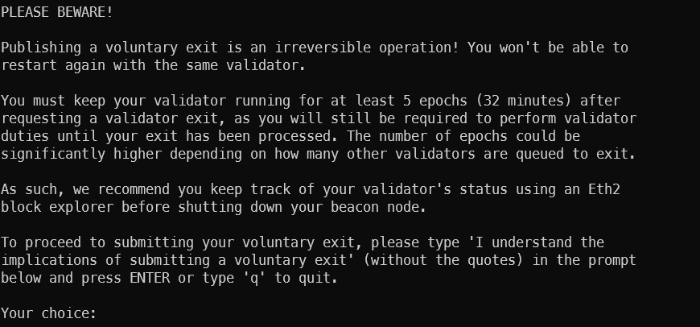

# Exiting the Validator (Voluntary Exit)

If you decide to stop validating, you can initiate a voluntary exit. This process will remove your validator from the active set and stop it from earning rewards.
You can read more about the process in the official nimbus documentation: <https://nimbus.guide/voluntary-exit.html>

## Initiate Voluntary Exit

To initiate a voluntary exit, use the following command:

```bash
nimbus_beacon_node deposits exit --validator=/path/to/keystore.json
```

Replace `/path/to/keystore.json` with the path to your validator keystore file.
You will be asked to enter the password for the keystore file.

## Confirm Exit

Nimbus will ask you to confirm the exit. Make sure you understand the implications of what you're doing before proceeding.



## Monitor Exit Status

After initiating the exit, you can monitor the status of your validator using a Beacon Chain explorer. The exit process may take some time, depending on network conditions and the number of validators exiting.

## Withdrawal of Funds

Once your validator has exited, you will be able to withdraw your staked ETH and any earned rewards. The withdrawal process is not instantaneous and may take a few days to complete, depending on network conditions and the number of validators exiting. You can monitor the status of your withdrawal using a Beacon Chain explorer.
