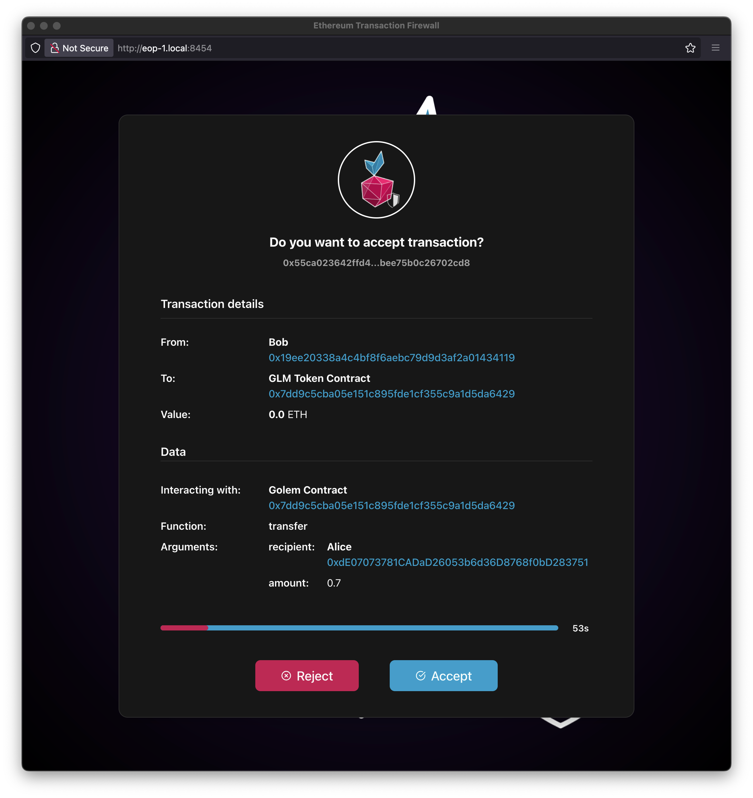

# Web3 Pi Transactions Firewall

TxFirewall is a tool that enhances the security of interactions with the Ethereum network through local RPC endpoints. It is designed to work with the [Ethereum On Raspberry Pi](https://github.com/Web3-Pi/Ethereum-On-Raspberry-Pi) suite.

At its core, TxFirewall functions as a local transaction-intercepting proxy server. It acts as an intermediary between the user's wallet (e.g., MetaMask) and the RPC endpoint of their own W3P Ethereum node.

Technically, TxFirewall listens on a specific local port configured in the wallet. When the wallet sends an RPC request, TxFirewall intercepts it. Simple data read calls (like `eth_getBalance`) can be passed directly to the W3P node. However, critical calls like `eth_sendTransaction` are halted and subjected to a verification process. Crucially, this entire process happens locally on the W3P device or the user's machine, before the transaction is broadcast to the Ethereum network.


## Installation

The firewall can be installed manually on any computer by following the instructions available at Github repository: [Web3 Pi Transaction Firewall](https://github.com/Web3-Pi/ethereum-transactions-firewall).

However, Web3 Pi Transaction Firewall is part of the Web3 Pi ecosystem, and the recommended installation method is through the __Cockpit__ management system, accessible via the __Web3 Pi Updater__ plugin. This installation approach automatically sets up the firewall along with the cockpit plugin, providing a complete graphical interface for firewall management.

You can easily install Transaction Firewall on your Raspberry Pi by clicking **Install** in the Web3 Pi Updater plugin.


In this version, the entire package is installed with initial configuration. The firewall is installed as a systemd service with appropriate permissions and configuration paths to ensure it uses the local Ethereum RPC client on your Web3 Pi by default. Additionally, the package includes a Cockpit plugin for complete management and control of the firewall.


## Configuration

After installation, a new item labeled **Web3 Pi Tx Firewall** will appear in the Cockpit Menu.
The firewall configuration window looks as follows:


!!!note

    You must have administrator privileges enabled to use the Web3 Pi Tx Firewall. Otherwise, you will see a warning message:
    

### Main settings

The top menu of the panel provides options to stop and start the firewall service, as well as configure basic settings:

{width=400px style="display: block; margin: 0 auto;"}

- **`Server Port`**: Port number where the main application serves the web interface for users to verify transactions.  
  **Default:** `8454`

- **`Proxy Port`**: Port number used for the proxy service. Used by RPC clients such as Metamask.  
  **Default:** `18500`

- **`WSS Port`**: Port number dedicated for WebSocket connections used between the web application and the firewall.  
  **Default:** `18501`

- **`RPC Endpoint`**: The RPC endpoint used to communicate with your Ethereum or blockchain node.  
  **Default:** `http://localhost:8545` - local Ethereum node in Web3 Pi

- **`Interactive Mode Timeout`**: Timeout duration for user decision in interactive mode (in seconds).  
  **Default:** `60`

!!!note

    Changing these settings requires a restart of the firewall service.

#### Opening ports in OS firewall

The default firewall application ports are blocked by the operating system firewall (USW). This is indicated by an icon next to the listed ports.

{width=400px style="display: block; margin: 0 auto;"}

To use the Tx firewall, you need to unblock these ports. You can do this manually via the [USW CLI](/#todo) or by clicking the lock icon next to each port.

!!!warning

    If the ports are not open, attempting to access the firewall's frontend application will result in the following message:
    

### Authorized address

In this table, you can add, edit or delete addresses that you recognize and set an appropriate name for them. This name will be displayed in the transaction verification window. It can be either an Ethereum account address or a contract address.


### Known contracts

In this table, you can define contracts that you recognize, including both their names and ABIs. This configuration will be used to decode transaction parameters. In the verification window, the name of the smart contract function being called and its argument names will be displayed. Additionally, if the argument type is `address`, it will be displayed with the appropriate name if it is found as an authorized address.


### Client configuration (Metamask)

You can configure any Ethereum RPC client - any wallet (including hardware wallets), or it can be an application using blockchain. This example demonstrates configuration instructions for the popular Metamask wallet.

For this purpose, you need to:

To navigate to the network configuration window in Metamask, follow [the official Metamask instructions](https://support.metamask.io/configure/networks/how-to-add-a-custom-network-rpc/#adding-or-editing-rpc-urls) and then fill in the required fields.

{width=300px style="display: block; margin: 0 auto;"}

!!!note

    You should use as `Default RPC URL` a URL consisting of your Pi's hostname or IP address and the port defined in the configuration as `Proxy Port`

## Usage

To use the Tx Firewall, open the frontend application by clicking the **Open Firewall App** button in the top menu.

!!!warning

    The Firewall in its current version works exclusively in interactive mode, which means that transactions will only be verified and rejected when the frontend application window is active. If the window is not running, <br>**all** (!) transactions will be forwarded to the specified RPC node.


### Frontend App

After opening the application, you can monitor transactions in the window:


If for any reason you lose the connection, you should see a notification message. 

{width=300px style="display: block; margin: 0 auto;"}
  
!!!warning
    Remember! In such a situation, the Firewall operates in mode: Accepts everything!


#### Validating transaction

##### Simple transfer

During a simple funds transfer from one account to another, the transfer transaction will be displayed in the application window with properly tagged addresses if they have been defined as _Authorized Addresses_.


You can accept or reject the displayed transaction within the time shown on the screen.

!!!note

    If you don't make a decision within the specified time, the transaction will be automatically rejected!
    The decision time is set in the `Interactive Mode Timeout` parameter.


##### Contract call

If you execute a transaction on a smart contract - for example, an ERC-20 token transfer like Golem Network - by calling the transfer function on a specific smart contract, it will be decoded and displayed in the application window.




!!!note

    Pay attention that the address fields have been tagged with names defined in the `Authorized Addresses` and `Known Contract` tables. If these definitions weren't present, the labels would display as `Unknown`.


If you make a transaction on a contract that hasn't been defined in the `Known Contracts` table, a data field with undecoded transaction data in hexadecimal format will appear in the verification window.


!!!note

    That's why it's important to define contract ABIs for proper transaction verification!


###### Predefined Standard Interfaces

If a contract address is not matched with any entries in the `Known Contracts` table, the firewall attempts to recognize and match the contract data against a set of predefined standard interfaces:

- **Main standards**:
    - ERC20 - Standard interface for fungible tokens
    - ERC721 - Standard interface for non-fungible tokens (NFTs)
    - ERC1155 - Multi-token standard
    - ERC4626 - Tokenized vault standard

- **Popular extensions**:
    - ERC20Burnable - ERC20 extension allowing token burning

- **Popular utility contracts**:
    - Ownable - Contracts with ownership functionality
      - AccessControl - Contracts with role-based access control

All these interfaces are imported from the [OpenZeppelin](https://github.com/OpenZeppelin/openzeppelin-contracts) library, which provides secure and community-vetted implementations of common smart contract standards. This automatic detection allows the firewall to correctly parse and display transaction data. Contract will be tagged as `Possible Interface: ...`


### Logs

While operating and using the firewall, you can view service logs in the Cockpit panel, where firewall activities are recorded:


By clicking on a specific log entry, you can see its details. Logs are stored in JSON format:

```JSON
{
  "level": 30,
  "time": "2025-04-25T16:54:57.819Z",
  "pid": 33525,
  "hostname": "eop-1",
  "transaction": {
    "id": "0xd1490ab481cb7c2d7713a98fa52878300d04ae750b73ed42e28724387aa840a1",
    "from": "0x19ee20338a4c4bf8f6aebc79d9d3af2a01434119",
    "to": "0x7dd9c5cba05e151c895fde1cf355c9a1d5da6429",
    "value": "0",
    "data": "0xa9059cbb000000000000000000000000de07073781cadad26053b6d36d8768f0bd283751000000000000000000000000000000000000000000000000001c6bf526340000",
    "labelFrom": "Bob",
    "labelTo": "GLM Token Contract",
    "txType": "contract-call",
    "contractInfo": {
      "address": "0x7dd9c5cba05e151c895fde1cf355c9a1d5da6429",
      "labelAddress": "Golem Contract",
      "functionName": "transfer",
      "args": [
        {
          "name": "recipient",
          "type": "address",
          "value": "0xdE07073781CADaD26053b6d36D8768f0bD283751",
          "label": "Alice"
        },
        {
          "name": "amount",
          "type": "uint256",
          "value": "8000000000000000"
        }
      ]
    }
  },
  "msg": "Transaction accepted"
}
```

## Security

### Limitations

Currently, only the Interactive Mode of the Firewall is available. This means that transaction verification can only be performed when the frontend application is open.

- If the web page is not open, the service automatically forwards all requests to the configured RPC endpoint
- Only one web page instance may be opened at a time
  - Opening an additional webpage instance drops the old connection and redirects all queries to the current page
- This is an asynchronous service, but it serves only one request at a time
  - Requests are not queued
  - New requests sent during the processing of a previous one are automatically forwarded to the configured RPC endpoint

### More about threats...

You can read more about the need to use the Firewall together with Web3 Pi on our blog [Fortify Your Ethereum Journey Web3 Pi Transaction Firewall](https://www.web3pi.io/blog/ethereum-txfirewall)
