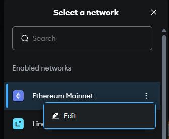
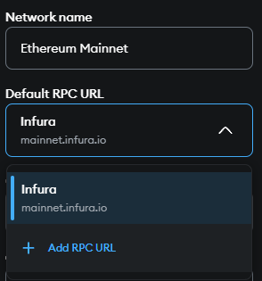
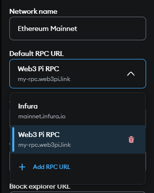

# Connect Your Wallet to Your Node

One of the significant advantages of running your own Ethereum node with Web3 Pi is the ability to use it as a private and trusted backend for your crypto wallets, such as MetaMask. Instead of relying on default public RPC endpoints provided by wallet developers or third parties, you can point your wallet directly to your own node running on your local network.

## Why Connect Your Wallet to Your Own Node?

- **Enhanced Privacy:** When you use public RPC endpoints, the provider _could_ potentially log your IP address and the wallet addresses you query. By using your own node, your transaction lookups and balance checks stay within your local network, significantly improving your privacy.
- **Increased Reliability:** Public endpoints can sometimes become congested or experience downtime. Your own node provides a dedicated resource that you control, potentially offering more consistent availability (assuming your node and internet connection are stable).
- **Trust Minimization:** You are directly querying the Ethereum blockchain state as validated by _your_ node, rather than trusting a third-party provider's node. This aligns with the core principles of decentralization.
- **No Rate Limiting:** Public RPCs often have rate limits to prevent abuse. Your own node doesn't impose such external limits (though it's still bound by its own processing capabilities).

## Prerequisites

1.  **Web3 Pi Node Running:** Your Raspberry Pi must be powered on, connected to your network, and the Ethereum Execution Client must be running and fully synced with the network you intend to use (e.g., Mainnet, Sepolia).
2.  **Wallet Installed:** You need a wallet that supports custom RPC endpoints (MetaMask is a common example).
3.  **Node's Local IP Address or Hostname:** You need to know the IP address (e.g., `192.168.1.123`) or hostname (e.g., `web3pi.local`) of your Raspberry Pi on your local network. You can find this using methods described in the [SSH Access](../management/ssh.md) or [Cockpit](../management/cockpit/dashboard.md) documentation. If you're using Web3 Pi Link, you can use the URL provided by the service instead.

## Finding Your Node's RPC Address

Your Execution Client exposes an RPC endpoint that wallets can connect to. You can access it in a few ways:

1.  **Local IP Address:** Use your node's IP address on your local network.

    - Format: `http://<your-pi-ip-address>:<rpc-port>`
    - Default Port: `8545`
    - Example: `http://192.168.1.123:8545`
    - _Use Case: Connecting from devices on the same local network (Wi-Fi)._

2.  **Local Hostname:** Use the hostname assigned to your node.

    - Format: `http://<your-pi-hostname>:<rpc-port>`
    - Default Port: `8545`
    - Example: `http://web3pi.local:8545`
    - _Use Case: Connecting from devices on the same local network (Wi-Fi). Requires local DNS resolution (mDNS/Bonjour) to work._

3.  **Web3 Pi Link Address (Remote Access):** If you have set up [Web3 Pi Link](../management/cockpit/web3-pi-link.md), you can use the secure public HTTPS URL provided by the service.
    - Format: `https://<your-chosen-name>.web3pi.link`
    - _(Note: Web3 Pi Link handles the port mapping and provides a standard HTTPS port 443 endpoint)._
    - Example: `https://my-awesome-node.web3pi.link`
    - _Use Case: Connecting from anywhere, including outside your local network (e.g., when you're not home)._

Choose the appropriate address based on how and where you want to connect to your node.

## Configuration Steps (MetaMask Example)

MetaMask doesn't allow adding a new network with the same Chain ID as an existing one (like Mainnet `1`, Sepolia `11155111`, etc.). Therefore, to use your node for these standard networks, you need to **edit the existing network settings** in MetaMask.

**Editing an Existing Network (e.g., Mainnet, Sepolia):**

1.  **Open MetaMask:** Unlock your MetaMask extension.
2.  **Network Dropdown:** Click on the network selection dropdown menu (top-left).
3.  **Open the Edit Network Wizard:** Click the "Edit" button in the network dropdown.
    
4.  **Update RPC URL:** Locate the "Default RPC URL" field and add a new RPC URL.

    

    - For local access: `http://web3pi.local:8545` or `http://192.168.1.123:8545` (Use `http`)
    - For remote access via Web3 Pi Link: `https://my-awesome-node.web3pi.link` (Use `https`)

5.  **Select Your RPC** Now that you've added your RPC endpoint, select it from the dropdown menu.

    

6.  **(Optional) Rename the network:** You can rename the network to something more descriptive (e.g., `Web3 Pi Mainnet` or `Ethereum Mainnet (Web3 Pi)`).
7.  **Save:** Click the "Save" button.
    Your MetaMask wallet is now configured to communicate directly with your own Web3 Pi Ethereum node using the specified RPC URL.

## Important Considerations

- **Local vs. Remote:** Remember to use the local `http://...:8545` address only when your wallet device is on the same network as the Pi. Use the `https://....web3pi.link` address for access from anywhere else.
- **Security (Manual Exposure):** The default Web3 Pi setup exposes the RPC port (`8545`) only locally. **Do not manually configure your router/firewall to expose port 8545 directly to the public internet** unless you implement robust security. Web3 Pi Link is the recommended way to achieve secure remote access.
