---
hide:
  - navigation
---

# Web3 Pi WelcomeBox

## The Complete Starter Kit for Ethereum Nodes on Raspberry Pi

The Web3 Pi WelcomeBox is designed to be an all-in-one package, providing you with everything you need to launch your own Ethereum node on a Raspberry Pi 5 with a seamless setup experience.

It bundles compatible, tested hardware components to save you the time and effort of sourcing them individually.

    <iframe width="1246" height="701" src="https://www.youtube.com/embed/-3Bj0rSCskk" title="Web3 Pi WelcomeBox Video Tutorial" frameborder="0" allowfullscreen></iframe>

## What’s Inside?

The WelcomeBox includes the following components:

<table class="custom-width-table">
  <thead>
    <tr>
      <th>Photo</th>
      <th>Product name</th>
      <th>Store Link</th>
    </tr>
  </thead>
  <tbody>
    <tr>
      <td>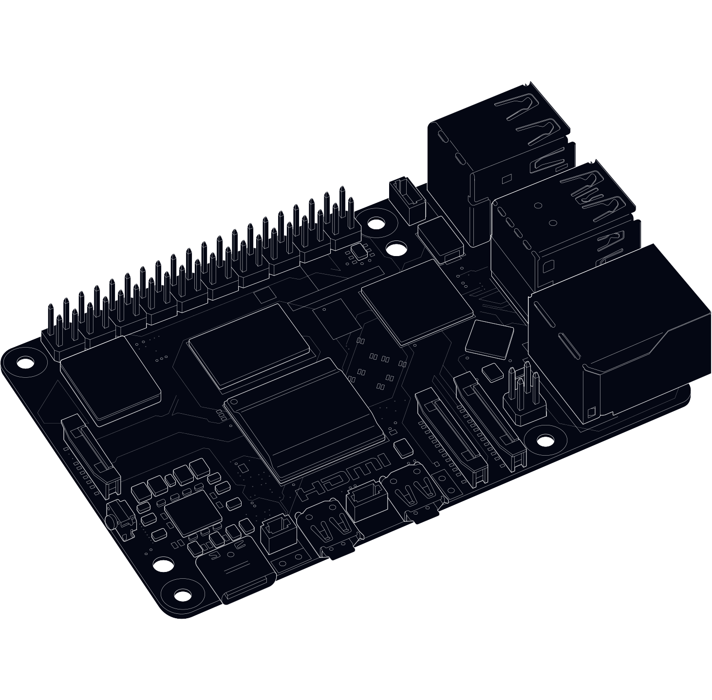</td>
      <td><b>Raspberry Pi 5 - 8GB RAM</b>  The heart of Web3 Pi. Powered by an efficient ARM processor, it delivers high performance while maintaining energy efficiency.</td>
      <td><a href="https://www.tme.eu/pl/en/details/sc1112/raspberry-pi-minicomputers/raspberry-pi/raspberry-pi-5-8gb-ram/">TME</a> / <a href="https://kamami.pl/en/raspberry-pi-5/1187962-raspberry-pi-5-8gb-ram-24ghz-wifi-dualband-bluetooth-pcie-20-2x-csidsi-2x-usb-30-2x-4kp60-microhdmi-5056561803326.html">Kamami</a> / <a href="http://botland.store/raspberry-pi-5-modules-and-kits/23905-raspberry-pi-5-8gb-5056561803326.html">Botland</a></td>
    </tr>
    <tr>
      <td>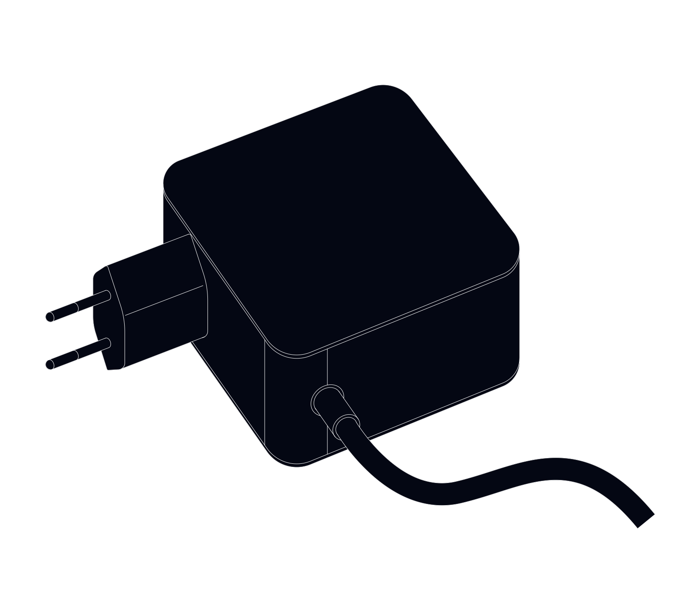</td>
      <td><b>Official Raspberry Pi 5 power supply</b>  Official Raspberry Pi 5 power adapter with a USB-C connector. Delivers up to 27W for stable and reliable operation.</td>
      <td><a href="https://www.tme.eu/pl/en/details/sc1408/raspberry-pi-acessories/raspberry-pi/rpi-27w-usb-c-power-supply-black-eu/">TME</a> / <a href="https://kamami.pl/en/power-supplies/1187966-sc1157-raspberry-pi-27w-usb-c-power--5056561803418.html">Kamami</a> / <a href="https://botland.store/raspberry-pi-5-power-supply/23907-raspberry-pi-27w-usb-c-power-supply-official-51v-5a-psu-for-raspberry-pi-5-black-5056561803418.html">Botland</a></td>
    </tr>
    <tr>
      <td>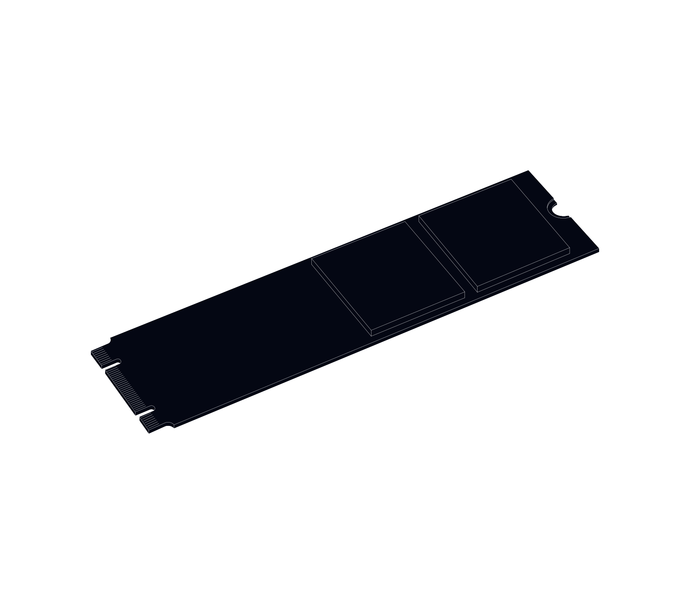</td>
      <td><b>2TB m.2 storage:</b> Lexar NM790 or Goodram PX700  A high-speed 2TB NVMe storage for fast blockchain synchronization. Designed for low power consumption, high performance, and long life.</td>
      <td>Lexar NM790: <a href="https://www.lexar.com/global/products/Lexar-NM790-M-2-2280-PCIe-Gen-4x4-NVMe-SSD/">Product page</a> / <a href="https://www.morele.net/dysk-ssd-lexar-nm790-2tb-m-2-2280-pci-e-x4-gen4-nvme-lnm790x002t-rnnng-12848184/">Morele.net</a>  Goodram PX700: <a href="https://www.goodram.com/produkty/goodram-px700-ssd/">Product page</a> / <a href="https://www.morele.net/dysk-ssd-goodram-px700-2tb-m-2-2280-pci-e-x4-gen4-nvme-ssdpr-px700-02t-80-13134971/">Morele.net</a></td>
    </tr>
    <tr>
      <td>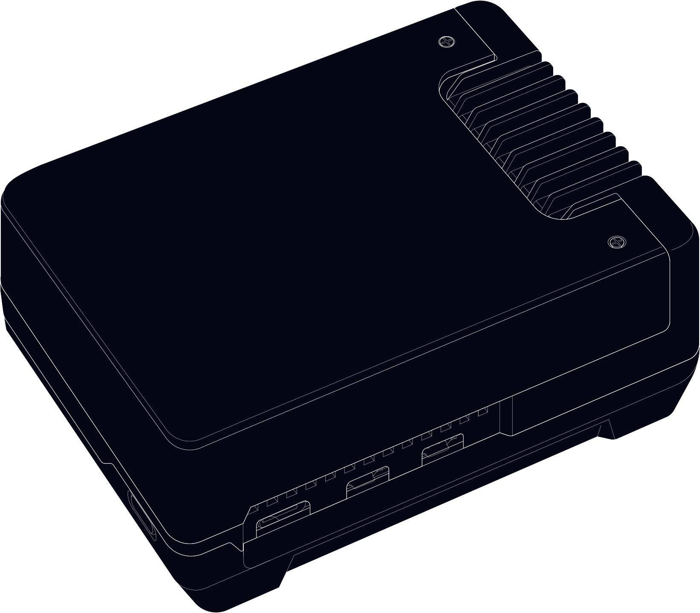</td>
      <td><b>Argon Neo 5 NVMe enclosure</b>  A compact enclosure with active cooling. It looks sleek, provides excellent thermal management, and fits in any corner.</td>
      <td><a href="https://kamami.pl/obudowy-do-raspberry-pi/1192348-argon-neo-aluminum-alloy-case-for-raspberry-pi-5-built-in-cooling-fan-optional-for-m-2-nvme-interf-5906623488377.html">Kamami</a> / <a href="https://botland.store/raspberry-pi-5-cases/24397-argon-neo-5-m2-nvme-pcie-case-for-raspberry-pi-5-with-fan-and-heatsink-aluminum-black-6974297862181.html">Botland</a></td>
    </tr>
    <tr>
      <td>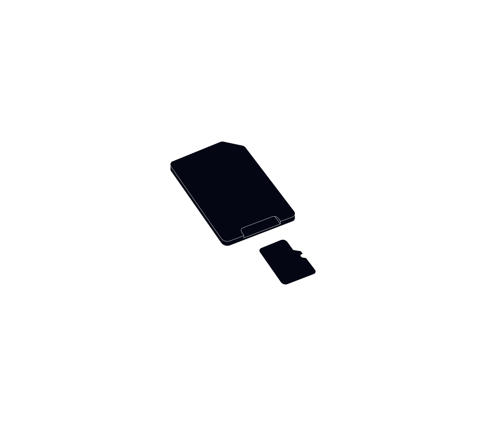</td>
      <td><b>microSD Card</b>  High-speed microSD card (preferably 32GB or larger) for storing the operating system and node data files, with plenty of space for future expansions.</td>
      <td><a href="https://kamami.pl/en/memory-cards/1185040-karta-pamieci-microsd-kingston-canvas-select-plus-64gb-c10-a1-740617298963.html">Kamami</a> / <a href="https://botland.store/microsd-sd-cards/20229-memory-card-goodram-ir-m2aa-microsd-64gb-170mbs-uhs-i-class-u3-with-adapter-5908267961339.html">Botland</a></td>
    </tr>
    <tr>
      <td>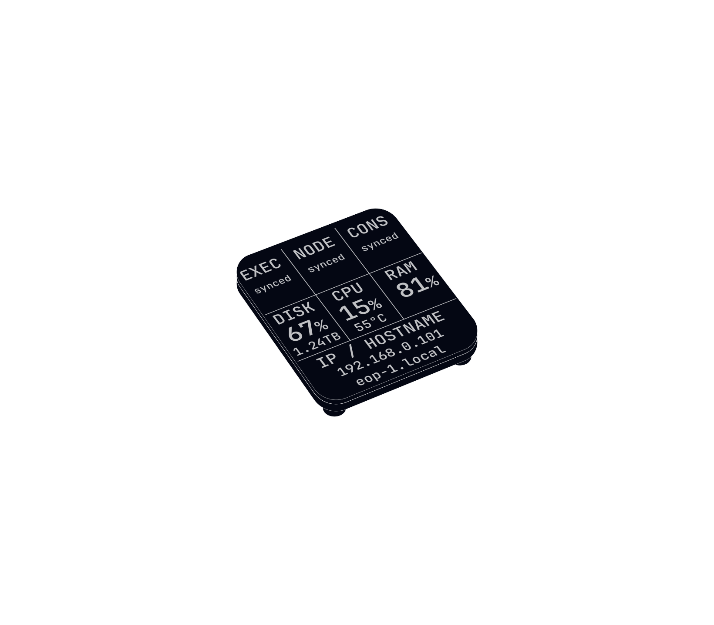</td>
      <td><b>Color LCD Dashboard</b>  A high-quality LCD screen designed to provide real-time insights into your node and operating system status.</td>
      <td><a href="https://kamami.pl/en/tftips-displays/1184835-1-69inch-lcd-display-module-240-280-resolution-spi-interface-ips-262k-colors-5906623427451.html">Kamami</a> / <a href="https://botland.store/lcd-tft-ips-displays/23391-lcd-ips-169-display-240x280px-spi-interface-262k-waveshare-24382.html">Botland</a></td>
    </tr>
    <tr>
      <td>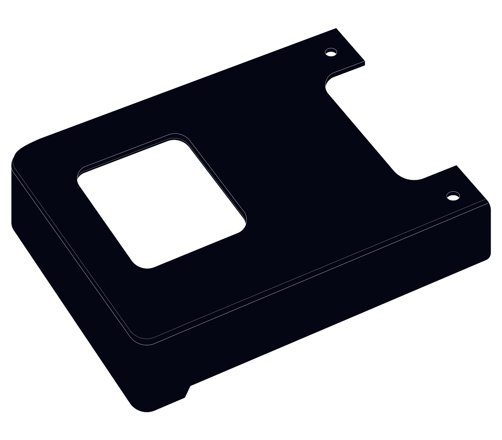</td>
      <td><b>3D Printed Cover</b>  A custom-designed plastic cover, 3D printed specifically for Web3 Pi. It allows for mounting the LCD display while providing a sleek and functional finish.</td>
      <td><a href="https://github.com/Web3-Pi/web3-pi-dashboard/tree/main/docs/3D_Model">3D models</a></td>
    </tr>
    <tr>
      <td>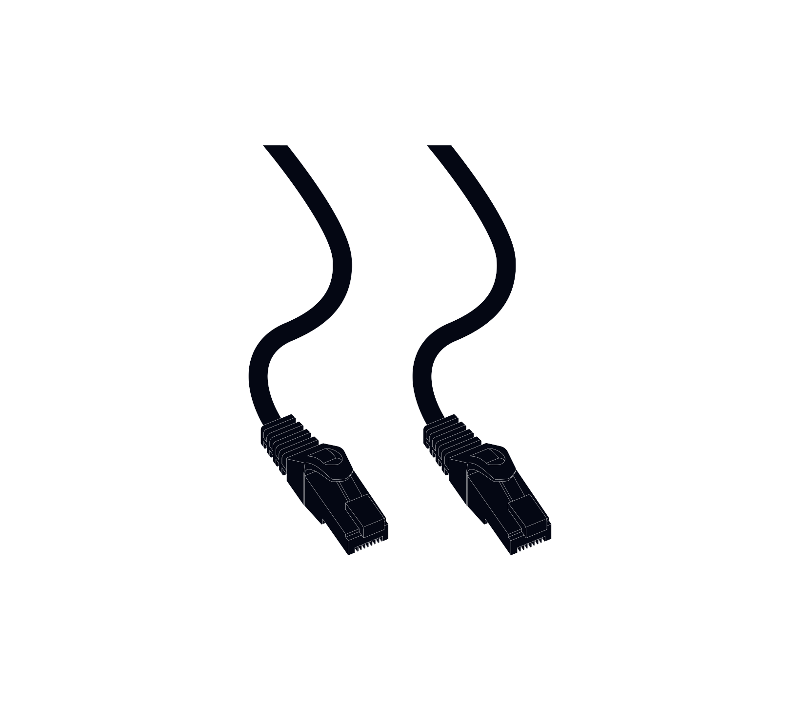</td>
      <td><b>Ethernet Cable cat. 5e</b>  A 2-meter high-quality Ethernet cable, included to complete the set.</td>
      <td><a href="https://www.tme.eu/pl/en/details/pcu5-10cc-0200-bk/rj45-cables/lanberg/">TME</a> / <a href="https://kamami.pl/en/ethernet-cables/1181917-patchcord-cat-5e-utp-2m-black-fluke-passed-lanberg-5901969406726.html">Kamami</a> / <a href="https://botland.store/utp-cat-5e/12852-lanberg-ethernet-patchcord-utp-5e-2m-black-5901969406726.html">Botland</a></td>
    </tr>
    <tr>
      <td>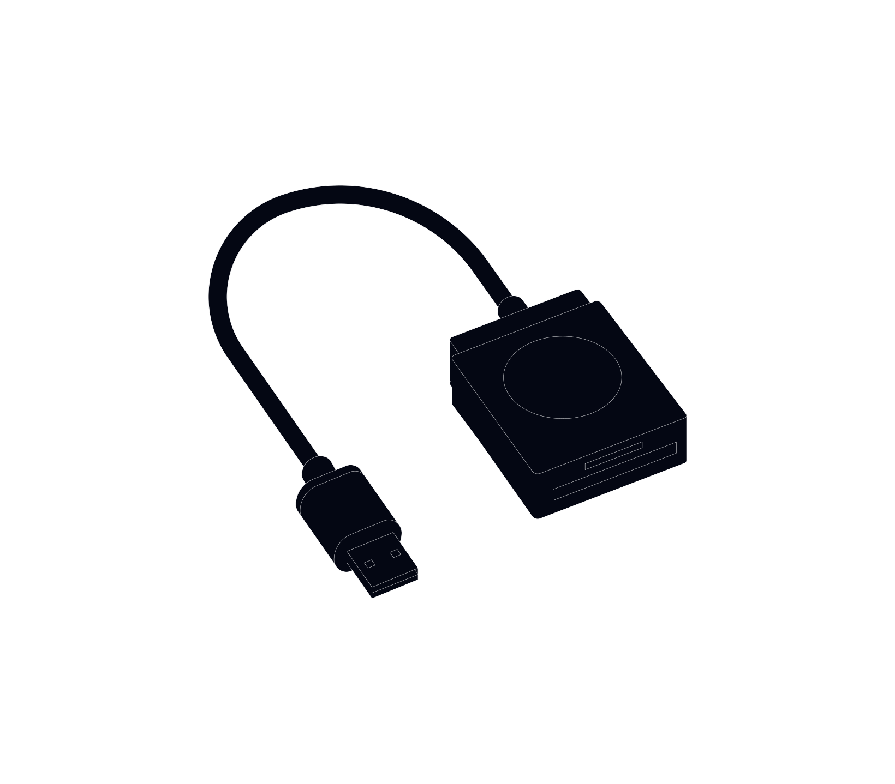</td>
      <td><b>microSD Card Reader:</b> Ugreen CR127  A handy tool for flashing your microSD card with the operating system and node data.</td>
      <td><a href="https://www.ugreen.pl/en/products/adapters/usb-a/ugreen-usb-adapter-card-reader-sd-microsd-black-141330">Ugreen</a> / <a href="https://www.morele.net/czytnik-ugreen-cr127-usb-3-0-20250-6697738/">Morele.net</a></td>
    </tr>
    <tr>
      <td>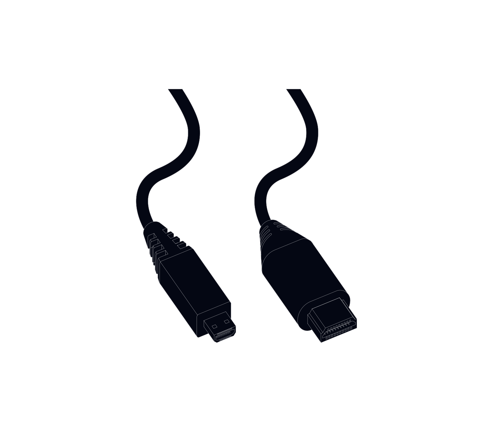</td>
      <td><b>microHDMI-HDMI cable</b>  Not required for running Web3 Pi, but invaluable for troubleshooting and initial setup.</td>
      <td><a href="https://www.tme.eu/pl/en/details/sc0532/raspberry-pi-acessories/raspberry-pi/micro-hdmi-m-to-hdmi-a-m-cable-2m-black/">TME</a> / <a href="https://kamami.pl/przewody-audio-wideo-do-raspberry-pi/584432-oficjalny-przewod-microhdmi-hdmi-do-raspberry-pi-2m-czarny-5056561800714.html">Kamami</a> / <a href="http://botland.store/raspberry-pi-4b-audio-video-cables/16337-microhdmi-cable-hdmi-20-original-for-raspberry-pi-45-2m-black-5056561800714.html">Botland</a></td>
    </tr>
    <tr>
      <td>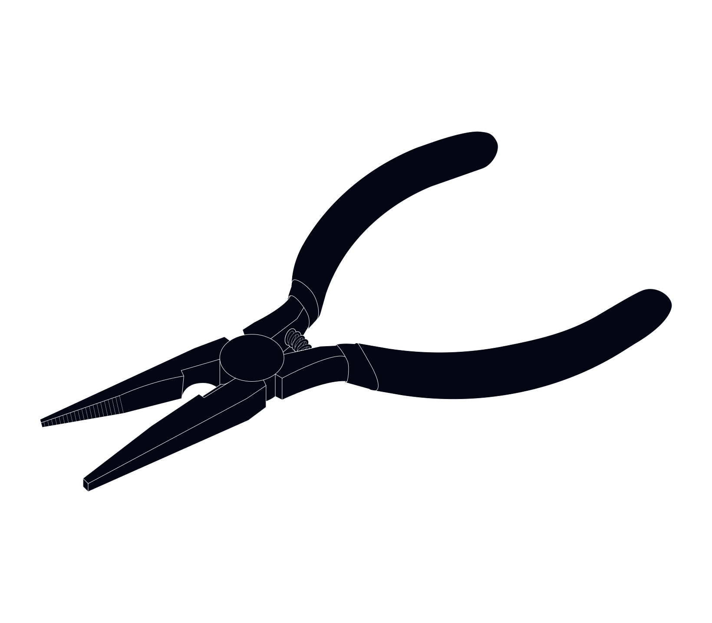</td>
      <td><b>Pliers</b>  Handy pliers that make hardware assembly easier. Ideal for gripping small components and included for your convenience.</td>
      <td><a href="https://www.tme.eu/pl/en/details/neo-01-102/universal-pliers/neo-tools/01-102/">TME</a> / <a href="https://kamami.pl/en/pliers/581378-straight-elongated-pliers-110-mm-vorel-42303-5906083423031.html">Kamami</a> / <a href="https://botland.store/straight-pliers/1518-straight-pliers-125mm-vorel-42303-black-5906083423031.html">Botland</a></td>
    </tr>
    <tr>
      <td>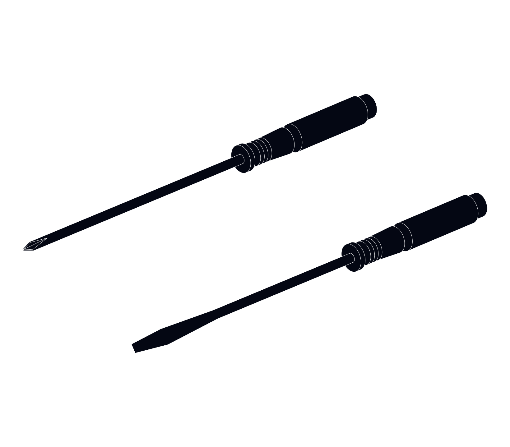</td>
      <td><b>Screwdrivers: PH0 and flat 3mm</B>  A set of screwdrivers to tighten screws and secure components. Included to ensure you have everything needed to set up Web3 Pi.</td>
      <td>PH0: <a href="https://www.tme.eu/pl/en/details/pg-t065/screwdrivers/pg-tools/pgt065/">TME</a> flat: <a href="https://www.tme.eu/pl/en/details/pg-t071/screwdrivers/pg-tools/pgt071/">TME</a></td>
    </tr>
  </tbody>
</table>

_(Note: Exact components like storage brand or specific tool types may vary slightly based on availability, but will meet the required specifications.)_

---

## Assembly and Setup

Follow the instructions in the [Full Setup Guide](../setup/single-mode/software-setup.md) to assemble and configure your Web3 Pi.

---

## Availability

_Coming soon_
