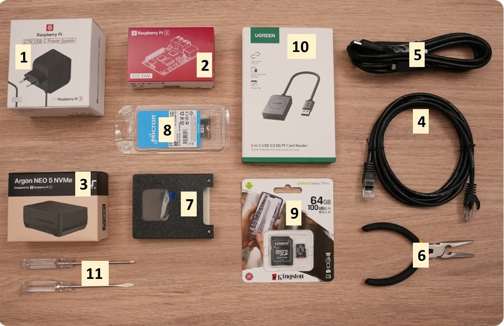

# Web 3 Pi: Welcome Box

The Welcome Box contains everything you need to set up a single node, or one of a dual node pair.

## Welcome Box Contents

### Key

1. Official Raspberry Pi 5 Power Supply
2. Raspberry 5 Pi with 8 GB RAM
3. Argon Neo 5 Case for Raspberry 5
4. Ethernet Cable
5. HDMI Cable for optional connection to a monitor
6. Precision Pliers
7. 3D Printed Case with LCD Dashboard
8. NVME M2 Drive with 2TB capacity
9. Micro SD card
10. Micro SD card reader
11. 2 Screwdrivers for assembly

## Assembly and Installation

Please refer to the [full setup guide](../setup/prerequisites.md) for instructions.
